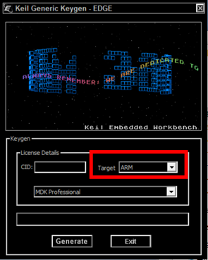
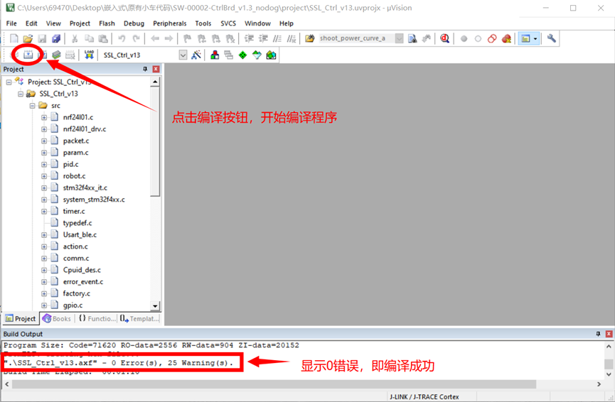
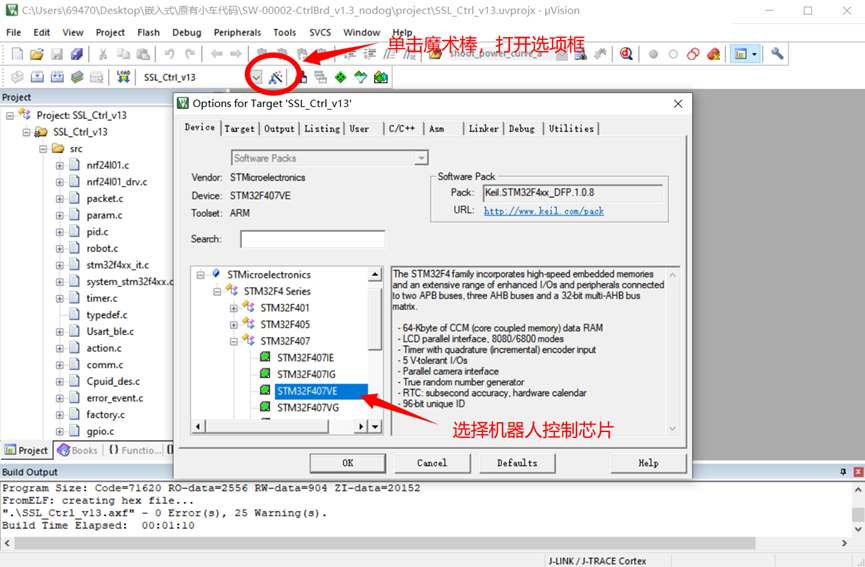
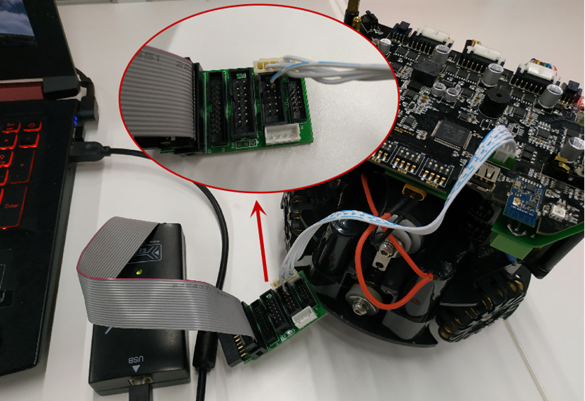
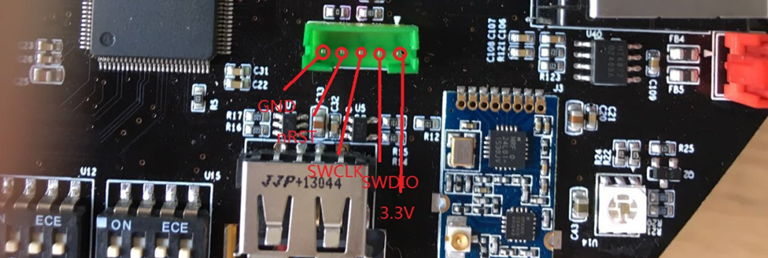
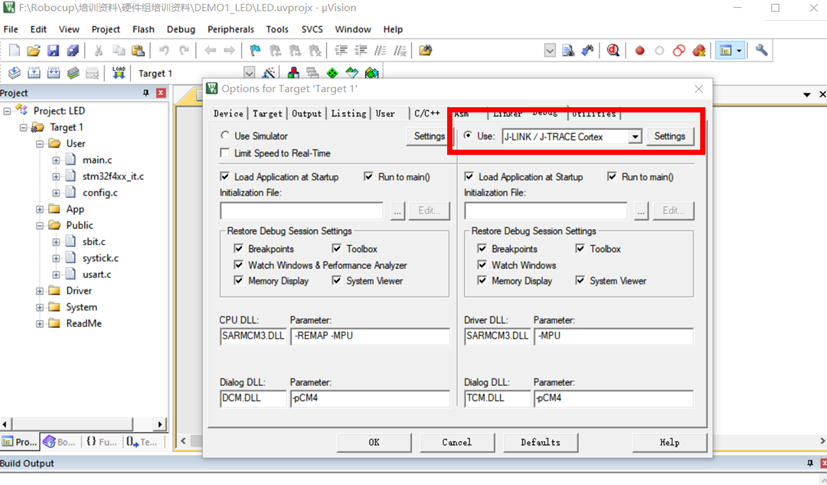
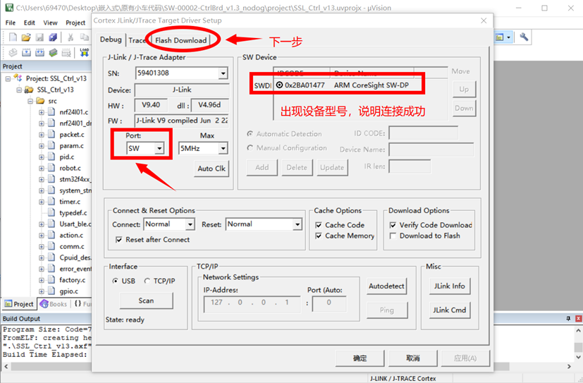
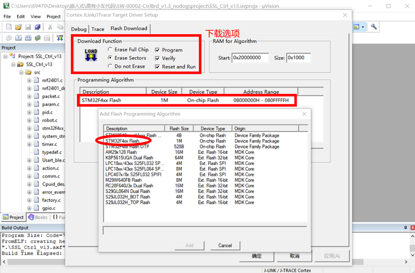
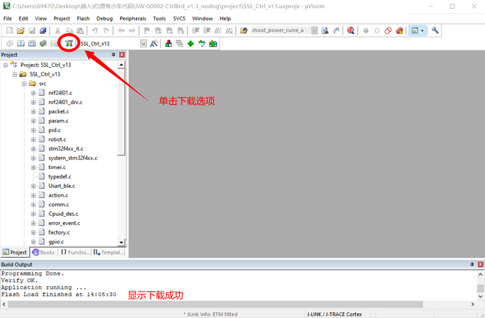

## 下载并安装Keil（MDK）

Keil是STM32单片机开发者使用最多的一款编译软件，安装与破解的教程百度一搜一大堆，这里节省篇幅不作赘述。我们Robocup机器人使用的芯片是STM32F407VET6，因此成功安装破解完Keil之后，需要安装STM32F4相关包，打开Keil.STM32F4xx_DFP安装完成后，Keil软件器件库中便有STM32F4系列芯片。

- [Keil5下载安装](https://jbox.sjtu.edu.cn/l/W1zaEp)
- [Keil.STM32F4xx_DFP.1.0.8.pack](https://jbox.sjtu.edu.cn/l/71nTUN)
- [百度教程](https://jingyan.baidu.com/article/414eccf69efc4d6b431f0a8a.html)
- 注意：破解软件Target选项选择“ARM”，如下图所示

## 小车代码烧写方法

Robocup机器人支持J-Link与ST-Link两种方式（串口烧录需要额外接线操作复杂），以下以J-Link为例，详解程序如何下载进机器人中。

+ 所需工具：Keil软件，小车代码（C语言），仿真器，[仿真器驱动](https://jbox.sjtu.edu.cn/l/R1EtSt)

1. 解压“机器人现有代码”压缩包，打开project文件夹，下拉找到Keil工程文件并打开“SSL_Ctrl_v13.uvprojx”，单击快捷工具栏编译按钮，直接编译程序。等待一两分钟后，输出框显示“0 Error”即编译成功。

+ [机器人现有代码](https://gitlab.com/src-ssl/src-hardware) ，自行下载最新分支下的代码

2. 单击工具栏魔术棒，打开Options选项框，切到Device选项卡，在器件栏中选择机器人芯片STM32F407VE。

3. 将J-Link用转接插槽与机器人SWD插槽连接，USB口插入电脑中，如下图所示。J-Link与SWD针脚必须一一对应，其中J-Link针脚名称在插槽上标出，SWD针脚名称见SWD示意图。单击魔术棒按钮，切到Debug选项卡，调试器选择“J-Link/J-TRACE Cortex”。

4. 单击魔术棒按钮，切到Debug选项卡，调试器选择“J-Link/J-TRACE Cortex”。

5. 单击右边Settings按钮，将“J-Link/J-trace Adapter”下面的“Port”选择“SW”，若右边“SW Device”中出现设备型号即连接成功。

6. 切换到Flash Download界面，按下图所示勾选“Reset and Run”。如果下方“Programming Algorithm”为空白，则单击“Add”按钮手动选择“STM32F4xx Flash”，确定即可。

7. 单击下载按钮，等待左下角进度条，下载成功后提示。

+ 如果点击download以后报错，按照经验来说一般是仿真器和小车之间的线没有连好，最好重新插线。
