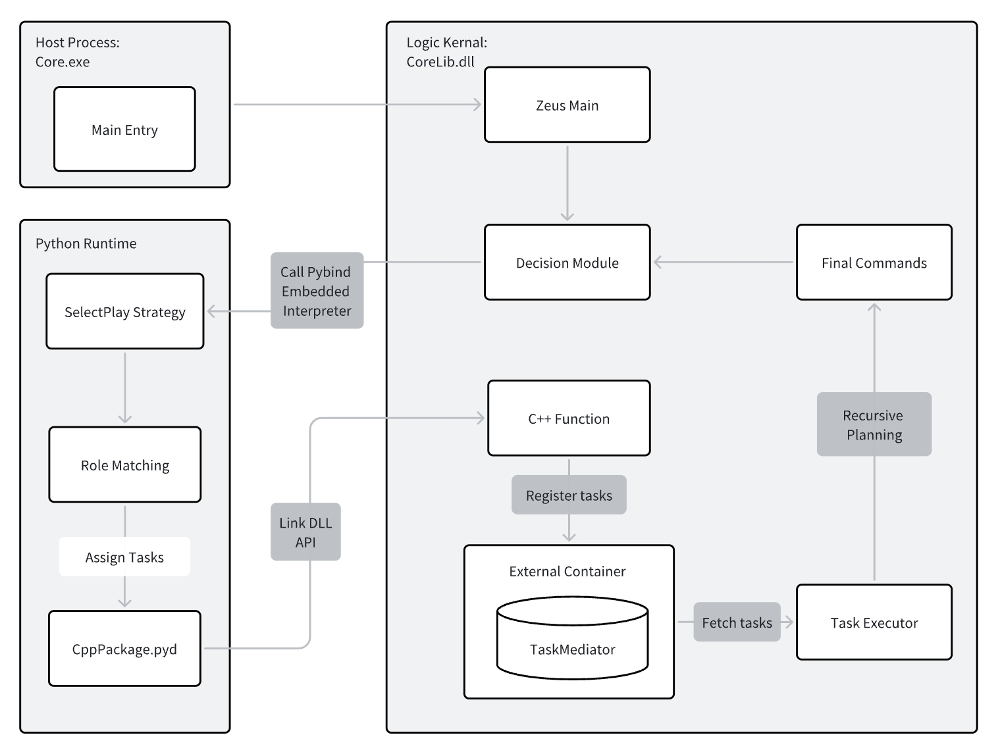
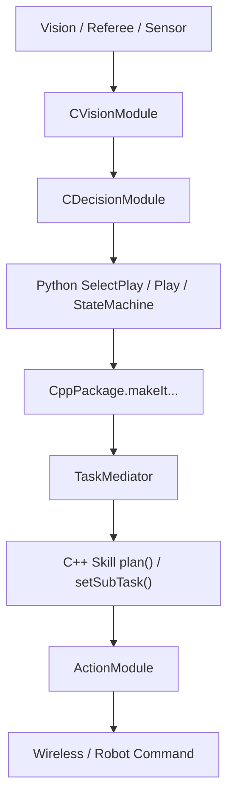

# 总体设计

这几年的软件重构，最重要的一件事并不是“把 Lua 改成了 Python”这么简单，而是把整个 Core 的职责重新切了一遍：**上层用 Python 表达战术意图，下层继续用 C++ 扛住实时性。** 这个判断不是凭感觉拍脑袋做的，而是 2026 TDP 里明确写过、现在仓库实现也已经落地的主线选择。

!!! quote "为什么从 Lua-C++ 迁到 Python-C++"
    TDP 里给出的理由很直接：Lua 顶层难做静态检查，老的 tolua++ 绑定工具多年无人维护，而现代 AI、编辑器补全、类型提示和数据工具几乎都围绕 Python 生态生长。与此同时，视觉、路径规划、运动控制这些高频模块仍然更适合留在 C++。

<figure markdown>

<figcaption>2026 TDP 中绘制的 Python-C++ Based Architecture 总览图。</figcaption>
</figure>

上面这张图很值得认真看。它传达的不是“系统里有 Python 和 C++ 两种语言”这么朴素的信息，而是一个更重要的事实：**C++ 既嵌入 Python 解释器，让 C++ 能在决策阶段调用 Python；也反过来生成 `CppPackage.pyd`，让 Python 能把任务重新送回 C++。** 这就是当前软件层最核心的“双向桥”。

## 现在的软件分层

如果只从“谁负责什么”来理解，当前系统可以粗分成四层：

| 层 | 代表位置 | 主要职责 |
| --- | --- | --- |
| 展示与外部交互层 | `Client/`、Falcon、裁判盒、grSim | 可视化、参数修改、外部输入、仿真环境 |
| C++ Core | `Medusa/src/` | 视觉处理、世界状态更新、底层 Skill、路径规划、运动控制、发包 |
| Python 顶层 | `ZBin/PythonScripts/` | Play、状态机、角色匹配、裁判盒脚本、测试脚本、快速迭代逻辑 |
| 绑定层 | `Medusa/src/Pybind11Module/` + `CppPackage` | 把 C++ 能力包装成 Python 可调用接口，并提供 `.pyi` 提示 |

这四层不是彼此平行的模块列表，而是一条从“外部输入”到“最终发包”的流水线。战术作者最常碰的是 Python 顶层；写底层 Skill 的人更常碰的是 C++ Core；而要让两者真正协同工作，就必须理解中间这层绑定代码。

## 当前架构里的关键对象关系

如果你对这张图只记住一句话，那就记这句：

> Python 负责“决定任务”，C++ 负责“把任务不断细化，直到能下发真实控制命令”。

后面你看到的 `TaskMediator`、`PlayerTask::plan()`、`setSubTask()`，其实都是在把这句话展开。

## 为什么要保留 `Medusa.exe`、`MedusaCore.dll` 和 `CppPackage.pyd`

很多人第一次看到这个架构，都会疑惑：既然已经有 Python 顶层了，为什么不干脆只留一个 Python 程序？

答案跟兼容性和系统边界都有关。

首先，`Client.exe` 在 Rocos 体系里原本就是直接调用 `Core.exe` 的。为了不把整套外部调用方式打碎，当前仓库保留了 `Medusa.exe` 这个入口层。其次，原本大量 C++ 核心逻辑并不适合塞进 exe 主体里零散复用，所以项目把主体功能拆进 `MedusaCore.dll`，既供 `Medusa.exe` 调用，也供 `CppPackage.pyd` 复用。这样一来，Python 顶层和传统 exe 顶层都能共享同一套底层状态、函数和单例。

所以你在代码里会看到：

- `main.cpp`：负责 exe 入口与线程启动；
- `zeus_main.cpp`：提供 `runLoop()` 和 `SystemRunner`；
- `DecisionModule.cpp`：同时支持 C++ 顶层和 Python 顶层两种路径；
- `pybind_CppPackage.cpp`：把绑定结果统一暴露为 `CppPackage`。

## 两种启动模式，其实是在复用同一套 Core

### 1. C++ 作为顶层入口

传统流程依然存在：`Medusa.exe -> runLoop() -> CDecisionModule -> SelectPlay.py`。这条线的优势是兼容老的 `Client -> Core` 调用关系，比赛环境里也更贴近历史工作流。

### 2. Python 作为顶层入口

另一条线是现在日常开发非常好用的模式：`python PythonScripts/main.py -> SystemRunner.init() -> preDecision() -> SelectPlay() -> postDecision()`。它不是“另一套独立系统”，而是把原本在 C++ 循环里做的事情拆成前半帧、Python 决策、后半帧三段，方便你直接在 Python 层做调试和实验。

## 这一页想帮你建立的全局感

真正重要的不是死记架构图，而是先形成一个稳定的阅读视角：当你以后看到 `Skill.py`、`TaskMediator`、`DecisionModule`、`SmartGotoPositionV4` 这些名字时，脑子里要能自动把它们放回这条大链里。

- `DecisionModule` 负责组织“这一帧何时生成任务、何时规划任务”；
- `SelectPlay.py` 和 `Play/*` 负责产出高层任务；
- `TaskMediator` 负责缓存本帧任务和角色标签；
- 各个 C++ Skill 再把这些任务递归细化到底层控制命令。

只要这个总图在脑子里站稳，后面不管是看 Python、看 C++、看 pybind，都会顺很多。
