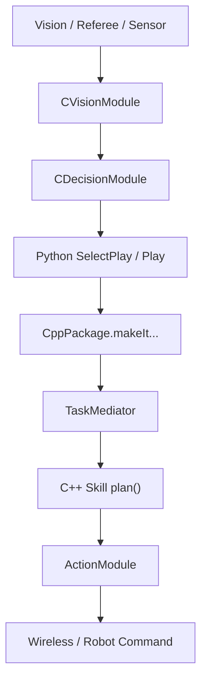

# 总体设计

## 从 Lua-C++ 到 Python-C++

结合 2026 TDP 和当前仓库实现，软件层近年的核心变化就是：

> 顶层战术语言从 Lua 迁移到 Python，而底层高实时模块仍然保留在 C++。

这样做的原因很现实：

- Python 的 IDE 支持、静态提示、调试体验更好。
- 现代 AI / 数据处理 / GUI 工具生态几乎都围绕 Python。
- 顶层战术更适合快速迭代，而高频计算、视觉、运动控制仍然适合 C++。

## 现在的软件分层

从“谁负责什么”来理解，最清楚：

| 层 | 代表位置 | 主要职责 |
| --- | --- | --- |
| 展示与外部交互层 | `Client/`、Falcon、裁判盒 | 显示、参数操作、仿真和外部输入 |
| C++ Core | `Medusa/src/` | 视觉处理、任务规划、底层技能、运动控制、发包 |
| Python 顶层 | `ZBin/PythonScripts/` | Play、状态机、角色匹配、裁判盒脚本、快速迭代逻辑 |
| 绑定层 | `Medusa/src/Pybind11Module/` + `CppPackage` | 把 C++ 能力安全暴露给 Python |

## 关键对象关系

## 为什么要保留 `Medusa.exe` 和 `MedusaCore.dll`

当前仓库不是简单地“Python 调用一些 C++ 函数”，而是把原来的核心拆成了：

- `Medusa.exe`
- `MedusaCore.dll`
- `CppPackage.pyd`

这样做的目的主要有两个：

1. 保持和原有系统入口兼容，`Client` 仍然可以调用 `Medusa.exe`
2. 让 Python 和 exe 共享同一份底层核心逻辑与状态

所以你会在源码里看到：

- `main.cpp` 负责 exe 入口
- `zeus_main.cpp` 提供 `runLoop()` 与 `SystemRunner`
- `DecisionModule` 同时支持 C++ 顶层和 Python 顶层两种模式

## 两种启动模式

当前系统实际支持两条主线。

### 1. C++ 作为顶层入口

流程是：

- `Medusa.exe`
- `runLoop()`
- `CDecisionModule`
- `SelectPlay.py`

这是兼容老流程、比赛系统和 `Client` 的传统启动方式。

### 2. Python 作为顶层入口

流程是：

- `python PythonScripts/main.py`
- `CppPackage.SystemRunner.Instance().init()`
- `preDecision()`
- `SelectPlay.SelectPlay()`
- `postDecision()`

这是当前更适合实验、调试和快速开发的方式。

## 新人最应该先建立的全局认识

当前主线不是“全 Python”，也不是“全 C++”，而是：

- Python 决定“这一帧想干什么”
- C++ 决定“这些任务怎么真正规划并执行”

理解这一点之后，再看 `Skill.py`、`TaskMediator`、`DecisionModule`、`SmartGotoPositionV4`，会顺很多。
