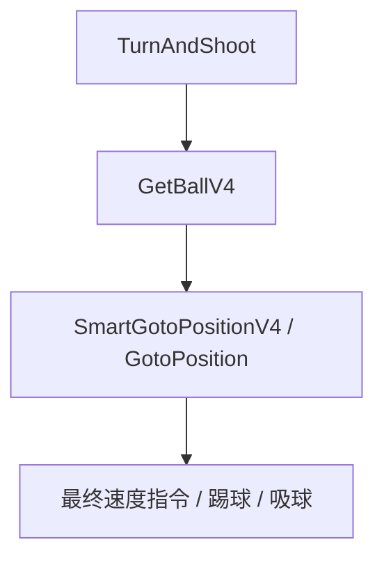

# Skill 递归、SubTask 与 TaskT

如果说 `DecisionModule` 负责把“一帧决策流程”组织起来，那么这一页讲的内容，负责解释另一件更底层的问题：

> 一旦 Python 或高层 C++ 已经说了“这台车做某个 Skill”，系统究竟是怎样一步步把这个 Skill 细化到底层控制命令的？

很多新人第一次看 C++ Skill 时，最困惑的点就在这里。明明已经叫 `TurnAndShoot` 了，为什么里面又 `setSubTask()` 到 `GetBallV4`？明明已经叫 `SmartGotoPositionV4` 了，为什么最后还要继续下发 `GotoPositionV4`？这不是“多绕了一层”，而是当前 Skill 体系的基本工作方式。

## `CPlayerTask` 的默认行为：递归往下传

先看最基础的抽象：`Strategy/skill/PlayerTask.h` 和 `PlayerTask.cpp`。

`CPlayerTask` 里有一个成员 `_pSubTask`，而默认实现的 `plan()` 和 `execute()` 都很简单：

- 如果有 `subTask()`，就继续调用它的 `plan()` / `execute()`；
- 如果没有，就停在当前这一层。

这意味着很多 C++ Skill 并不是直接产生命令，而是先做“更高层的战术判断”，再把真正的底层动作作为子任务交下去。于是一个 Skill 树就会长成这样：



这就是文档里常说的“递归调用到底层 Skill”的真实含义。

## 一个最小但很清楚的例子：`TurnAndShoot`

`Medusa/src/Strategy/skill/TurnAndShoot.cpp` 很适合拿来说明这套结构。

这个 Skill 在 `plan()` 里会先读：

- `task().executor`
- `task().player.pos`，这里被当成射门目标点
- `task().player.kickpower`
- `task().player.flag`

然后它会结合视觉信息判断三件事：

1. 这台车现在是否已经拿到球；
2. 朝向是否已经对准目标；
3. 是否该提前打开吸球。

如果方向对了、球也控制住了，它会直接设置 `KickStatus`；但即便如此，它仍然不会在这一层自己去做完整的运动控制，而是继续：

```cpp
setSubTask(PlayerRole::makeItGetBallV4(executor, targetDir, flag));
```

也就是说，`TurnAndShoot` 真正负责的是“什么时候该踢、什么时候该吸、什么时候还需要继续调整身体朝向”；至于“为了把车真正带到合适姿态，需要怎么接近球、怎么跑过去”，它会把这部分交给下一层 Skill 去完成。

## 再看一个更常用的底层例子：`SmartGotoPositionV4`

`SmartGotoPositionV4.cpp` 是整个底层执行链里最值得啃的一份源码。它做的事非常多：

- 读取 `TaskT` 里的目标点、角度、速度、标志位；
- 从 `TaskMediator` 判断当前执行者是不是守门员、后卫等特殊角色；
- 按角色类型调整速度、加速度等能力上限；
- 处理裁判盒约束，例如 stop 球圈、摆球区、禁区约束；
- 构造障碍物集合；
- 调用 RRT 或相关路径规划器求中间点；
- 修正最终目标和末速度；
- 最后再把结果交给更底层的轨迹 / 运动控制任务。

所以你会看到它末尾并不是“在本函数里直接输出轮速”，而是继续：

```cpp
setSubTask(TaskFactoryV2::Instance()->GotoPositionV4(newTask));
```

这正说明了一个很重要的分工：

- 上层 Skill 负责解释“我要以什么语义去到哪里”；
- 更底层的子任务负责解释“具体应该怎么走过去”。

## `TaskT` 是这条链上的参数载体

上面这些 Skill 之所以能一层层传递，是因为它们都围绕同一个参数结构：`TaskT`。

`Utils/misc_types.h` 里定义的 `TaskT` 可以粗略理解成“本帧某个执行者的一整包任务参数”。最常用的字段如下：

| 字段 | 典型含义 | 常见来源 |
| --- | --- | --- |
| `executor` | 真实执行车号 | Munkres 匹配后的 `task.num` |
| `player.pos` | 目标点 | `Skill.py` 里传入的点位参数 |
| `player.angle` | 目标朝向 | 例如 `RushTo` / `GetBallV4` 的目标朝向 |
| `player.flag` | 标志位 | `Flags.dodge_ball`、`Flags.allow_dss` 等 |
| `player.vel` | 期望末速度 | 某些轨迹类 Skill 使用 |
| `player.max_acceleration` | 最大加速度限制 | `RushTo` 等包装层传入 |
| `player.needdribble` | 是否吸球 | `needDribble=True` 之类参数 |
| `ball.Sender` | 出球者 / 辅助整数字段 | 传球者编号，或某些旧 Skill 复用 |
| `extraTaskParams` | 额外参数字典 | 不适合塞进固定字段的新参数 |

## `tasks` 字典是怎么“变成”这些 `TaskT` 的

这一点非常容易误解，值得单独讲清楚。

在 Python 状态机里，`getTasks()` 返回的是一张 `dict[str, Task]`，例如：

```python
{
    "L": Task(Skill.Crossover(...)),
    "A": Task(lambda runner: Skill.RushTo(...)),
    "G": Task(Skill.Goalie(...)),
}
```

这张字典本身**不会原封不动传到 C++**。它先在 Python 里完成三件事：

1. 按角色名组织任务；
2. 跑角色匹配，把 `L/A/G` 这些槽位分给真实车号；
3. 调用每个 `Task.run()`，而 `Task.run()` 内部又会去调用 `skill_cpp(num)`。

真正进入 C++ 的时候，已经不是整张字典，而是“每个角色各自调用一次 `CppPackage.makeIt...`”。也就是说，每次进入 pybind 层时，处理的都是**一个执行者的一份 `TaskT`**，而不是整个战术状态的一张大表。

!!! note "一个常见误解"
    Python 里的 `tasks` 字典是“本帧整队任务的组织形式”；C++ 里的 `TaskT` 是“单个执行者当前任务的参数包”。两者是一对多映射关系，不是同一个数据结构的跨语言传递。

## pybind 包装层到底做了什么

以 `Pybind11Module/Strategy/Skill/pybind_Skill.cpp` 里的 `makeItRushTo` 为例，包装层做的事情其实很具体：

1. 新建一个 `TaskT playerTask`；
2. 把 `executor`、`target`、`angle`、`flag`、`sender`、`maxAcc`、`needDribble` 等参数一个个写进 `TaskT`；
3. 调 `TaskFactoryV2::Instance()->SmartGotoPosition(playerTask)` 创建真正的 C++ Skill 对象；
4. 再调用 `TaskMediator::Instance()->setPlayerTask(executor, pTask, 1)` 把这份任务注册进本帧任务中心。

所以 pybind 并不是“直接把 Python 函数暴露给 C++”，而是把 Python 侧传入的高层参数，翻译成 C++ Skill 体系看得懂的 `TaskT`。

## `TaskMediator` 在这一页里的角色

在这条递归链里，`TaskMediator` 承担两个非常重要的作用。

第一，它是本帧任务的存放处。高层通过 `setPlayerTask()` 把任务塞进去，`DecisionModule::PlanTasks()` 再按优先级把这些任务取出来，逐个调用 `plan()`。

第二，它还是角色标签的共享处。像 `Skill.py` 里经常会先调用：

```python
taskMediator.registerRole(executor, "leader")
```

或者：

```python
CppPackage.TaskMediator.Instance().registerRole(executor, "goalie")
```

这样到了 C++ 里，`SmartGotoPositionV4` 之类的模块就能根据 `TaskMediator::Instance()->goalie()`、`isBack()` 这些接口，知道当前执行者应该套用哪种能力限制、是否允许进禁区、该使用怎样的避障逻辑。

## `TaskT` 字段并不总是“语义完美”

这一点很现实，但很有必要提前说清楚。由于历史包袱和渐进迁移的原因，并不是所有 Skill 都严格遵守“一个字段只做一种含义”的现代接口设计。

例如：

- `ball.Sender` 有时确实表示传球者编号；
- 在某些老 Skill 里，它也会被复用来装 `defendNum`、敌方编号等整型参数；
- `extraTaskParams` 则被用来给 `NormalShoot` 这种需要额外模式信息的 Skill 传参。

这不是优雅设计，但它是当前代码的真实情况。所以当你新增或修改 Skill 时，最重要的不是先追求“接口看起来漂亮”，而是先确认：

1. 这个参数在当前 C++ Skill 里最终是从哪个字段读出来的；
2. 这个字段有没有被别的旧逻辑复用；
3. 是否更适合走 `extraTaskParams` 而不是继续挤占旧字段。

## 看懂这条链后，再回去读代码会轻松很多

如果你以后在 Python 里写了一句：

```python
Task(Skill.RushTo(target, angle, flag=...))
```

最好在脑子里自动补全成下面这段流程：

```text
State.getTasks() 产出 Task
    -> Munkres 分配真实车号
    -> Task.run(num)
    -> Skill.py 里的 skill_cpp(num)
    -> CppPackage.makeItRushTo(...)
    -> pybind 包成 TaskT
    -> TaskFactoryV2 创建 C++ Skill
    -> TaskMediator 缓存本帧任务
    -> DecisionModule::PlanTasks() 调 plan()
    -> 各层 Skill 通过 setSubTask() 递归下钻
    -> 最终得到真正的底层控制命令
```

一旦这个流程在脑子里通了，很多原本看起来“怎么又套了一层”的地方，就会突然变得非常合理。
