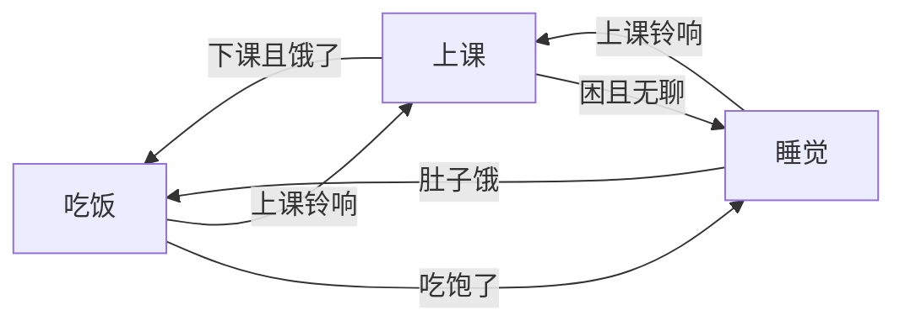

# 状态机

状态机这个词听起来像教科书，但在 SRC 当前的软件里，它不是“理论背景知识”，而是每天都在跑的主工作流。你看到的 `NormalPlayMessi_11vs11_new.py`、`GameStop.py`、各类 Test 脚本，本质上都在回答同一件事：**这一帧全队处于什么状态，每个角色该做什么，下一帧要不要换一种做法。**

!!! question "先把“状态机”想成什么？"
    先别急着把它想成代码。更自然的理解是：系统面对不同情况，会切换到不同的“工作模式”；每个模式下，输出不同的动作；当条件满足时，再跳到下一个模式。

为了不把这个概念说得太抽象，我们先用一个非常生活化的例子热热身。

这个图里，`睡觉 / 吃饭 / 上课` 就是状态；“铃响了”“肚子饿了”就是触发条件；而每个状态本身会带着一整套输出行为。机器人战术也是一样，只不过这里的“输出行为”不再是闭眼或者咀嚼，而是 `RushTo`、`WBack`、`WMarking`、`Goalie` 这些任务。

## 在 SRC 代码里，状态机具体长什么样

当前 Python 框架把这件事拆成了三个层次：

- `Task`：某个角色本帧要执行的任务包装。
- `State`：某个战术状态下，整队角色如何分工。
- `StateMachine`：负责组织状态之间的切换。

所以一个 `State` 往往要回答三件事：

1. `getTasks()`：这一状态下，`L/A/B/C/.../G` 各自拿什么任务。
2. `getMatchString()`：这些角色的身份该稳定到什么程度，是实时匹配还是只在切换时匹配。
3. `transFunction()`：下一帧要不要跳状态，如果跳，跳到哪一个。

这里有一个容易忽略、但特别关键的事实：SRC 里的状态机并不只是“决定跳不跳”。它把**任务生成、角色匹配、任务执行、调试显示、状态跳转**整条链都串在了一起。

## 一帧里到底发生了什么

`RoleMatch_LuaStyle/State.py` 里的 `State.run()` 基本就是当前框架的核心入口。把源码翻成自然语言，大体就是下面这个顺序：

1. 当前状态先产出一张 `tasks` 字典，键是角色名，值是 `Task` 对象。
2. 系统根据 `matchStr` 和 Munkres 算法，为这些角色分配真实车号。
3. 对那些依赖真实车号的延迟任务做解包。
4. 每个任务开始执行，把底层 Skill 通过 `CppPackage.makeIt...` 下发到 C++。
5. 更新缓存的 `matchPos` 和调试显示。
6. 调用 `transFunction()`，决定下一帧继续留在当前状态，还是跳去别的状态。

如果你把这一页和后面的“状态机与角色匹配”“DecisionModule 与 TaskMediator”两页连起来看，就会发现它们实际上讲的是同一条链，只是站位不同：这一页从“概念理解”出发，后面两页从“代码流动”出发。

## 一个最适合入门的真实例子：`GameStop`

`Play/RefPlay/GameStop.py` 很值得当作第一份状态机源码来读，因为它的状态数量不多，但结构非常完整。

进入 `Stop` 状态时，脚本先让大部分角色统一执行 `Skill.Stop()`，守门员走 `Skill.Goalie()`。这个状态的目的不是“设计漂亮站位”，而是先把全队收住，避免在裁判盒刚切到 `GameStop` 的那几帧里还沿用上一套战术的残留行为。

接着，`play_switch()` 会检查比赛是否重新 `gameOn`、`beckhamDecision` 里识别到的主攻车是否改变、当前缓存的角色号是否冲突等条件。如果需要重新组织 stop 阵型，它就跳到 `Run`。`Run` 状态会调用 `generateStopTasks()`，动态生成 `WBack`、`WMarking`、`RushTo` 等任务，并同步拼出新的 `matchStr`。换句话说，`Stop` 像是在“收队”，`Run` 像是在“按裁判要求重新摆阵”。

这个例子特别好，因为它清楚地展示了：**状态切换不是为了写得花哨，而是为了把不同时机下的逻辑边界切干净。**

## 再看一个比赛主线例子：`Messi_11vs11_new`

如果说 `GameStop` 适合入门，那 `Play/Normal/NormalPlayMessi_11vs11_new.py` 就适合你真正理解“主战术为什么要写成状态机”。

这个脚本表面上只有两个状态：`GetBall` 和 `Pass`。但千万别被状态数量骗了。每次进入这两个状态时，系统都会重新计算 leader、receiver、back、marking、goalie 的分工；会根据 `messiDecision`、`defenceSequence` 去重组任务表；还会根据场上形势重新拼接匹配字符串。也就是说，状态虽然只有两个，状态内部干的事却非常重。

这也是为什么比赛代码通常不会把整套逻辑塞进一个大 `if/else` 里。那样写短期也许省事，但一旦要调试角色漂移、切换条件、盯人逻辑或裁判盒过渡问题，很快就会失控。

## `transFunction()` 返回值该怎么读

当前框架里，`transFunction()` 的约定很朴素：

- 返回另一个状态名：发生状态切换。
- 返回空字符串：留在当前状态继续跑。
- 返回 `exit`：当前 Play 结束，常见于某些 RefPlay。

这听起来简单，但在调试时很好用。你在断点里只要盯住 `transFunction()` 的返回值，就能很快判断问题出在“状态生成错了”还是“切换条件错了”。

## 写状态机时最常踩的三个坑

第一个坑，是把“角色名”和“真实车号”混为一谈。`L`、`A`、`B` 这些是角色槽位，不是车号。真实编号通常要等匹配完成后，才能从 `task.num` 或 `Global.getRoleNumber(roleName)` 里拿到。如果你在还没匹配时就把它们当成真实车号用，后面大概率会出现莫名其妙的串角色问题。

第二个坑，是过早求值。很多任务会依赖“另一个角色当前的真实车号”或“另一个角色当前的位置”，所以不能在 `Task(...)` 创建的那一瞬间就把参数算死。这就是为什么框架里专门保留了 `lambda runner:` 这类延迟写法，以及 `achedMatchPos` 这样的缓存机制。

第三个坑，是偷懒复用上一个状态的残留任务。当前这套框架的设计取向很明确：宁可每个状态显式地把这一帧每个角色要做什么写清楚，也不要让任务在多个状态之间“半隐式地沿用”。前者啰嗦一点，但后者会让你在维护时不停追问“这辆车到底是谁在控制、什么时候换过状态、为什么它现在还在做上一个动作”。

## 这一页读完之后，你应该有的感觉

真正理解状态机，不是记住“状态机由状态和转移组成”这句话，而是读到 `GameStop` 或 `Messi_11vs11_new` 时，脑子里能自动翻译成一句更具体的话：

> 这一帧脚本先定义每个角色的任务，再决定这些角色由哪些真实车辆执行，最后根据场上条件决定下一个状态。

一旦你能这样去看代码，后面再读 `Task.py`、`State.py`、`StateMachine.py`，就不会觉得它们是在绕概念，而会觉得它们只是把这句话翻译成了程序。
