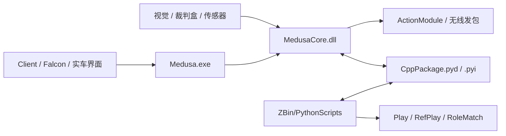

# 软件与算法总览

这一章面向现在正在维护 `MilkTest` / `Medusa` / `PythonScripts` 的队员，而不是早期 Lua 时代的历史版本。你可以把它理解成一份“从第一天接手代码，到敢自己改战术、加 Skill、做调试”的上手地图。

当前主线架构已经非常明确：**Python 负责表达战术意图，C++ 负责高实时执行**。比赛时真正跑在场上的不是某一个孤立脚本，而是 `SelectPlay.py -> Play -> Skill.py -> CppPackage -> MedusaCore.dll` 这一整条链。

!!! note "关于带 `*` 的标题"
    本章里标题前带 `*` 的页面，表示它们属于“进阶拓展内容”。这些内容很重要，但建议你先把主链路读通，再回头啃这几页，会轻松很多。

## 推荐阅读顺序

如果你是第一次接触本队软件，推荐按下面的顺序走。顺序本身并不是教条，而是为了避免“还没搞清楚系统怎么跑，就先扎进单个 Skill 的细节”。

1. `开发入门`：先把命令行、`uv`、VS Code、Git 工作流这些最容易卡人的基础打通。
2. `软件总体架构`：先知道整个系统从哪里进、数据怎么流，再去看单个模块。
3. `Python 顶层`：理解 `main.py`、`InitAllModules.py`、`SelectPlay.py`、`Config.py`、`Play/` 与 `RoleMatch_LuaStyle/` 这些“战术作者最常碰的地方”。
4. `C++ Core`：再去看 `Medusa.exe` / `MedusaCore.dll`、`DecisionModule`、`TaskMediator`、视觉与运动控制，理解“这些 Python 任务最后怎么真正跑起来”。
5. `调试与排障`：最后把 `launch.json` 的几种工作流走通，不然你后面改代码会一直处在“只能猜”的状态。

## 一张图先看全局

这张图有一个非常重要的阅读姿势：不要把 `Python` 和 `C++` 看成两个互相替代的版本，而要把它们看成同一个系统里的上下两层。上层描述“这帧应该做什么”，下层负责把这个描述变成真正的跑位、避障、控球、踢球和发包。

## 这一版文档的原则

- 以 **当前仓库真实代码** 为准，尽量不给“只存在于老文档里”的说法。
- 把新人最常问的问题写清楚：从哪里启动、在哪里改、为什么要这样组织。
- 过时的 Lua 教程不再作为主线内容。旧资料已移到 `chapter_software/archive/legacy_pre_2026/`，仅供追溯历史时参考。

## 你看完这一章后应该做到

- 能从 `ZBin` 正确启动 Python 顶层或 C++ 顶层流程。
- 能根据 `SelectPlay.py -> Play -> Skill -> CppPackage` 这条链追到任务的真实执行位置。
- 能看懂 `Task` / `State` / `StateMachine` / `Munkres` 在本项目里的具体含义。
- 能用 VS Code 对 Python 和 C++ 做联合调试，而不是靠 `print` 硬猜。
