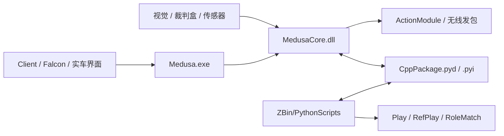

# 软件与算法总览

这一章面向现在正在维护 `MilkTest` / `Medusa` / `PythonScripts` 的队员，而不是早期 Lua 时代的历史版本。

当前主线架构已经是 **Python + C++**：

- C++ 负责视觉处理、任务执行、路径规划、底层技能与发包。
- Python 负责顶层战术组织、状态机、角色匹配、裁判盒脚本与大量快速迭代逻辑。
- 二者通过 `Pybind11` 连接，统一暴露为 `CppPackage`。

## 推荐阅读顺序

如果你是第一次接触本队软件，建议按下面的顺序阅读：

1. `开发入门`：先把命令行、`uv`、VS Code、Git 工作流这些最容易卡人的基础打通。
2. `软件总体架构`：先知道整个系统从哪里进、数据怎么流，再去看单个模块。
3. `C++ Core`：理解 `Medusa.exe` / `MedusaCore.dll`、`DecisionModule`、`TaskMediator`、视觉与运动控制。
4. `Python 顶层`：理解 `main.py`、`InitAllModules.py`、`SelectPlay.py`、`Config.py`、`Play/` 与 `RoleMatch_LuaStyle/`。
5. `调试与排障`：学会用 `launch.json` 把 C++ 和 Python 一起 debug。

## 一张图先看全局

## 这一版文档的原则

- 以 **当前仓库真实代码** 为准，尽量不给“只存在于老文档里”的说法。
- 把新人最常问的问题写清楚：从哪里启动、在哪里改、为什么要这样组织。
- 过时的 Lua 教程不再作为主线内容。旧资料已移到 `chapter_software/archive/legacy_pre_2026/`，仅供追溯历史时参考。

## 你看完这一章后应该做到

- 能从 `ZBin` 正确启动 Python 顶层或 C++ 顶层流程。
- 能根据 `SelectPlay.py -> Play -> Skill -> CppPackage` 这条链追到任务的真实执行位置。
- 能看懂 `Task` / `State` / `StateMachine` / `Munkres` 在本项目里的具体含义。
- 能用 VS Code 对 Python 和 C++ 做联合调试，而不是靠 `print` 硬猜。
