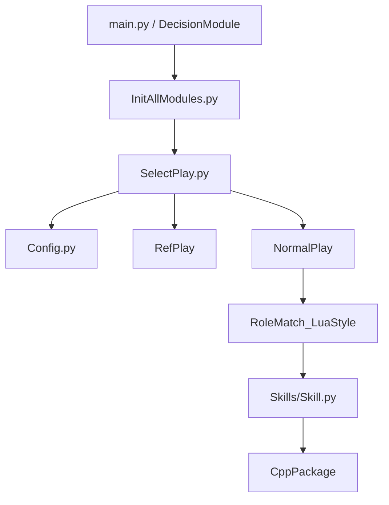

# Python 层总览

如果只用一句话概括当前 Python 层，它不是“负责底层控制”的，而是 **负责组织顶层战术** 的。也就是说，Python 更像教练席：它决定这一帧该跑哪套战术、哪些角色要上、角色之间怎么匹配、什么时候切换状态；真正涉及高实时的轨迹、避障、控球和发包，依然主要落在 C++。

这个边界非常重要。很多人在刚开始改代码时，容易把 Python 写成“半套底层控制器”，然后一边写点位逻辑、一边试图自己在高层硬管运动细节。这样做短期可能看起来方便，但长期会把分层彻底搅乱。

## 先认识目录，再认识代码

`ZBin/PythonScripts/` 里文件不少，但真正建议优先认识的是下面这些位置：

| 路径 | 作用 |
| --- | --- |
| `main.py` | Python 作为顶层入口时的主循环 |
| `InitAllModules.py` | 一次性初始化脚本，把环境、配置和模块拉起来 |
| `SelectPlay.py` | 每帧入口，决定当前该跑 Test、RefPlay 还是 NormalPlay |
| `Config.py` | 注册策略、默认 NormalPlay、Test 模式入口、守门员编号等 |
| `Play/` | 具体战术脚本，按 `Normal / RefPlay / Test` 分类 |
| `RoleMatch_LuaStyle/` | 状态机、角色匹配、`Task`/`State`/`StateMachine` 框架 |
| `WorldModel/` | 常用方向、点位、条件、力度和底层状态包装 |
| `CppPackage/` | Python 访问 C++ 能力的统一入口 |

比起死记目录，理解它们的上下游关系更重要：

当你后面开始顺代码时，会发现这张图几乎就是日常开发最常走的路径。

## 一帧里最该盯的入口是谁

答案非常统一：`SelectPlay.SelectPlay()`。

不管你是从 `Medusa.exe` 传统入口启动，还是直接跑 `python PythonScripts/main.py`，真正每帧反复执行、负责顶层分发的核心入口，最终都会落到 `SelectPlay.py`。所以如果你现在完全不知道从哪里开始读，先看 `SelectPlay.py` 基本不会错。

它的职责可以概括成一句话：

> 先看当前是不是 Test Mode，再看裁判盒是不是接管了比赛，如果都不是，就进入 NormalPlay。

这也是为什么很多问题最后都能回到这里来排查。比如“为什么我写的 Test 脚本没跑”“为什么裁判盒切到 `GameStop` 之后还在走 NormalPlay”“为什么刚切回比赛时还沿用了上一套 RefPlay 状态”，第一站通常都该先看 `SelectPlay` 的分支判断。

## Python 这一层最擅长做什么

当前这层最适合承载的事情，往往有两个共同特点：第一，逻辑经常会改；第二，写的人更希望有 IDE 提示、断点和快速实验能力。

典型例子包括：

- 组织状态机；
- 切换和注册 Play；
- 角色匹配；
- 根据裁判盒消息选择比赛脚本；
- 写各种 Test / Benchmark / 调参脚本；
- 做力度模型、GUI 工具、编辑器、数据处理这类辅助模块。

与之对应，C++ 更适合扛住高实时、强几何约束和性能敏感的部分，例如视觉处理、路径规划、运动控制和底层 Skill 执行。理解了这个边界之后，你在写 Python 代码时就会自然克制：不要在高层重复造一套运动控制，也不要因为一时方便，把本该在 C++ 里维护的实时逻辑散落到 Python 各个角落。

## 这套 Python 代码还有明显的“迁移痕迹”

这一点提前知道会很有帮助。虽然主线已经是 Python-C++ 架构，但仓库里仍然保留了很多明显来自旧 Lua 时代的命名和组织痕迹，例如：

- `RoleMatch_LuaStyle`
- `Global.roleNumberStructTable`
- 某些兼容旧语义的工具函数和角色名约定

这些名字本身没有问题，它们也确实帮助团队把旧逻辑平稳迁过来了。但读代码时要始终记住：

!!! note "读旧命名时的心态"
    现在的主线已经是 Python 体系。旧名字只是历史迁移留下的外壳，不代表我们还要继续按 Lua 时代的思维去扩展新功能。

## 你接下来最应该带着什么问题去读后面的页面

读 Python 层时，最有价值的不是记住每个文件名，而是持续带着下面这三个问题：

1. 这一层是在决定“做什么”，还是在决定“怎么做”？
2. 这一段逻辑是整队范围的，还是单个执行者的？
3. 它最终是怎么把任务交回 C++ 的？

如果这三个问题一直在脑子里，后面你不管是看 `Config.py`、`Skill.py`、`State.py`，还是自己新写一个 `Test_*.py`，都会更容易把代码放到正确的位置上。
