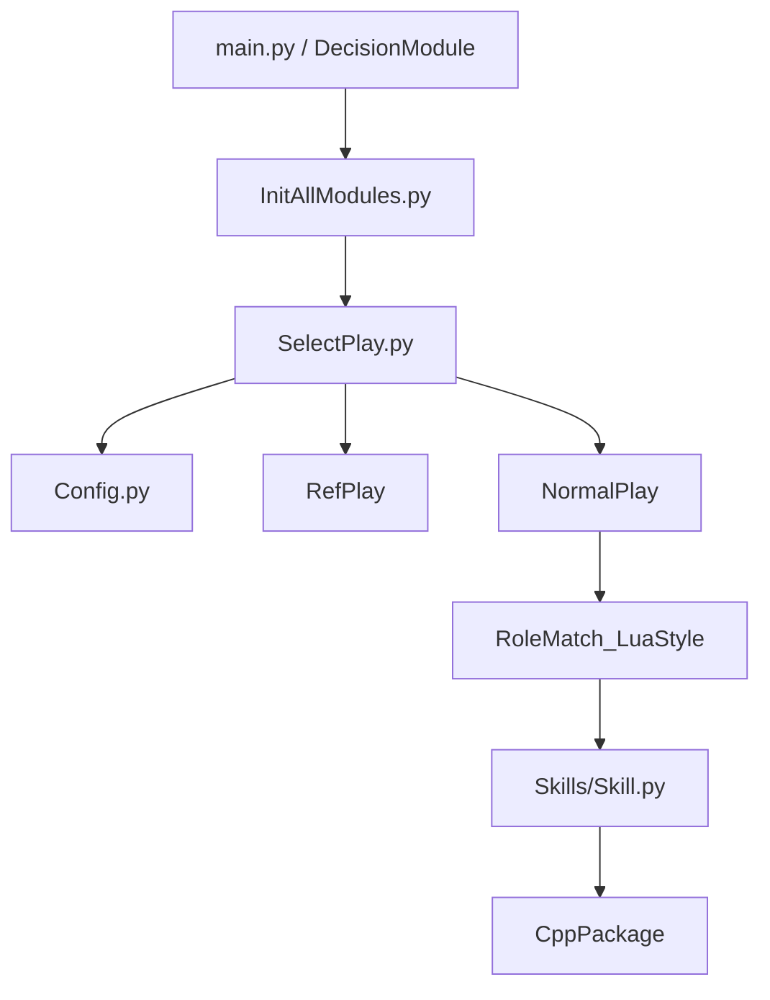

# Python 层总览

## 先给一句最准确的描述

当前 Python 层不是“拿来算底层速度”的，而是：

> 用来组织顶层战术、状态机、角色匹配和快速迭代逻辑的。

底层实时执行依然主要在 C++。

## 目录地图

`ZBin/PythonScripts/` 里最值得优先认识的是这些位置：

| 路径 | 作用 |
| --- | --- |
| `main.py` | Python 作为顶层入口时的主循环 |
| `InitAllModules.py` | 一次性初始化脚本 |
| `SelectPlay.py` | 每帧入口，决定本帧走哪套 Play |
| `Config.py` | 注册 NormalPlay / RefPlay / TestPlay |
| `Play/` | 具体战术脚本 |
| `RoleMatch_LuaStyle/` | 状态机 + 角色匹配框架 |
| `Vision/` | 对 `CppPackage.VisionModule` 的 Python 包装 |
| `WorldModel/` | 方向、点位、条件、力度等常用战术工具 |
| `CppPackage/` | Python 访问 C++ 能力的统一入口 |

## 顶层调用关系

## 一帧里 Python 层最重要的入口是谁

是 `SelectPlay.SelectPlay()`。

无论是：

- C++ 顶层模式
- 还是 Python 顶层模式

真正每帧会反复调用的核心入口，都是它。

所以你如果完全不知道从哪看起，先看 `SelectPlay.py` 基本不会错。

## Python 层和 C++ 层的分工边界

### Python 更适合做的事

- 组织状态机
- 注册和切换 Play
- 角色匹配
- 对裁判盒消息做高层决策
- 写各种实验性脚本
- 做数据驱动工具、编辑器、测试脚本

### C++ 更适合做的事

- 视觉处理
- 运动控制
- 路径规划
- 高实时 Skill 执行
- 发包

如果你把边界想清楚，就不容易把 Python 写成“半套底层控制器”。

## 当前代码风格的一个现实特点

虽然整体已经迁移到 Python-C++ 架构，但很多命名和组织方式仍然带有明显历史痕迹，例如：

- `RoleMatch_LuaStyle`
- `Global.roleNumberStructTable`
- 一些旧 Lua 语义兼容函数

这不是坏事，但你读代码时要记住：

> 现在的主线是 Python 体系，很多旧命名只是迁移痕迹，不代表我们还应该沿着旧 Lua 思维继续扩展。
