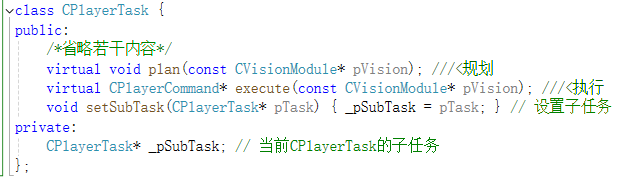

# CPlayerTask原理
在Core\src\ssl\skill\PlayerTask.h中定义了类 CPlayerTask，CPlayerTask即每个机器人所需要完成的任务  
简单介绍一下CPlayerTask的原理，打个比分，我们把所有的任务分层：  
基础任务：移动，踢球，转圈，吸球  
低级任务：拿球（移动到球位置+吸球），传球（转圈至朝向队友+踢球）  
高级任务：拿球转身传（拿球+传球）  
我们可以这样进行理解：一个低级任务是由多个基础任务组成，一个高级任务是由多个低级任务组成（而实际上任务的层数可能不只三层，一个高级任务也可以由低级任务和基础任务共同组成）。  
因此我们让一辆车”拿球转身传”，它显然不是直接执行这个高级指令，而是依次执行：”移动→吸球→转圈→踢球” 这一系列基础的指令。  

我们不妨定义每个CPlayerTask在当前时刻需要执行的低一级任务为其子任务。比方说”拿球转身传”的子任务，可能是”拿球”或者”传球”，”拿球”的子任务可能是”移动”或者”吸球”。子任务在每个时刻只有一个，但不同时刻不同情况下可以变化。
  
可以看到CPlayerTask类中定义了成员CPlayerTask*指针pSubTask，指向其子任务，其实就是链表的数据结构。

# plan与execute
接下来讲解CPlayerTask的两个重要函数：plan 和 execute。
plan本质上也是写状态机，当出现一个怎样的情况，我需要选择哪个低级的任务作为我的子任务。
比如我们要写一个拿球转身踢的skill，它的plan函数是这样的逻辑
```
void plan(){
    if(我还没拿到球) setSubTask(拿球)；    //如果我还没拿到球，我的子任务就是拿球
    else  setSubTask(传球)；              //如果拿到了，我的子任务就是传球
}
```
但是拿球和传球并不是最低级的任务，所以它们也有自己的子任务和plan函数。这样它们就以链表的形式一直嵌套下去……  
是不是给人一种很简单的感觉？但事实上plan代码要复杂的多。有自信的童鞋可以去了解一下最复杂的advance.cpp，也就一千多行代码吧。

execute则比较简单，大部分skill（即除了最底层的、没有子任务的CPlayerTask）的execute的代码大概长这样：
  
即从顶层的CPlayerTask以函数嵌套的方式往下执行子函数。最底层的CPlayerTask，如GotoPosition、StopRobot，则有特殊的execute执行方式。
总的来说就是：每个CPlayerTask的plan设定子任务的挑选逻辑，execute则以函数嵌套的方式执行在plan中选择的子任务。

# decisionmodule
理解了以上这些，我们理解decisionmodule就是水到渠成的事情了。
decisionmodel的实现类是CDecisionModule，它主要的函数是PlanTasks()
  
它的逻辑就是，从TaskMediator的单例类里面获取所有机器人的任务指令，并且用冒泡排序法进行优先级排序，然后对每个CPlayerTask依次调用plan方法。接着在ActionModule中会依次调用execute执行。
  

TaskMediator可以理解为一个所有机器人任务的存储器，它负责从lua脚本中接受当前周期的任务、清理旧周期任务、保存每个车号对应的角色（advancer、helperBack、supporter等）。如PlanTasks()的这一小段代码，就是使用getPlayerTask(int num)来获取num号机器人当前的任务。
  

而TaskMediator中保存的这些PlayerTask信息，则是在Core/src/LuaModule.cpp中使用setPlayerTask函数，从lua层面传递给TaskMediator。
  