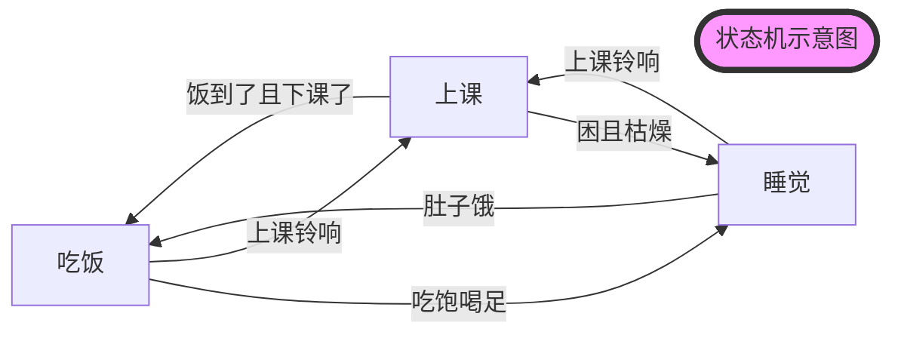

# SRC中的lua
本文将大致介绍SRC代码系统中的lua部分，按照文件夹的结构依次向读者展示lua部分的组成和各自的功用
## config
详见第三节“特殊的lua”

## Select Play
在程序开始运行时，先运行SelectPlay.lua，判断运行哪个脚本。如果是TestMode则运行config里指定的test脚本，如果不是TestMode则运行config里指定的NormalKick脚本

```lua
---------------------------------------
--选play--gCurrentPlay在config中指定
--------------------------------------
if SelectRefPlay() then --有裁判盒指令
	...
else --没有裁判盒指令
	if IS_TEST_MODE then --if在测试模式下，IS_TEST_MODE接config
		...
	else --不在测试模式，一般为比赛模式
		...
	end
end
```
选定脚本（即gCurrentPlay）后，通过RunPlay(gCurrentPlay)运行脚本。此处一般会接Test系列脚本或比赛时的NormalKick脚本

# Opponent
opponent中的NormalKick系列脚本用于比赛期间，当裁判盒发出指令后，根据接收到的指令判断运行哪个脚本，例如：

```lua
gOppoConfig = {
    ------------------------------play-----------------------------------
    
        CornerKick  = {"Ref_CornerKick_show"},
        FrontKick   = {"Ref_FrontKick_show"},
        MiddleKick  = {"Ref_MiddleKick_show"},
        BackKick    = {"Ref_BackKick_show"},
        
    -------------------------------Def-----------------------------------
    
        CornerDef   = "Ref_CornerDef_show",
        FrontDef    = "Ref_FrontDef_show",
        MiddleDef   = "Ref_MiddleDef_show",
        BackDef 	= "Ref_BackDef_show",
    
    -------------------------------Special-------------------------------
    
        PenaltyKick = "Ref_PenaltyKick_normal",
        PenaltyDef  = "Ref_PenaltyDef_normal",
    
        KickOff		= "Ref_KickOff_show",
        KickOffDef  = "Ref_KickOffDef_show",
        
        NorPlay     = "Nor_4_show",
    }
```
## Play
Play分为Nor、Ref和test两部分，Nor和Ref部分分别放置了NormalKick中NorPlay指令包含的脚本和其它指令包含的脚本。Test系列脚本用于开发时的各种Skill测试，在TestMode下运行。

### 脚本介绍
这部分的脚本的底层逻辑是状态机跳转，通过分析场上的情况决定进入哪种状态，进而执行哪种任务.

#### 状态机

!!! question "什么是状态机"
    状态机用来描述系统在面对不同情况下的行为.状态机的组成包括 **当前状态** 、**输出事件** 、**状态转移** 等.

    状态机的设计遵循以下步骤
    
    1. 定义状态：确定系统需要的所有状态
    
    2. 定义转换：确定状态之间的转换规则，包括触发转换的事件和条件
    
    3. 设计状态转移图：使用图形化的方式表示状态和转换，这有助于理解和设计状态机
    
    4. 实现状态机：根据设计的状态转移图，使用编程语言或硬件描述语言实现状态机

举个例子:


- 三个状态:睡觉,吃饭,上课
- 对应三个输出事件:闭眼,心率降低,呼吸拉长; 牙齿咬合,舌头搅拌,消化系统活跃; 发呆,游离,打哈欠
- 四个状态转移:睡觉->上课,上课->睡觉,吃饭->上课,上课->吃饭,睡觉->吃饭,吃饭->睡觉
- 状态转移条件:上课铃响,肚子饿,饭到了且下课了,困且枯燥...
-------

#### 用lua写状态机

1. 进入一个状态，
   
2. 从World Model中获取信息，判断下一步进入哪个状态

3. 动作分配

4. 匹配规则
我们以Ref中的Ref_BackKick_th.lua脚本为例

```lua
--首先是变量和函数的定义和声明
--定义一些可能要用到的值,包括距离阈值,跑位点等
local SHOOT_POS = ball.antiYPos(CGeoPoint:new_local(120/1200*param.pitchLength,0/900*param.pitchWidth))

local RECEIVE_POS = function()
  return SHOOT_POS() + Utils.Polar2Vector(20,ball.toPointDir(SHOOT_POS())()+ball.antiY()*math.pi/4)
end
...

--从gPlayTable.CreatPlay开始为程序的主体部分
-- 在实现中，每个状态都是一个Lua的table类型变量，
-- 包括switch，match，Kicker、Goalie（各个角色）这些键
gPlayTable.CreatePlay{

  firstState = "toBall1", --进入第一个状态

  ["toBall1"] = {
    switch = function () --switch中进行状态跳转的决定
      if bufcnt(player.toTargetDist("Assister") < 5, 10, 180) then
        return "toBall2" --满足if条件，跳转到 “toBall2”
      end
    end,
    --若不跳转状态，在此状态下场上4辆车分别担任以下任务,调用封装的SKill
    Assister = task.goCmuRush(...),--跑位
    Leader = task.goCmuRush(...),--跑位
    Powerhouse = task.support(...),
    Goalie   = task.goalieNew(),--守门
    --在match部分进行任务匹配.match = ""就是不匹配。match中从左往右优先级依次降低，对场上车辆而言离球从近到远的优先级由高到低。例如下面离任务点（一般是球的位置）最近的车成为Assiter，执行goCmuRush任务，以此类推。Goalie固定为0号车，不用匹配。这里Goalie的固定车号在Config中的gRoleFixNum里设置
    --一对括号内的任务点为“一组”，按组依次匹配组内的最优任务点执行车辆。[]:Real Time，实时最优匹配；():Once，进入状态后匹配一次；{}:Never，除非该状态为进入脚本初状态才会匹配一次
    match    = "[A][L][P]",
    --order用于当有车被罚下时，如有一辆车被罚下，则先取消Assister的角色，即场上不会有车执行Assister的任务，以此类推
    order="ALP"
  },
  ["toBall2"] = {
    switch = function ()
      if bufcnt(player.toTargetDist("Assister") < 5, 10, 180) then
        return "getball"
      end
    end,
    Assister = task.goCmuRush(...),
    Leader = task.goCmuRush(...),
    Powerhouse = task.support(...),
    Goalie   = task.goalieNew(),
    match    = "[A][L][P]",
    order="ALP"
  },
  ...
  --最后是程序结束部分  
  --可以直接简单理解为格式,其中name对应文件名
  name = "Ref_BackKick_show",--文件名
  applicable = {
    exp = "a",
    a   = true
  },
  attribute = "attack",
  timeout = 99999

}
```
#### 匹配规则
- 由于在机器人足球比赛中,以多智能体的形式执行动作,因此匹配动作的执行者非常重要

- 目前的匹配机制以离任务点的距离来作优先级进行区分

- 以下是可使用的球员角色


**三种匹配机制**:

一对括号内的任务点为“一组”(1)，按组依次匹配组内的最优任务点执行车辆
    { .annotate }

1.  详情参见RoleMatch.lua

------
- []: Real Time，实时最优匹配

- (): Once，进入状态后匹配一次

- {}: Never，除非该状态为进入脚本初状态才会匹配一次


-------

#### 常用到的状态跳转时调用的函数

##### bufcunt

```lua
bufcnt(player.toTargetDist("Assister") < 5, 10, 180)
```

!!! success "巧用bufcnt实现状态机跳转"
    bufcnt相比其他的状态跳转如if,else,switch case等,可以实现更加复杂的跳转逻辑

    bufcnt(cond, buf, cnt)
    
    其中cond为跳转条件,buf为满足的cond的持续帧数,当满足cond时间超过buf后返回true
    
    当一直没有切换状态的时间超过buf后也返回true
    ```lua
    switch = function ()
    	if bufcnt(player.toTargetDist("Kicker") < distThreshold , 300, 1000) then
    		return "run2";
    	end
    end,
    ```
-------

下面是一些常用的bufcunt里的第一个参数:

```lua
player.toTargetDist(role) --role到目标点的距离

player.toPointDist(role, point) --role到point的距离

player.kickBall(role) --role将球踢出

ball.toPlayerHeadDist(role) --球到接球车的距离
```
##### ball

详情可见ssl\worldmodel\ball.lua

```lua
--位置
ball.pos()
ball.posX()
ball.posY()
---速度 
ball.vel()
ball.velX()
ball.velY()
--距离
ball.toPlayerHeadDist() --球到某球员的距离
ball.toPlayerHeadDir() --球到某球员的方向
--其他
ball.antiYPos(p) --将 p 点的 Y 坐标取为负值
ball.syntYPos(p) --将 p 点的 Y 坐标取为正值
ball.refAntiYPos(p) --在定位球中使用的反向点
ball.refSyntYPos(p) --在定位球中使用的同向点v
```
##### player
详情可见ssl\worldmodel\player.lua
```lua
--位置及朝向
player.pos()
player.posX()
player.posY()
player.dir() 
player.vel()
--速度
player.vel()
player.velDir()
player.velMod()
--距离
player.toBallDist()
player.toBallDir()
player.toTargetDist()
palyer.toPointDist()
--机器人是否拿到球了(返回值越大越可能拿到球了)
world:getBallPossession(true, gRoleNum["Kicker"])
```

## Skill
Skill中的各种脚本在task中的各种函数中被调用（详见task的介绍），自身调用C++中的skill。

### 脚本介绍

```lua
function AdvanceBallV4(task) --函数名
	local mpos --匹配的坐标
	local mflag     = task.flag or 0 --任务标签，flag.lua里的
	local mrole     = task.srole or "" 
	local tandem = function () --可能的函数
		return gRoleNum["Special"]
	end

	execute = function(runner)
		if runner >= 0 and runner < param.maxPlayer then
			...
		else
			print("Error runner in AdvanceBall", runner)
		end
		local tandemNum    = tandem() and tandem() or 0
		return CAdvanceBallV4(runner, mflag, tandemNum)  --调用C++中的底层skill
	end

	matchPos = function()
		if type(task.pos) == "function" then
			mpos = task.pos()
		else
			mpos = task.pos
		end
		return mpos
	end
	return execute, matchPos
end

gSkillTable.CreateSkill{
	name = "AdvanceBallV4", --skill名
	execute = function (self)
		print("This is in skill"..self.name)
	end
}
```

## Utils

* bit：TODO；

* bufcunt：状态跳转的判定

* file：打开/关闭等等文件操作

* learn：TODO；

* score：TODO；

## WorldModel
这部分包含了在opponent，play，skill的各个脚本中都可以调用的一些工具性函数，包括：

* ball.lua：与球有关的函数，可提供包括但不限于球的坐标，速度，到车距离，运动方向等等

* combo.lua：对task.lua更高一层的抽象,包括一些通过标志位决定的task和一些组合的task

* cond.lua：TODO （由名字看大概是判断各种状态？？比如匹配的决定什么的）例如isGameOn()判断比赛是否开始；

* cp.lua：与挑射有关的函数，可提供不同的挑射力度

* dir.lua：与角度有关的函数，可提供包括但不限于球与球门连线的角度，球车连线角度，车与球门连线的角度等等

* enemy.lua：与敌方车辆有关的函数，可提供包括但不限于敌方的坐标，速度，到我方车辆的距离，运动方向等等

* flag.lua：各种状态标签，用于控制车的运动，例如nothing(无特殊要求)dodge_ball(避球)
avoid_shoot_line(避开射门线)placer_to_ball_dis(放球车到球距离)等等

* kick.lua：与踢球有关的函数，用于判定是挑球还是平射等等

* kp.lua：与平射有关的函数，可提供不同的平射力度

* param.lua：与场地有关的参数，如球员数、场地的长宽、球门的长宽深等等

* player.lua：与我方车辆有关的函数，可提供包括但不限于我方的坐标，速度，到我方车辆的距离，运动方向等等

* pos.lua：与坐标有关的函数，提供各种坐标，如踢球点等等

* pre.lua：与精度有关的坐标，可能在临界情况判定或踢球角度校准中用到

* task.lua：与车所执行的任务有关的函数，包含了在opponent，play，skill的各个脚本中车辆调用的task函数，如射门、传球、防守、盯人等等

这里简单介绍一下task中函数的基本架构，以传球函数pass()为例：
```lua
function pass(role, power) --函数名
	local idir,ikp
  --这一段决定车的朝向
	if type(role) == "string" then 
		idir = ball.toPlayerHeadDir(role)
	elseif type(role) == "function" then
		idir = ball.toFuncDir(role)
	elseif type(role) == "userdata" then
		idir = player.antiYDir(role)
	end

  --这一段决定踢球的力度
	if power == nil then
		ikp =  kp.toTarget(role)
	else
		ikp = kp.specified(power)
	end

  --在此处调用Skill中的ChaseKickV2函数，传入两个参数pos和dir，其中pos代表匹配时的任务点（参见前文play小节关于匹配的说明），dir代表车的朝向
	local mexe, mpos = ChaseKickV2{pos = ball.pos, dir = idir}
  --返回部分依次包括{mexe, mpos, 平射/挑射，车的朝向，精度，平射力度，挑射力度，任务标签}，前两项为必填项，后面的参数可省略（此处若省略则需要全部省略）。
	return {mexe, mpos, kick.auto(role), idir, pre.middle, ikp, cp.toPlayer(role), flag.nothing}
end
```

下面列举一些常用的task：

### 防守型

```lua
--防守时反踢
task.defendKick()
--退回禁区附近防守
task.sideBack()
task.leftBack()
task.rightBack()
--守门
task.golieNew()
--盯人，First/Second代表离球最近的第一/二辆敌方车
task.marking("First"/"Second"/...)
--在禁区边线附近防守，车头一直朝向球
task.defendMiddle()
```


### 进攻型
```lua
--跑位函数，CGeoPoint为要走的点, dir默认为射门朝向, ACC为加速度, flag为相关的任务标签。
task.goCumRush(CGeoPoint, dir, ACC, flag)
--去拿球，拿到球后往球门射一脚。
task.chase()
task.chaseNew()--智能射门
--静态拿球，比较稳，但拿球速度也慢，去CGeoPoint拿球,anti若为false,则不将点进行反向，f为传入的flag。
task.staticGetBall(CGeoPoint, anti, f)
--去pos拿球。
task.getball(pos)
--挑传到CGeoPoint，力度为power，flag为相关的任务标签。
task.chipPass(CGeoPoint, power,_,_, flag)
--平传给role，力度为power。
task.flatPass(role, power)
--传球给role，力度为power。role为接球车或某个点。
task.pass(role, power)
--向dir方向传球，力度为power。
task.passToDir(dir, power)
--传球到CGeoPoint，力度为power，精度为precision。
task.passToPos(CGeoPoint, power, precision)
--接role传来的球，在CGeoPoint接球。
task.receive(role, CGeoPoint)
task.receivePass(role, CGeoPoint)
```

## 其它
### DebugEngine
DebugEngine是我们开发的和Falcon配套的debug系统，其主要作用是将debug信息显示在Falcon的界面上，方便查看。在跑仿真的时候可以看到场地上有很多我们开发时遗留的debug信息。下面简单介绍一下：

```lua
debugEngine:gui_debug_msg(CGeoPoint:new_local(-50, -param.pitchWidth/2),massage)
--debugEngine：类
--gui_debug_msg：类中的debug函数
--CGeoPoint:new_local(x, y)：debug信息在场地上显示的坐标，CGeoPoint是我们自己的一个坐标点的类
--massage：要print出的信息，这里是字符串，其它类型的变量要转换成字符串再输出
```


一些基础的debug函数：
```C++
//此处的debug_color包括
#define COLOR_WHITE 0
#define COLOR_RED 1
#define COLOR_ORANGE 2
#define COLOR_YELLOW 3
#define COLOR_GREEN 4
#define COLOR_CYAN 5
#define COLOR_BLUE 6
#define COLOR_PURPLE 7
#define COLOR_GRAY 8
#define COLOR_BLACK 9
//用X标出某个坐标点
void gui_debug_x(const CGeoPoint& p, char debug_color = 1);
//画出从p1到p2的直线
void gui_debug_line(const CGeoPoint& p1, const CGeoPoint& p2, char debug_color = 1);
//在某点处print信息
void gui_debug_msg(const CGeoPoint& p, const char* msgstr, char debug_color = 1);
```
注意，上文的函数为C++中定义的函数，若在lua中调用，则需采用debugEngine::gui_debug_...形式