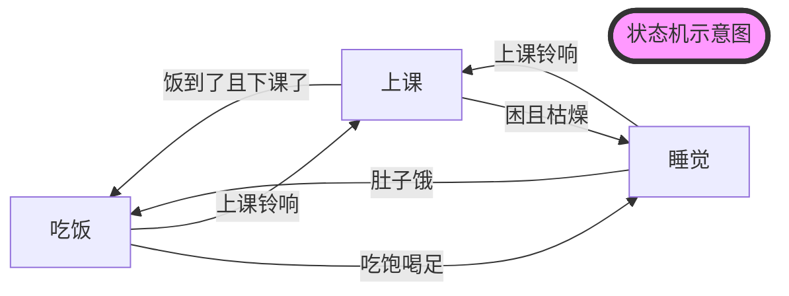

# 状态机与跳转

本文将大致介绍SRC代码系统中lua部分最重要的逻辑，即状态机跳转，以及Play文件夹下的个脚本。这些脚本在脚本选择后被调用，是组织机器人在场上活动的核心。

## Play

Play分为Nor、Ref和test两部分，Nor部分放置了NormalKick中NorPlay指令链接的脚本，Ref部分放置了其它指令链接的脚本。Test系列脚本用于开发时的各种Skill测试，在TestMode下运行。

这部分的脚本的底层逻辑是状态机跳转，通过分析场上的情况决定进入哪种状态，进而执行哪种任务.

## 状态机

!!! question "什么是状态机"
    状态机用来描述系统在面对不同情况下的行为.状态机的组成包括 **当前状态** 、**输出事件** 、**状态转移** 等.

    状态机的设计遵循以下步骤
    
    1. 定义状态：确定系统需要的所有状态
    
    2. 定义转换：确定状态之间的转换规则，包括触发转换的事件和条件
    
    3. 设计状态转移图：使用图形化的方式表示状态和转换，这有助于理解和设计状态机
    
    4. 实现状态机：根据设计的状态转移图，使用编程语言或硬件描述语言实现状态机

举个例子:



- 三个状态:睡觉,吃饭,上课
- 对应三个输出事件:闭眼,心率降低,呼吸拉长; 牙齿咬合,舌头搅拌,消化系统活跃; 发呆,游离,打哈欠
- 四个状态转移:睡觉->上课,上课->睡觉,吃饭->上课,上课->吃饭,睡觉->吃饭,吃饭->睡觉
- 状态转移条件:上课铃响,肚子饿,饭到了且下课了,困且枯燥...


### 用lua写状态机

1. 进入一个状态，

2. 从World Model中获取信息，判断下一步进入哪个状态

3. 动作分配

4. 匹配规则
我们以Ref中的Ref_BackKick_th.lua脚本为例

```lua
--首先是变量和函数的定义和声明
--定义一些可能要用到的值,包括距离阈值,跑位点等
local SHOOT_POS = ball.antiYPos(CGeoPoint:new_local(120/1200*param.pitchLength,0/900*param.pitchWidth))

local RECEIVE_POS = function()
  return SHOOT_POS() + Utils.Polar2Vector(20,ball.toPointDir(SHOOT_POS())()+ball.antiY()*math.pi/4)
end
...

--从gPlayTable.CreatPlay开始为程序的主体部分
-- 在实现中，每个状态都是一个Lua的table类型变量，
-- 包括switch，match，Kicker、Goalie（各个角色）这些键
gPlayTable.CreatePlay{

  firstState = "toBall1", --进入第一个状态

  ["toBall1"] = {
    switch = function () --switch中进行状态跳转的决定
      if bufcnt(player.toTargetDist("Assister") < 5, 10, 180) then
        return "toBall2" --满足if条件，跳转到 “toBall2”
      end
    end,
    --若不跳转状态，在此状态下场上4辆车分别担任以下任务,调用封装的SKill
    Assister = task.goCmuRush(...),--跑位
    Leader = task.goCmuRush(...),--跑位
    Powerhouse = task.support(...),
    Goalie   = task.goalieNew(),--守门
    --在match部分进行任务匹配.match = ""就是不匹配。match中从左往右优先级依次降低，对场上车辆而言离球从近到远的优先级由高到低。例如下面离任务点（一般是球的位置）最近的车成为Assiter，执行goCmuRush任务，以此类推。Goalie固定为0号车，不用匹配。这里Goalie的固定车号在Config中的gRoleFixNum里设置
    --一对括号内的任务点为“一组”，按组依次匹配组内的最优任务点执行车辆。[]:Real Time，实时最优匹配；():Once，进入状态后匹配一次；{}:Never，除非该状态为进入脚本初状态才会匹配一次
    match    = "[A][L][P]",
    --order用于当有车被罚下时，如有一辆车被罚下，则先取消Assister的角色，即场上不会有车执行Assister的任务，以此类推
    order="ALP"
  },
  ["toBall2"] = {
    switch = function ()
      if bufcnt(player.toTargetDist("Assister") < 5, 10, 180) then
        return "getball"
      end
    end,
    Assister = task.goCmuRush(...),
    Leader = task.goCmuRush(...),
    Powerhouse = task.support(...),
    Goalie   = task.goalieNew(),
    match    = "[A][L][P]",
    order="ALP"
  },
  ...
  --最后是程序结束部分  
  --可以直接简单理解为格式,其中name对应文件名
  name = "Ref_BackKick_show",--文件名
  applicable = {
    exp = "a",
    a   = true
  },
  attribute = "attack",
  timeout = 99999

}
```

## 匹配规则

- 由于在机器人足球比赛中,以多智能体的形式执行动作,因此匹配动作的执行者非常重要

- 目前的匹配机制以离任务点的距离来作优先级进行区分

- 以下是可使用的球员角色


**三种匹配机制**:

一对括号内的任务点为“一组”(1)，按组依次匹配组内的最优任务点执行车辆
    { .annotate }

详情参见RoleMatch.lua


- []: Real Time，实时最优匹配

- (): Once，进入状态后匹配一次

- {}: Never，除非该状态为进入脚本初状态才会匹配一次


## 常用到的状态跳转时调用的函数

### bufcunt

```lua
bufcnt(player.toTargetDist("Assister") < 5, 10, 180)
```

!!! success "巧用bufcnt实现状态机跳转"
    bufcnt相比其他的状态跳转如if,else,switch case等,可以实现更加复杂的跳转逻辑

    bufcnt(cond, buf, cnt)
    
    其中cond为跳转条件,buf为满足的cond的持续帧数,当满足cond时间超过buf后返回true
    
    当一直没有切换状态的时间超过buf后也返回true
    ```lua
    switch = function ()
    	if bufcnt(player.toTargetDist("Kicker") < distThreshold , 300, 1000) then
    		return "run2";
    	end
    end,
    ```


下面是一些常用的bufcunt里的第一个参数:

```lua
player.toTargetDist(role) --role到目标点的距离

player.toPointDist(role, point) --role到point的距离

player.kickBall(role) --role将球踢出

ball.toPlayerHeadDist(role) --球到接球车的距离
```

##### ball

详情可见ssl\worldmodel\ball.lua

```lua
--位置
ball.pos()
ball.posX()
ball.posY()
---速度 
ball.vel()
ball.velX()
ball.velY()
--距离
ball.toPlayerHeadDist() --球到某球员的距离
ball.toPlayerHeadDir() --球到某球员的方向
--其他
ball.antiYPos(p) --将 p 点的 Y 坐标取为负值
ball.syntYPos(p) --将 p 点的 Y 坐标取为正值
ball.refAntiYPos(p) --在定位球中使用的反向点
ball.refSyntYPos(p) --在定位球中使用的同向点v
```

##### player

详情可见ssl\worldmodel\player.lua

```lua
--位置及朝向
player.pos()
player.posX()
player.posY()
player.dir() 
player.vel()
--速度
player.vel()
player.velDir()
player.velMod()
--距离
player.toBallDist()
player.toBallDir()
player.toTargetDist()
palyer.toPointDist()
--机器人是否拿到球了(返回值越大越可能拿到球了)
world:getBallPossession(true, gRoleNum["Kicker"])
```
