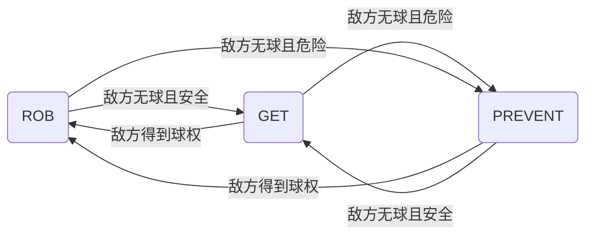

> sasuke-yang 24.11

## 用途和使用方法

`getBallV5`是综合性的拿球,目前包括了多种拿球手段: 安全拿球, 截球, 抢球

调用时,可以在lua层的状态机调用`task.getBall(dir)`, 其中dir为拿球后预期朝向的方向.在C++层以如下方式调用

````C++
setSubTask(PlayerRole::makeItNoneTrajGetBall(_executor, KickorPassDir, CVector(0, 0), ShootNotNeedDribble, GetBallBias,CMU_TRAJ, Intercept));
````
或者是重载

````C++
setSubTask(PlayerRole::makeItNoneTrajGetBall(_executor, KickorPassDir,intercept, f);
````


具体实现见`factory.cpp`, 前两个参数`num, dir`分别为拿球车车号和拿球后预期朝向的方向, 后面为缺省实现的细节参数


??? warning
    lua层调用时注意大小写
    ifintercept参数后续弃用

## 核心原理
此函数的核心原理是预测得到敌方和己方机器人接球的时刻,然后根据时间差来决定拿球方式,是安全拿球还是比较冒险的拦截球
````C++
double CGetBallV5::IsOKGetball(const CVisionModule *pVision, const int robotNum)
{
    const PlayerVisionT &me = pVision->OurPlayer(robotNum);
    const PlayerVisionT &opp = pVision->TheirPlayer(opponentID);
    const BallVisionT &ball = pVision->Ball();
    int t1, t3;
    // cout << &t1 << "dasd" << &t3 << endl;
    Ball_Predict_Pos(pVision, &t1, robotNum);
    Ball_Predict_Pos(pVision, &t3, opponentID, 1); // t1, t3分别代表预测敌我双方机器人接球的时间
    t1 = (abs(t1) > 300) ? 300 : t1;
    t3 = (abs(t3) > 300) ? 300 : t3;
    GDebugEngine::Instance()->gui_debug_msg(CGeoPoint(650, -400), ("metime" + to_string(t1)).c_str(), COLOR_YELLOW);
    // GDebugEngine::Instance()->gui_debug_msg(CGeoPoint(-350, 40), (std::to_string(t2).c_str()), COLOR_YELLOW);
    GDebugEngine::Instance()->gui_debug_msg(CGeoPoint(760, -400), ("opptime" + to_string(t3)).c_str(), COLOR_YELLOW);
    // GDebugEngine::Instance()->gui_debug_msg(CGeoPoint(-350, 60), (std::to_string(t4).c_str()), COLOR_YELLOW);
    // if(!opponentID) return 0;
    if (!pVision->getTheirValidNum())
        return 0;

    return (double)t1 / t3;
}
````
此函数是`Ball_Predict_Pos`的具体实现,其中`opponentID`为敌方最有可能拿球的机器人,`Ball_Predict_Pos`函数的返回值是预测的拿球时刻和预期拿球点.返回值越小越容易拿到球.

实现方法是依赖于机器人模型和球模型的预测,利用搜索的方式预测接球点.设定1帧的步长,依次预测t帧后的接球点,并计算机器人和球分别到点的时间.直到找到最早的时间,使得机器人到点的时间比球到点的时间早.此时返回预测的接球点.
````C++
CGeoPoint CGetBallV5::Ball_Predict_Pos(const CVisionModule *pVision, int *Frame, int num, int flag) // 返回最佳的点 flag 为0表示我方 1表示对方
{
    const int robotNum = (num == -1) ? task().executor : num;
    const PlayerVisionT &me = (!flag) ? pVision->OurPlayer(robotNum) : pVision->TheirPlayer(robotNum);
    const BallVisionT &ball = pVision->Ball();
    if (ball.Vel().mod() < 5)
    {
        if(Frame)
            *Frame = PredictForRobot(ball.Pos(), pVision, robotNum, flag);
        return ball.Pos();
    }
    CGeoPoint point;
    int FramePerfect = 0;
    for (FramePerfect = 1; FramePerfect <= 300; FramePerfect++)
    {
        int TmpTime = PredictForRobot(PredictForBall(FramePerfect, pVision), pVision, robotNum, flag) + adjust_time;//adjust_time用于手调机器人接球时间, 为0则完全依据模型, 为负数则速度比模型预测提前接球
        if (TmpTime < FramePerfect)
            break;
    }
    // 做二分不合适, 因为随着球移动时间增加,球到达某个位置的时间-人到达改位置的时间并不单调! 应该搜索! --2024.9 sasuke-yang
    point = PredictForBall(FramePerfect, pVision);
    if (Frame)
        *Frame = FramePerfect;
    return point;
}
````
??? info
    原先是利用二分的方式得到时间,后续发现做二分不合适, 因为随着球移动时间增加,球到达某个位置的时间-人到达改位置的时间并不单调! 应该搜索!

## 参数管理
- 目前由于没有准确的机器人运动模型,因此引入`adjust_time`参数用于手调机器人接球时间, 为0则完全依据模型, 为负数则速度比模型预测提前接球.
- `DEBUG_ENGINE`为debug开关,用于在调试时显示调试信息.

## 状态机跳转


### ROB

- 上身体对抗 几乎取消夺球敌人的避障圈
- 若我也拿到了球，我需要把球吸出来
- 若我没拿球
	-   敌人背向球门 且 我被敌人挡住无法触球 -> 卡住敌人使其无法转身射门
	-   我没有被敌人挡住可以触球 -> 上前吸球
	-   我被挡住了 敌人面对球门但没有进入进攻三区 -> 试图拦截传球并靠近敌人
	-   我被挡住了 敌人已经可以射门了 -> 绕道封堵射门

### PREVENT

- 卡位阻碍接球
- 投影点接球
- 找出球在高速运动时(可能是对方传球)   可能的接球人, 并提前阻碍接球
- 直接去抢球

### GET

- 边线救球
- 防止一直没拿到球磕碰的缓冲
- 即将拿球的后退缓冲
- 慢速球情况下防止把球冲走慢速拿球
- 直接去拿球

## TODO:

1. 优化模型,得到准确的机器人运动模型.
2. ROB, INTERCEPT, GET拆分并各自丰富.
	- ROB抢球减少僵持, 减少开吸球嘴时间,保护机器人
	- INTERCEPT目前看来截球成功率较低
	- 可以考虑多加入拿球时对拿球时所处位置的考虑,目前只有边线救球
3.  状态机跳转完善,预期最后都能跳转到GET中的ready to get中, 可以考虑将拿球后调整方向单独化

