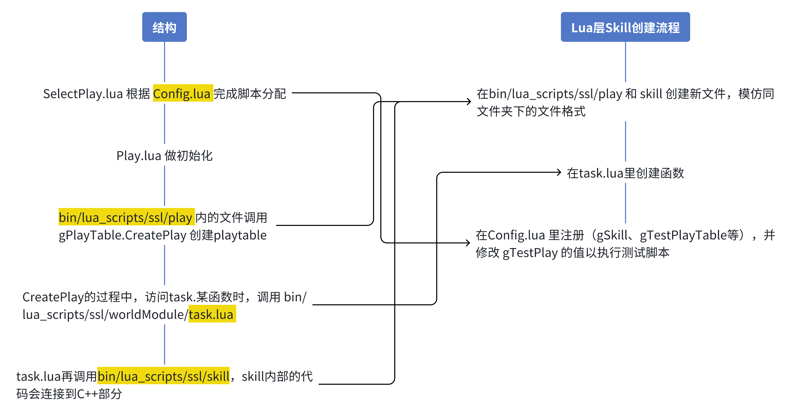
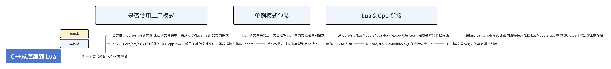

# 如何写一个skill

## 1. 什么是skill

Skill 是可以在Lua状态机层，被某辆车使用的函数。如 `task.staticGetBall(ball.pos())` 的就是一个skill。

```lua
["chase"] = { -- 状态机内的一个状态
    switch = function ()
        if world:getBallPossession(true, gRoleNum["Kicker"]) > 0.3 then
            return "break";
        end
    end,
    
    Kicker = task.staticGetBall(ball.pos()), -- task.staticGetBall 是一个 skill
    match = ""
},
```

Skill 是最常见的策略函数。一个完整的 Skill 有能力具体地描述小车一段时间内所有的行为，可以处理场地环境信息，其他车辆（我方和敌方）和球的运动状态信息。写好 Skill 是掌握 SRC 软件开发的基础。

## 2. Skill 的基本结构

完成 Skill 的编写，需要了解的基本结构包括：

- Lua 层：状态机分派任务，决定哪一个 Skill 被执行。
- C++ 层：实现 Skill 的具体功能，主要承担具体计算和控制的任务。

下文将分两层详细的介绍 Skill 的编写方法。

## 3 Lua 层

Lua层主要承担最顶层状态机的功能，并可通过一系列脚本筛选并调用 Lua skills。

- 所有决策相关脚本位置: bin/base/lua_scripts/ssl
- 重要脚本：Config.lua, SelectPlay.lua

### 3.1 Lua 结构 & 创建Skill的流程



下文将举例说明如何在 Lua 层完成 Skill 的注册和测试代码编写。

#### 3.1.1 bin/base/lua_scripts/ssl/play/ 内的新文件创建

```lua

--bin/base/lua_scripts/ssl/play/Test_ChaseKick.lua 古老的追踢代码

local ALL_AVOID = flag.dodge_ball + flag.avoid_stop_ball_circle + flag.avoid_shoot_line
local ALL_NOT_AVOID = flag.not_avoid_their_vehicle + flag.not_avoid_our_vehicle + flag.not_dodge_penalty
local FLAG = ALL_AVOID + flag.dribbling

local distThreshold = 50

--本质上就是一个表
gPlayTable.CreatePlay{

firstState = "chase", -- 初始状态

["chase"] = { -- 一个状态机
    switch = function ()
        if world:getBallPossession(true, gRoleNum["Kicker"]) > 0.3 then
        --if bufcnt(world:getBallToucher() == gRoleNum["Kicker"], 5) then
        --if bufcnt(robotSensor:IsInfraredOn(1), 5)then
            return "break";
        end
    end,
    
    Kicker = task.staticGetBall(ball.pos()),
    match = ""
},
["break"] = {
    switch = function ()
        if world:getBallPossession(true, gRoleNum["Kicker"]) == 0 then
        --if bufcnt(world:getBallToucher() ~= gRoleNum["Kicker"], 10) then
        --if bufcnt(not robotSensor:IsInfraredOn(1), 10)then
            return "chase";
        end
    end,
    Kicker = task.testBreak(CGeoPoint:new_local(param.pitchLength / 2, 0)),
    match = ""
},

name = "Test_ChaseKick",
applicable ={
    exp = "a",
    a = true
},
attribute = "attack",
timeout = 99999

}

```

#### 3.1.2 task.lua 内的新函数

```lua
function chase()
    local mexe, mpos = ChaseKick{dir = dir.chase}--调用skill部分
    return {mexe, mpos, kick.flat, dir.chase, pre.middle, kp.full(), cp.full(), flag.nothing}
end
```

#### 3.1.3 bin/base/lua_scripts/ssl/skill/ 内的新文件创建

```lua

function ChaseKick(task) --bin/base/lua_scripts/ssl/skill/ChaseKick.lua
    local mdir
    local mflag = task.flag or 0 --flag是形如 8'b00001010 的二进制码
    execute = function(runner)
        if type(task.dir) == "function" then
            mdir = task.dir(runner)
        else
            mdir = task.dir
        end
        return CChaseKick(runner, mdir, mflag) -- 在这里调用c++的部分，也就是LuaModule.cpp工厂的一个类
    end

    matchPos = function()
        return ball.pos()
    end

    return execute, matchPos --最终传给用来匹配车号的Lua脚本
end

gSkillTable.CreateSkill{
    name = "ChaseKick",
    execute = function (self)
        print("This is in skill"..self.name)
    end
}。-- 同时在gskilltable注册
```

## 4 C++ 层

C++层位于 Core/src，其中 Core/src/LuaModule 负责C++与Lua的衔接， Core/src/ssl 负责储存具体的C++代码，Core/src/SSLstrategy 是核心。

### 4.1 C++ 层结构 & 沟通 Lua 的方式



下文将逐步说明 C++ 层的具体结构，Skill 的实现原理，以及如何在 C++ 层完成 Skill 核心内容的编写。

#### 4.1.1 C++ skill 的工厂模式

###### 4.1.1.1 CTaskFactoryV2 

作为所有 skill 的第一层包装，CTaskFactoryV2 主要有两个功能

1. MakeTask 模版为每个executor（每辆车）管理task。

2. 将全体 task 统一通过工厂自身的 NormalSingleton 包装加上 MakeTask 的分配，在NormalSingleton 创造的单例的空间中再次实现单例。

```cpp
//CTaskFactoryV2。定义于 Core/src/ssl/skill/Factory.h

class CPlayerTask;
class CTaskFactoryV2 {
public:
    //skill 本身的task
    CPlayerTask* GoPIDCircle(const TaskT& task);
    //略

protected:
    template < class CTaskType >
    CPlayerTask* MakeTask(const TaskT& task); // 包装skill为task，定义于Factory.cpp
};

typedef Falcon::NormalSingleton<CTaskFactoryV2> TaskFactoryV2; //将整个工厂包装成单例，NormalSingleton 定义于 share/singleton.h

namespace PlayerRole {
   //调用skill的接口
   CPlayerTask* makeItGoPIDCircle(const int runner, const CGeoPoint pos, const double r, const bool opt);
   //略
}

#endif // _TASK_FACTORY_V2_H_
```

###### 4.1.1.2 CPlayerTask

CPlayerTask 是所有C++ skill的父类，规范化skill撰写，并给了子类访问当前task执行状态的权限。

```cpp

//CPlayerTask，定义于 Core/src/ssl/skill/PlayerTask.h
class CPlayerTask{
public:
    CPlayerTask() : _pSubTask(0){ }
    virtual ~CPlayerTask() { }
    virtual void plan(const CVisionModule* pVision); ///<规划
    virtual CPlayerCommand* execute(const CVisionModule* pVision)///<执行
    virtual bool isEmpty() const; // 是否空任务
    
    //友元重载了 "<<" 运算符，让 task 的信息可以输出到 shell 中。
    friend std::ostream& operator << (std::ostream& os, const CPlayerTask& task)
    {
        task.toStream(os);
        if( task.subTask() ){
            os << "-->" << *(task.subTask());
        }
        return os;
    }
    virtual void reset(const TaskT& task) { _task = task; }
protected:
    virtual void toStream(std::ostream& os) const { os << "Invalid task"; }
    void setSubTask(CPlayerTask* pTask){ _pSubTask = pTask; } 
    CPlayerTask* subTask() const{ return _pSubTask; }
    const TaskT& task() const { return _task; }
    TaskT _task; //　任务的具体内容
private:    
    CPlayerTask* _pSubTask; // 子任务
};

```

##### 4.1.1.3 其他 skill 相关
- 书写skill时，还可参考TaskT的定义（Core/src/ssl/misc_types.h）从父类的 task() 中提取车辆状态信息，或直接使用 const CVisionModule* pVision 来访问当前场上的信息。
- Util模块（Core/src/ssl/utils.h）内有丰富的数学/物理函数。

#### 4.1.2 单例模式

单例模式的包装类定义于 share/singleton.h， 了解一下即可。

```cpp

    template <typename SingletonClass>
    class NormalSingleton {
    public:
        static SingletonClass* Instance() {
            static SingletonClass* instance = nullptr;
            if (!instance) {
                instance = new SingletonClass; 
            }
            return instance;
        }

        SingletonClass* operator ->() { return Instance(); }

        const SingletonClass* operator ->() const { return Instance(); }

    private:
        NormalSingleton(){}

        ~NormalSingleton(){}

        NormalSingleton(const NormalSingleton&);

        NormalSingleton& operator=(const NormalSingleton&);
    };

```

#### 4.1.3 LuaModule
Core/src/LuaModule.cpp 内定义了将函数从 C++ 翻译到 Lua 的方法。

1. 首先定义Lua层信息和cpp层信息的转化方法。

```cpp

// extern 关键字表示引用某定义于本文件之外的同名全局变量的值，
// extern "C" 保证函数名不会被编译器与函数形参混淆。
extern "C" int Skill_CrazyPush(lua_State * L) {
    int runner = LuaModule::Instance()->GetNumberArgument(1, NULL); //从 Lua 传入变量
    double faceDir = LuaModule::Instance()->GetNumberArgument(2, NULL);
    CPlayerTask* pTask = PlayerRole::makeItCrazyPush(runner, faceDir); // 从Factory.cpp 的 namespace 引用
    TaskMediator::Instance()->setPlayerTask(runner, pTask, 1); // 分配具体任务
    return 0;
};

```
这里的 TaskMediator::Instance()->setPlayerTask 可以存储的 task 信息最终会被 DecisionModule 调用：

```cpp
// 定义于 Core/src/ssl/DecisionModule.cpp
TaskMediator::Instance()->getPlayerTask(taskPairList[i].first)->plan(_pVision);

```

2. 再在 LuaModule.cpp 的底部找到 GUIGlue，这里定义了函数名的对应关系。

```cpp
luaDef GUIGlue[] =
{
    //....
    {"CCrazyPush",         Skill_CrazyPush}, //{"从Lua中调用时使用的函数名"，定义在LuaModule中的方法名}，
    //....
}
```

3. 此时编译后即可在 Lua 层调用。

```lua

--bin/lua_scripts/ssl/skill/Chasekick.lua
function ChaseKick(task)
    local mdir
    local mflag = task.flag or 0
    execute = function(runner)
        if type(task.dir) == "function" then
            mdir = task.dir(runner)
        else
            mdir = task.dir
        end
        return CChaseKick(runner, mdir, mflag) -- 在此处调用
    end

    matchPos = function()
        return ball.pos()
    end

    return execute, matchPos
end

gSkillTable.CreateSkill{
    name = "ChaseKick",
    execute = function (self)
        print("This is in skill"..self.name)
    end
}
    
```

### 4.2 C++ 层skill撰写

参考4.1中的结构，顺向创建即可。

C++ skill 类 --> Factory --> LuaModule。

#### 4.2.1 C++ skill 内的必要元素
根据以上结构介绍，最核心的skill决策都有由C++层的skill中的.cpp文件做出。该文件也是C++层灵活度最大的部分。其中，skill 的父类 CPlayerTask 规定了几个构成 skill 的必要的函数 plan、execute、isEmpty等。书写skill时，应将主要功能于 plan 和 execute 中实现。

> 按照老文档的说法，plan 的功能相当于布置任务，execute 相当于执行任务。

##### 4.2.1.1 CPlayerTask.plan()

默认定义：

```cpp
void CPlayerTask::plan(const CVisionModule* pVision) ///<规划
{ 
    if( subTask() ){ //等价于 subtask != nullptr;
        subTask()->plan(pVision); // 调用 subtask 指向的更下一层 task 中的 plan 函数，也就是将 pVision 传递给下一层 task 
    }
} 
```

subTask() 是 CPlayerTask 的父类 CStatedTask 的成员函数。CStatedTask 记录了子任务、任务进行情况等信息。
对于正常的顶层skill，一般主动进行 subTask 的分配：

```cpp
TaskT taskT(task()); //TaskT.task() 可以默认初始化所有TaskT内的变量
setSubTask(TaskFactoryV2::Instance()->SmartGotoPosition(taskT)); //使下一层的 task 变为走位的task
CPlayerTask::plan(pVision)// 未声明子类，编译器会使用默认版本
```

##### 4.2.1.2 CPlayerTask.execute()

默认定义：

```cpp
CPlayerCommand* CPlayerTask::execute(const CVisionModule* pVision) 
{ 
    if( subTask() ){
        return subTask()->execute(pVision);
    }
    return 0; 
} //与plan类似，传递子命令
```

通常不需要顶层的 skill 直接进行 command 分配，所以不需要额外在 execute 中主动实例化命令。
一般的覆写方法：

```cpp
CPlayerCommand* CProtectBall::execute(const CVisionModule* pVision) // CProtectBall 一个 skill 的类名
{    
    // 有直接命令就执行（发送）
    if (_directCommand) {
        return _directCommand; 
    }
    
    //有就分配到下级
    if (subTask()) {
        return subTask()->execute(pVision);
    }

    return NULL;
}
```

##### 4.2.1.3 其他

isEmpty 直接返回false即可。skill自己的构造函数也是必要的。可额外自定义成员函数。

#### 4.2.2 skill 例子

以一个“使一辆车跑位到离球左边100个单位的位置”的 skill 为例。

```cpp

// 在头文件 GotoPosition100.h 中

//防止重复定义
#ifndef __GO_TO_POSITION_100_H__
#define __GO_TO_POSITION_100_H__

#include <skill/PlayerTask.h> // 引入 CPlayerTask 类的定义
//根据需要可添加其他的库

class CGotoPosition100 : public CPlayerTask 
{
public:
    CGotoPosition100(){}; //构造函数
    
    //
    virtual void plan(const CVisionModule* pVision);
    virtual bool isEmpty()const { return false; }
    virtual CPlayerCommand* execute(const CVisionModule* pVision);
    
protected:
    virtual void toStream(std::ostream& os) const { os << "Skill: CGotoPosition100\n"; } //父类的要求，debug用品

private:
    CVector move_from_ball = CVector(-100,0); //定义在类内会用到的变量
    int a_useful_variable = 1023;
    int a_useful_function(int n);
}

#endif //__GO_TO_POSITION_100_H__ <-这个加在结尾，方便其他功能执行

```

```cpp

//在源文件 GotoPosition100.cpp 中
#include "GDebugEngine.h" 
#include "skill/Factory.h" //子任务的来源
#include <Vision/VisionModule.h> // CVisionModule 类的定义
#include "GotoPosition100.h" //自己的头文件

namespace{  
    enum runState {
        Running =1,
        Stopped,
        OtherUsefulState,
    }; // 定义状态机的状态
    double USEFUL_NUMBER = 111; // 定义有用的变量，方便调整
}

//覆写 plan
void CGotoPosition100::plan(const CVisionModule* pVision)
{
    const int this_number = task().executor; //执行该任务的车号
    
    //可以通过这种方式获取场上信息
    const BallVisionT& ball = pVision->Ball();
    const PlayerVisionT& us = pVision->OurPlayer(vecNumber);//我方所有车
    const PlayerVisionT& them = pVision->TheirPlayer(vecNumber);//敌我方所有车

    //随意选择我方的车（只检验是否存在）
    int valid_num = -1;
    for (int i = 0; i < Param::Field::MAX_PLAYER; i++)
    {
    auto test_player = pVision->OurPlayer(i);
    if (test_player.Valid() && i != TaskMediator::Instance()->goalie()) { //保证不是守门员
            valid_num = i;
            break;
        } 
    } 
    if ( valid_num == -1 || this_number != valid_num ) { //如果场上一辆车都没有，或者正在执行任务的不是 vaild_num
    GDebugEngine::Instance()->gui_debug_msg(CGeoPoint(0.0,0.0),"No player valid",COLOR_CYAN);//可以将 debug 信息显示在球场中
    CPlayerTask::plan(pVision)；//直接传递到下一级
    return；//结束 plan
    }
    
    // 让当前车跑位
    TaskT run(task()); //默认初始化所有TaskT内的变量
    run.pos = ball.Pos() + move_from_ball //从上文中的 const BallVisionT& ball = pVision->Ball();获取球的位置，调用类内的变量 move_from_ball 用于计算
    setSubTask(TaskFactoryV2::Instance()->SmartGotoPosition(run)); //使下一层的 task 变为走位的task
    CPlayerTask::plan(pVision)  //分派任务到下级
    return;
}

//覆写execute，只要传递命令即可
CPlayerCommand* CGotoPosition100::execute(const CVisionModule* pVision)
{
    if (_directCommand) {
        return _directCommand;
    }

    if (subTask()) {
        return subTask()->execute(pVision);
    }

    return NULL;
}

int CGotoPosition100::a_useful_function(int n){ //同样可以定义一些自己的函数，只要在头文件里声明即可
    return 2 * n;
}

```
## 5. Tips：

### 5.1 DebugEngine

C++ 层和 Lua 层均有可视化的 Debugengine。

- Lua 层：

```lua

--例子
debugEngine:gui_debug_msg(CGeoPoint:new_local(500, 0), robot_number)

```

- C++ 层：

```cpp

//例子
GDebugEngine::Instance()->gui_debug_msg(CVector(-25.0,10.0),"aaaaa",COLOR_CYAN);

```

GDebugEngine 包含丰富的函数和重载，不仅可以在指定位置显示指定的的字符串类信息，还可以画图。

```cpp

// 定义于 Core/src/ssl/GDebugEngine.h
class CGDebugEngine{
public:
    CGDebugEngine();
    ~CGDebugEngine();
    void gui_debug_x(const CGeoPoint& p, char debug_color = 1);
    void gui_debug_line(const CGeoPoint& p1, const CGeoPoint& p2, char debug_color = 1);
    void gui_debug_arc(const CGeoPoint& p, double r, double start_angle, double span_angle, char debug_color = 1);
    void gui_debug_triangle(const CGeoPoint& p1, const CGeoPoint& p2, const CGeoPoint& p3, char debug_color = 1);
    void gui_debug_robot(const CGeoPoint& p, double robot_dir);
    void gui_debug_msg(const CGeoPoint& p, const char* msgstr, char debug_color = 1);
    void gui_debug_curve(const double num, const double maxLimit, const double minLimit, char debug_color = 1);
    void send(bool teamIsBlue);
private:
    void gui_debug_add(const net_gdebug& new_debug);
    QUdpSocket debug_socket;
};
typedef Falcon::NormalSingleton< CGDebugEngine > GDebugEngine;

```

#### 5.2 C++ 层常用的skill

可在 Core/src/ssl/skill/Factory.cpp 内的 PlayerRole namespace 里直接找。

#### 5.3 编译相关

可在 Core/src/ssl/skill/Factory.cpp 内的 PlayerRole namespace 里直接找。

Lua 属于动态语言，修改 Lua 层代码后无需过 Visual Studio 的编译，可直接在软件内暂停重开脚本。
C++属于静态语言，修改 C++层代码后需重新用 Visual Studio 生成解决方案。
- 编译时需关闭软件，否则报错。
- 只有在初次编译时，会花费较长时间。当仅有小部分文件被修改时，make 工具仅会重新编译有修改的部分和新增文件，通常不会超过数秒钟。

#### 5.4 代码规范

- 容器用完不要忘记 .clear()
- 多写点注释；git 提交少量多次，越详细越好；不要动 dev 分支。
- 常量可以const 或者定义 namespace，不要随意 #define ...
- 多写函数，不要全部塞到 plan 里面。
- IDE里设置好格式化，否则git不好查看更改来源。
