# SRC软件算法组 开发环境搭建教程
___
!!! abstract
    本教程旨在帮助新成员快速搭建开发环境，并熟悉SRC项目的基本结构。

    ---by 陶涵 23.11.15


## 1.必要软件安装
+ **Git Bash与Github注册**

    !!! question "为什么要使用git"
        我们赛队的代码由多人共同维护，直接用压缩包或聊天软件传文件很容易出现“谁改了什么”“哪个版本能跑”“文件被覆盖了”等问题。Git 就是用来解决这些问题的代码版本管理工具。

        使用 Git 后，每一次修改都可以被记录下来，出现问题时可以回退到之前能正常运行的版本；多人同时开发时，也可以把各自的修改合并到同一个项目里，减少互相覆盖代码的风险。GitHub 则是远程代码仓库，我们的项目代码会放在上面，大家通过 Git 从 GitHub 拉取最新代码、提交自己的修改，并和队友保持同步。

        因此，在开始配置环境前，需要先安装 Git Bash 并注册 GitHub 账号，后续获取、更新和管理项目代码都会用到它。

    - 首先，在https://github.com 注册一个账号并登录。
    - 其次，安装git。参考[Git Bash教程](https://blog.csdn.net/qq_36667170/article/details/79085301)进行配置，也可以在网上自行查找教程。
    - 全部完成后可以输入`ssh -T git@github.com`命令行后看是否能够正常连入你的Github
    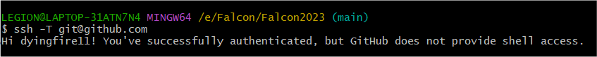

+ **Cmake安装**

    !!! question "为什么要使用Cmake"
    	gcc将源文件编译成可执行文件或者库文件；而当需要编译的东西很多时， **需要说明先编译什么，后编译什么** ，这个过程称为构建，常用的工具是make。而我们的代码体系较为庞大，需要通过CMake软件更加简单的定义构建的流程。**代码从Github上pull下来后需要通过Cmake进行编译**
    
    [CMake官网](https://cmake.org/)
    进入官网后找到合适自己电脑对应的Cmake安装包即可，可以选择最新版本。
    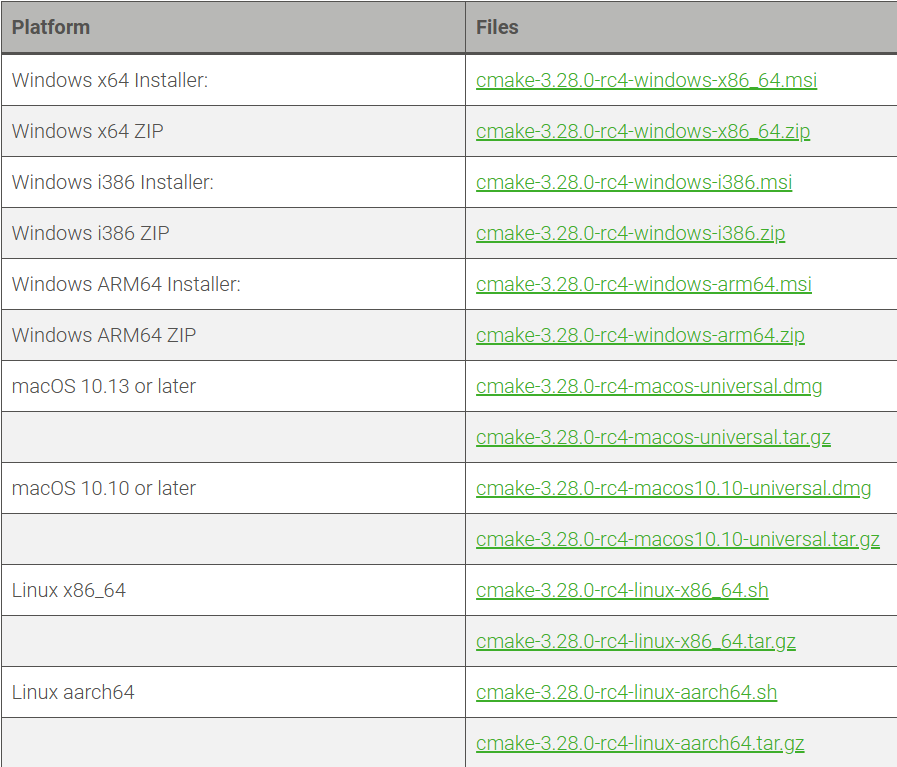
    
+ **Visual Studio**
  
    我们的项目需要通过Visual Studio的MSVC编译器进行编译运行，可以下载Visual Studio 2022/2026
    
    直接访问[VS](https://visualstudio.microsoft.com/zh-hans/vs/)官网，可以选择community下载安装程序。
    
    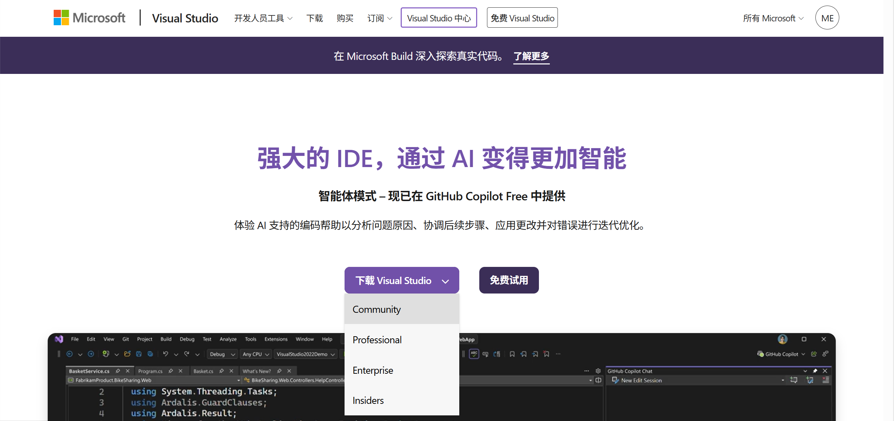
    
    安装过程所需项目勾选含有本地cpp开发的选项即可，注意更改安装路径（占用空间很大）
    完成界面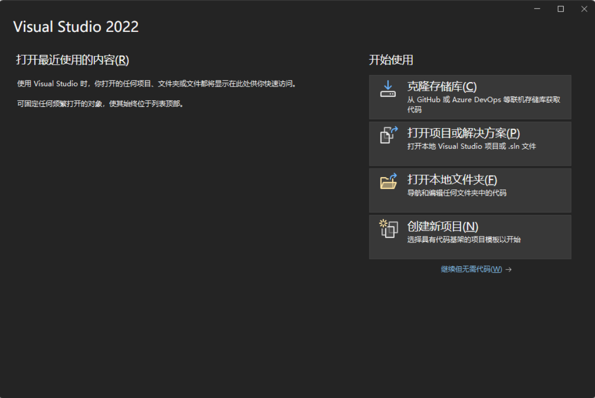
    

    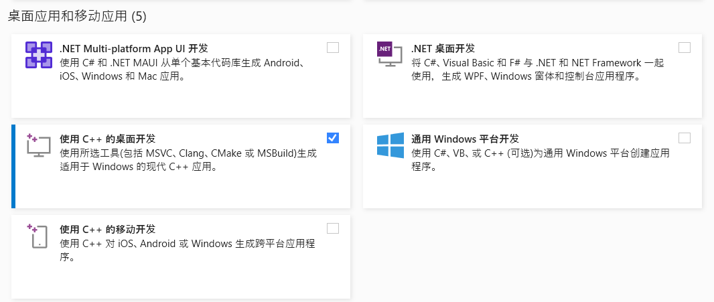

!!! warning "重要提醒"
    如果你的电脑有invida显卡，并考虑安装CUDA（参见第3节），那么在安装Visual Studio时需要考虑与CUDA的版本适配问题，可以上网查找具体的版本适配信息。

    如需安装17.9.2以前的版本，参考[解决方案](https://answers.microsoft.com/zh-hans/msoffice/forum/all/%E5%A6%82%E4%BD%95%E4%B8%8B%E8%BD%BDms-visual/576e8cab-00b3-4371-9824-3eb698903a19)
    
    否则cmake编译时会报错

    如果不选择安装CUDA则应该不用考虑版本问题。(注：SRC的暑期集训并不需要用到CUDA)。
---

+ **VS Code** 
    本项目主要使用VS Code作为编辑器，并使用其内部的cmake插件进行编译。

    可直接访问[VS Code官网](https://code.visualstudio.com/)下载安装。如需教程，可以参考https://blog.csdn.net/msdcp/article/details/127033151。

    安装完成后，点击左侧扩展按钮，在扩展商店里搜索CMake，然后安装CMake Tools插件。

    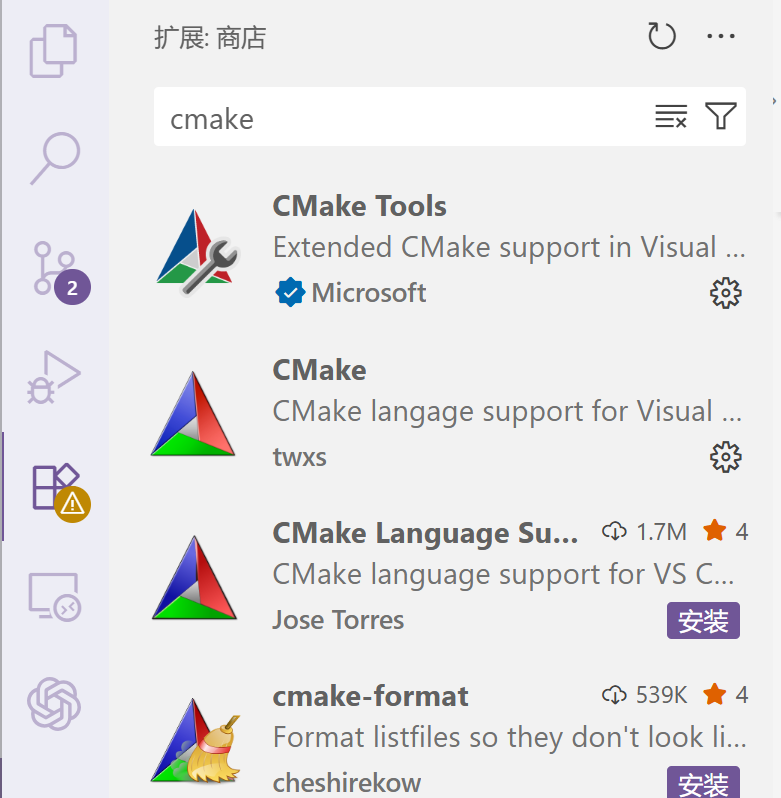

    然后再扩展商店里搜索git和C++，分别安装Git Graph和C/C++相关插件。

    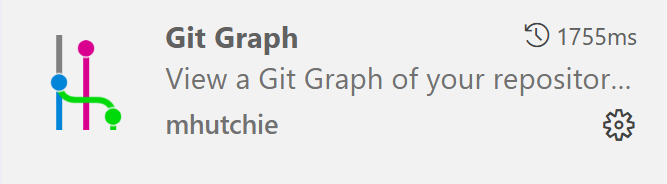

    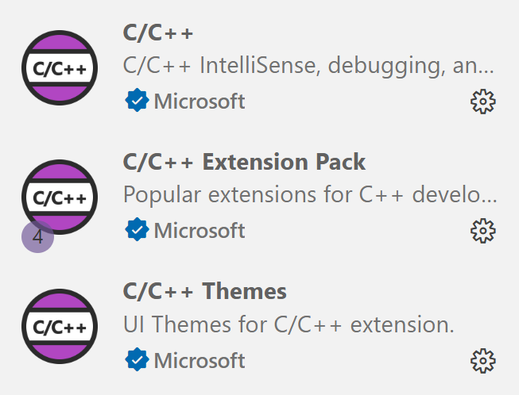

    注意Git Graph主要用于Git记录可视化管理，对于暑期集训同学如不打算使用git管理仓库，可以不安装。

    同样是否安装C/C++插件不影响代码正常编译，主要是为了在VS Code里写C++更加方便和美观。

## 2.Falcon环境配置
### 编译准备
**Qt:**

!!! warning "重要提醒"
    如果安装过程中出现网络错误，可以考虑关闭网络代理


- 访问[Qt官网](https://doc.qt.io/qt-6/zh/get-and-install-qt.html)，选择Qt Online Installer (图形用户界面)

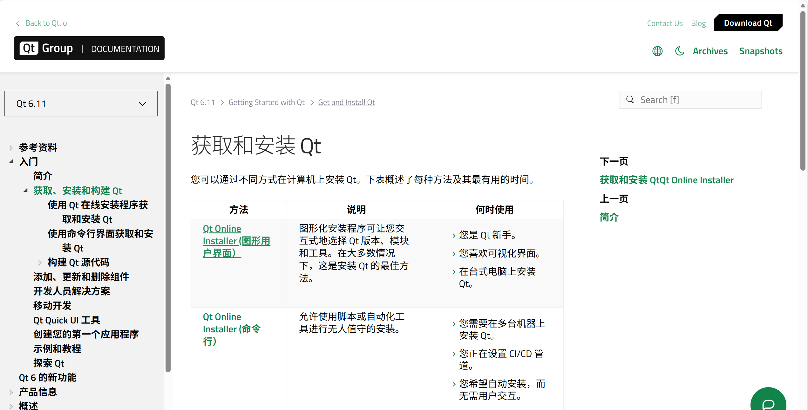

- 注册/登录账号，在左侧Downloads里下载Qt在线安装器。

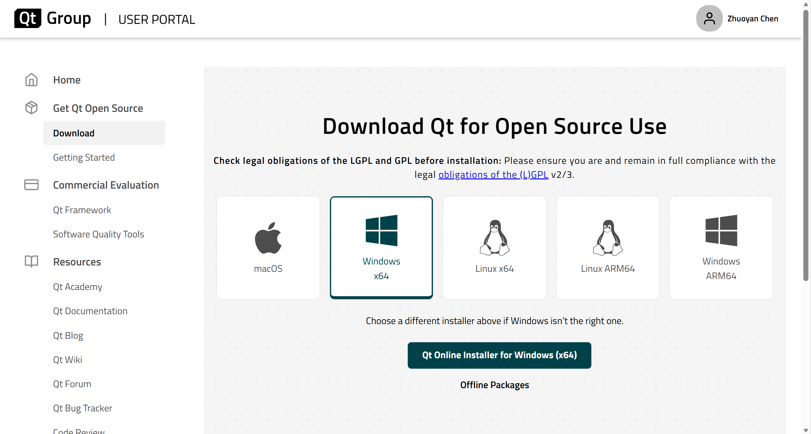

- 双击安装程序进入到 Qt 安装阶段。
- 打开下载好的在线安装器，进入登录界面注册/登录。

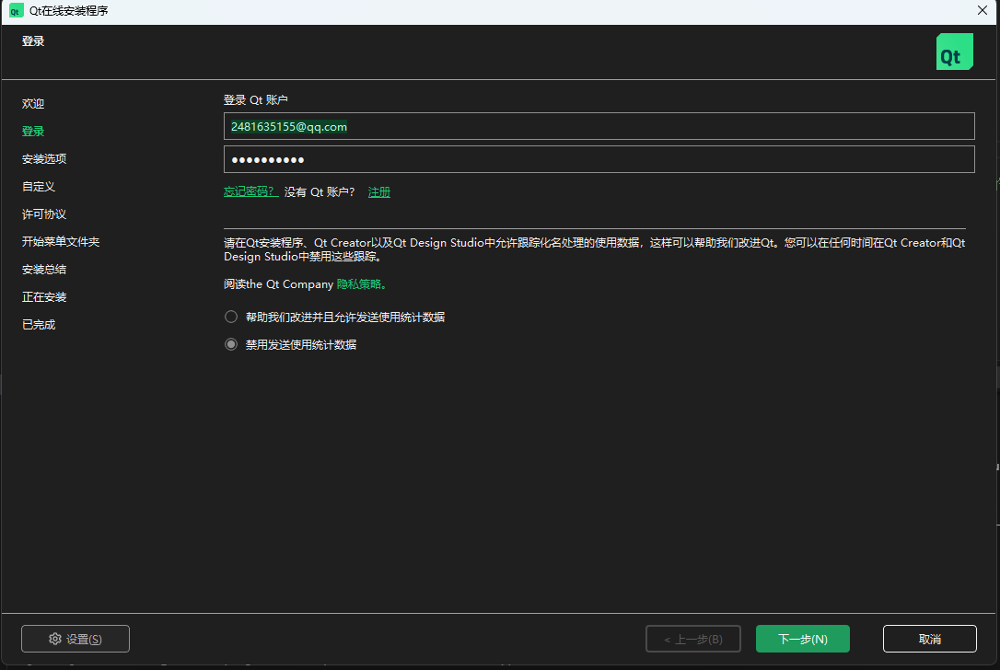

- 勾选下方的两个选项，点击“下一步”
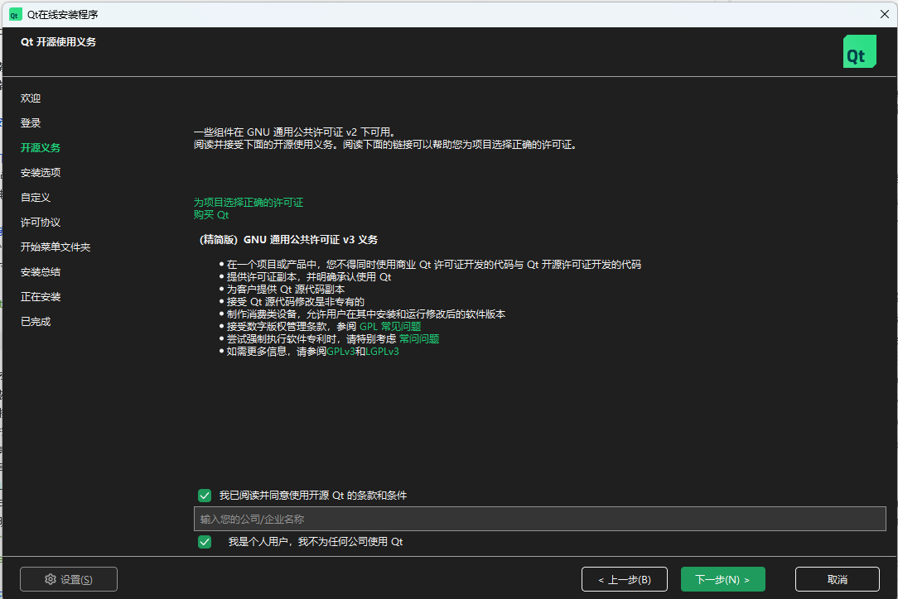

- 取消默认勾选，选中“自定义安装”，点击“下一步”
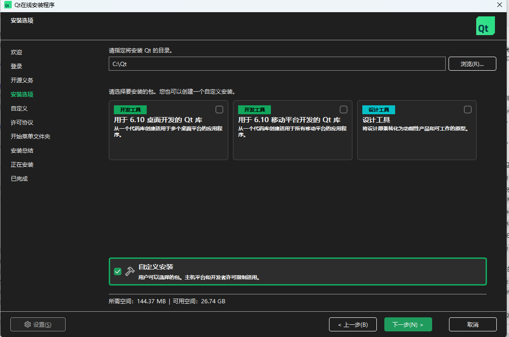

- 在右上角下拉“显示”，勾选“Archive”，在弹出框内选择“是”，等待更新完成
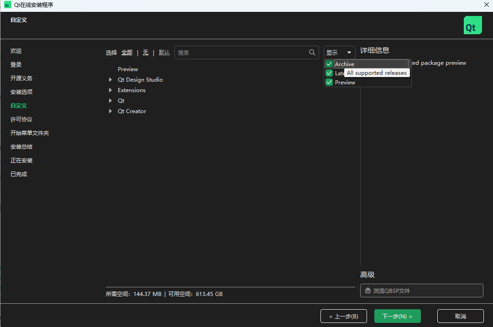

- 勾选以下组件：
  - Qt -> 6.9.1 -> MSVC 2022 64-bit
  - Qt -> 6.9.1 -> additional lib -> Qt Network Authorization
  - Qt -> 6.9.1 -> additional lib -> Qt Protobuf and Qt GRPC
  - Qt -> 6.9.1 -> additional lib -> Qt Quick 3D
  - Qt -> 6.9.1 -> additional lib -> Qt Quick Effect Maker
  - Qt -> 6.9.1 -> additional lib -> Qt Quick Timeline
  - Qt -> 6.9.1 -> additional lib -> Qt Serial Port
  - Qt -> 6.9.1 -> additional lib -> Qt Shader Tools

- 最后安装。

**Python:**

首先在你的电脑中安装Python3.12，Python的安装教程网上有很多，此处不再赘述。
在本项目中，我们使用UV来创建并管理Python版本，访问[uv官网](https://uv.doczh.com/getting-started/installation/)，并根据其中指南进行安装。可以使用

```powershell
uv --version
```

来验证安装是否成功。如报错找不到uv命令，则需要配置uv路径到环境变量。

安装完成后，在VS Code中打开项目文件夹，右键ZBin/PythonScripts，选择在集成终端中打开：

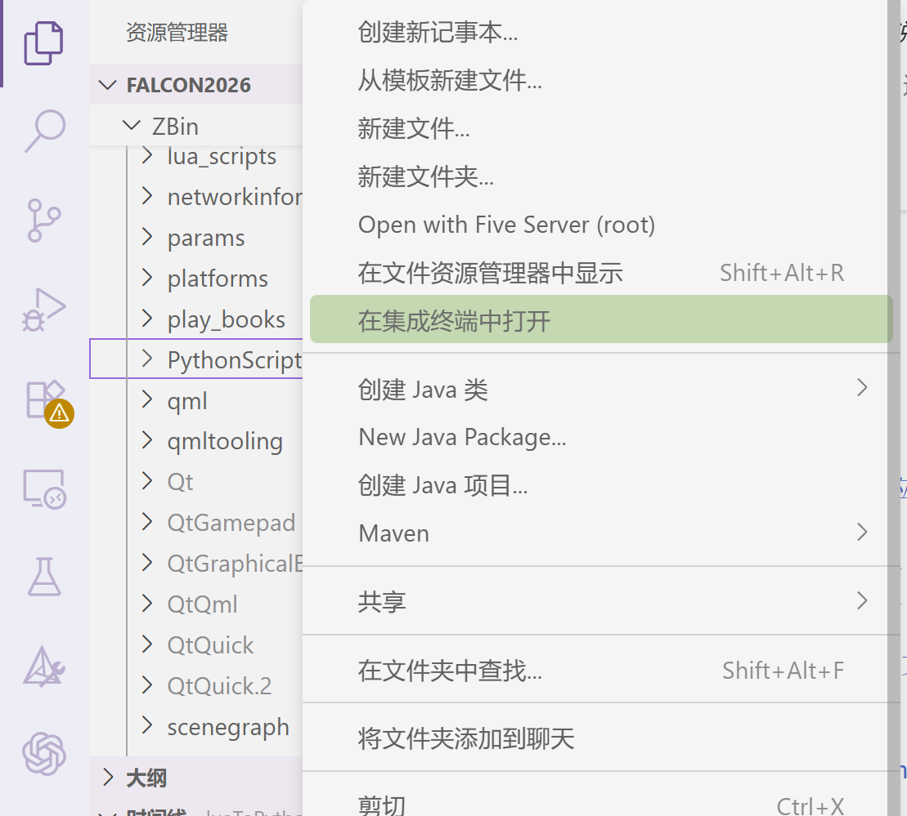

然后在VS Code打开的终端中输入

```powershell
uv sync
```

等待环境安装完毕即可。


### 编译方法
**Windows :**

在顶层 `CMakeLists.txt` 设置 `set(Qt6_DIR "Your/Path/To/Qt6/6.9.1/msvc2022_64/lib/cmake/Qt6" CACHE PATH "Qt6 cmake package directory")` 指向你的电脑中的QT6目录。

!!! warning
    如果一开始cmake时路径是错的，修改完路径后重新cmake，需要delete cache后重新配置。

---

在左侧扩展栏中选择CMake，并点击“配置”。

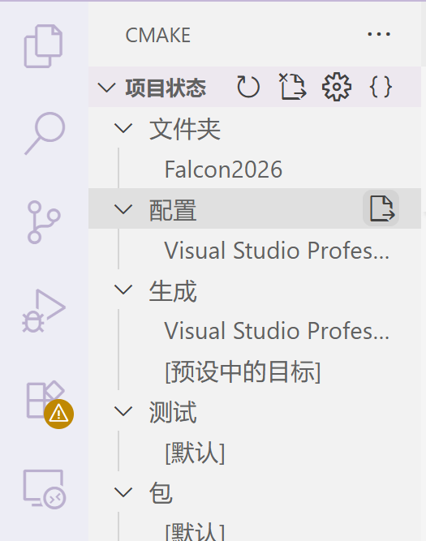

第一次选择配置的时候，VS Code需要选择编译器，选择已安装的Visual Studio即可。

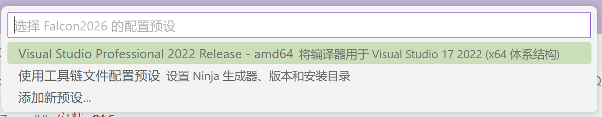

等待终端配置完成。然后在cmake中点击生成即可。

!!!
    如果生成失败，可以一个个项目生成看看是哪里出了问题，方便debug。


## 3.CUDA配置
[参考文档](https://github.com/sjtu-src/Wiki/blob/master/docs/Algorithm/%E5%8A%A0%E5%85%A5cuda%E7%9A%84falcon%E7%BC%96%E8%AF%91.md)

+ CUDA下载
    - 首先电脑得有NVIDIA显卡，然后命令行输入nvidia-smi查看当前驱动支持的最高CUDA版本
        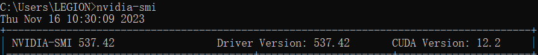
        如果低于12.0就需要升级显卡驱动
    - 推荐下载CUDA12，安装教程网上多的是，不再赘述了
    - [CUDA下载官网](https://developer.download.nvidia.com/compute/cuda/12.0.1/local_installers/cuda_12.0.1_528.33_windows.exe)

+ CMake配置
    如需在编译时启动CUDA，需要将Medusa/CmakeLists.txt里的ENABLE_CUDA改成TRUE，然后重新配置+生成。

    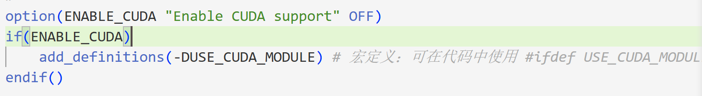

