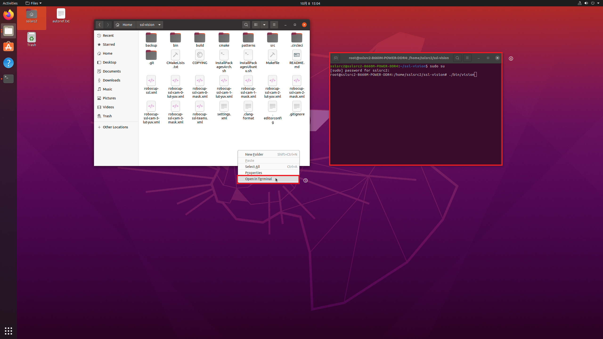
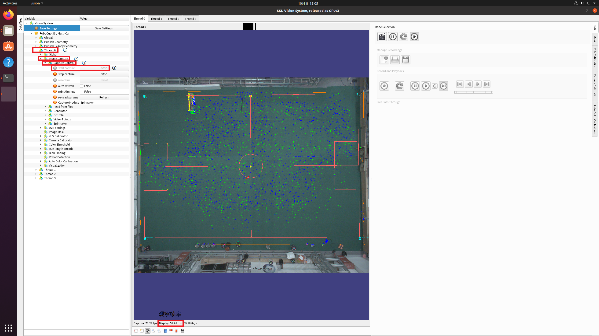
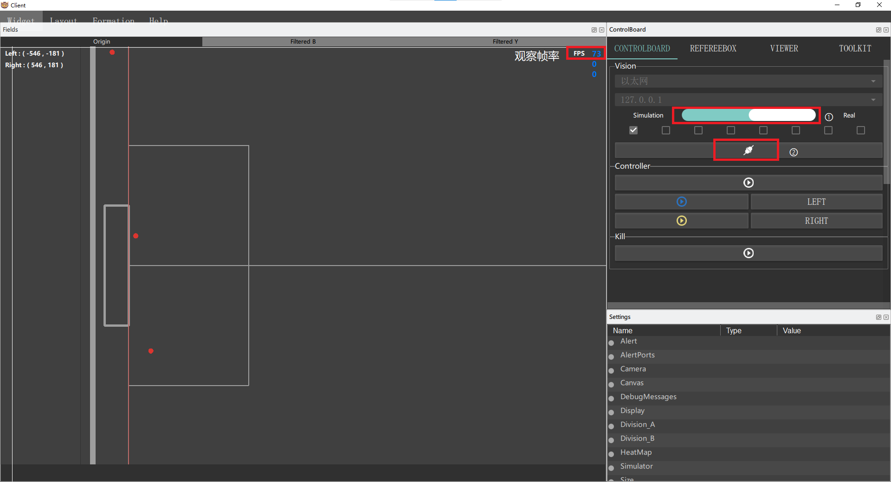
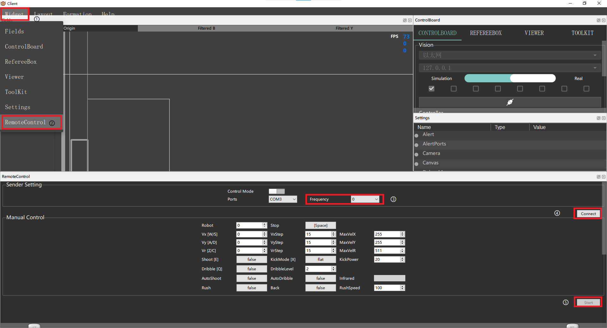

# 快速开始

## Vision

1. 打开视觉机和控制机，密码贴在机箱上
2. 视觉机：在任务栏中打开文件目录，进入 `ssl-vision`

3. 视觉机：右键选择 `open in terminal`，`sudo su` 并输入密码（不回显），然后 `./bin/vision`

4. 视觉机：左侧变量树中依次展开：`Thread 0`-`Image Capture`-`Capture Control`-`start capture`，观察下方帧率，55-100 即为正常

5. 控制机：打开 Falcon，切换至 `Real`，连接视觉，同样观察帧率是否正常

## Control

1. 插入电池。注意对准方口与圆口，**发现不好插进去时切勿盲目用力，一定要再三确认是否搞反！**
2. 拨码。二进制，右侧为低位，往下为 0 往上为 1。

	- FREQ：频率。建议选择 0 频和 8 频，需要与发射机保持一致，同时与其他发射机错开。调整发射机频率方式：重新插拔后在 Falcon 中打开 `Remote Control`，更改频率后点 `Connect`
	
	- NUM：车号。需要提前选定车壳后拨视觉中对应的号码
	- MODE：模式。0 为正常模式，3 为自检模式

3. 在 `Remote Control` 中点击 `start` 开始控车，检查车子运动、吸球和踢球性能是否正常
