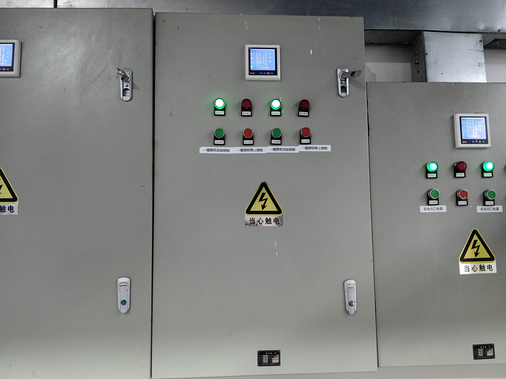
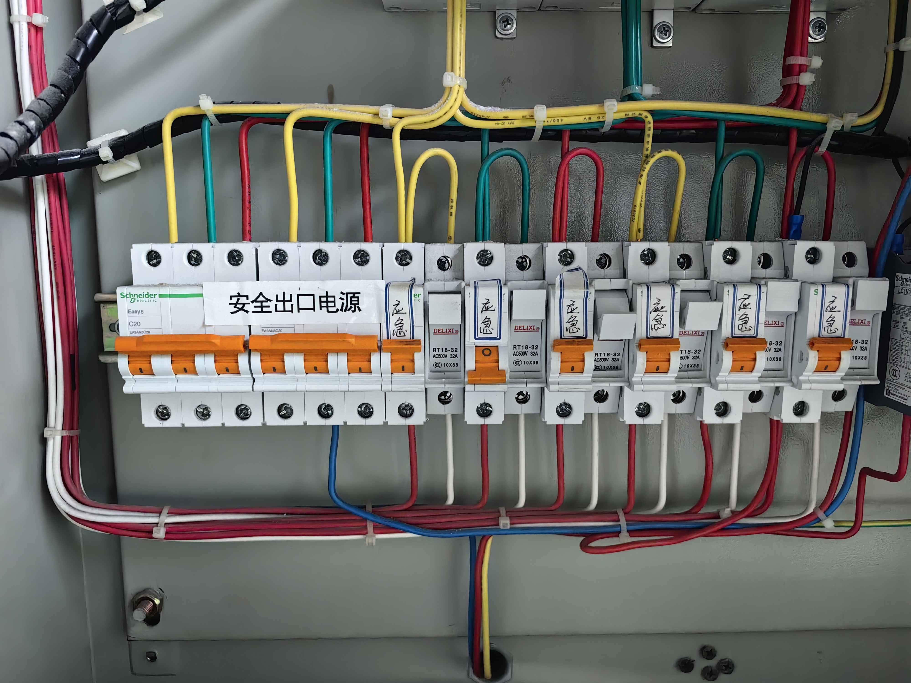
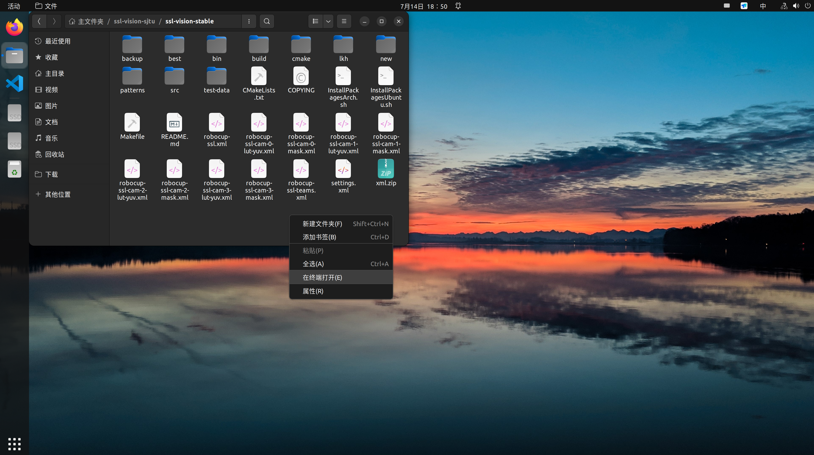
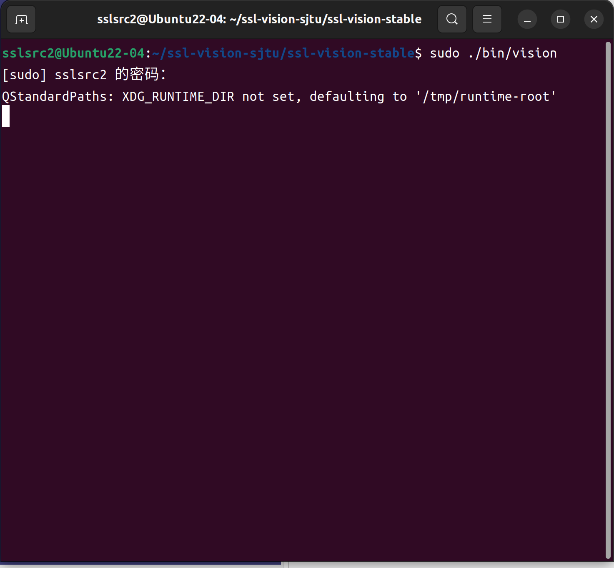
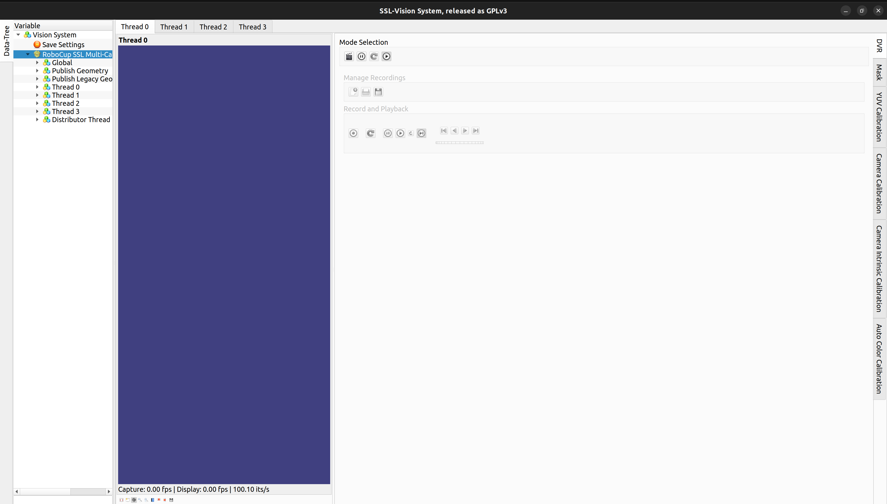
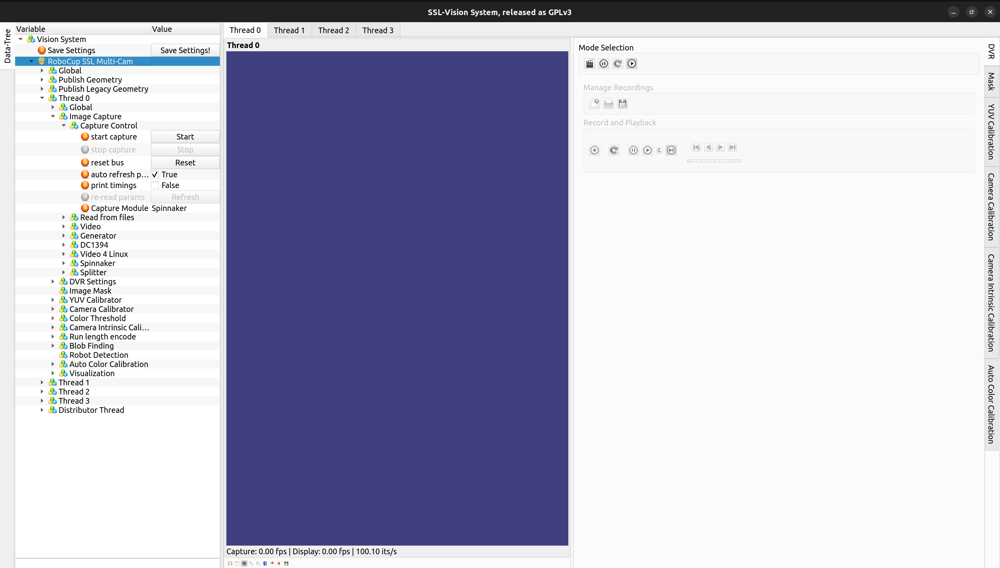
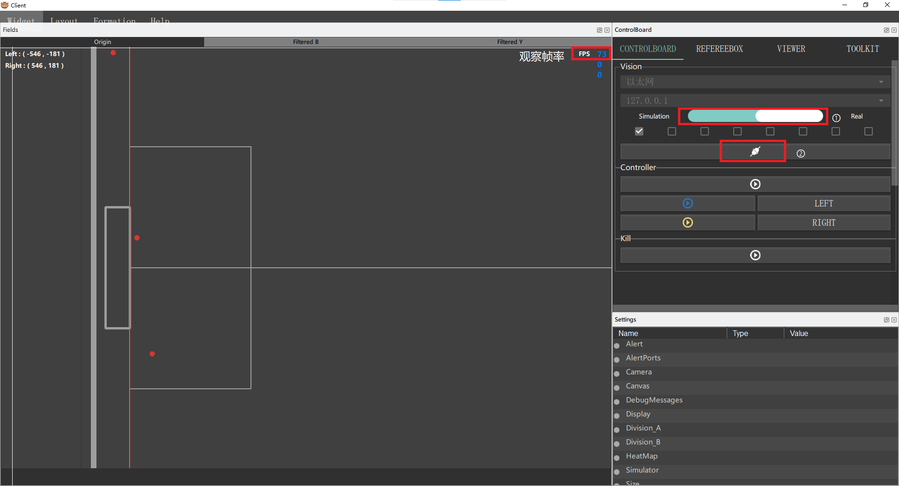

# 快速开始

## 灯光准备

由于视觉机对光照很敏感，因此保证一个稳定的场地光照强度是维持视觉稳定的基础。

!!! warning "注意"
	如果在白天来调车，首先关闭场地四周的窗帘，以免自然光对场地造成干扰

首先，打开一楼大厅的整体光照，开关位于大厅最里侧的楼梯下方，按中间电箱的两个绿色按钮开灯（如果来调车时灯已被其他人打开可以跳过这步）。

其次，打开最右侧的电箱，把下方的“应急”从左往右第一、第三个开关向上拨（打开），切记不要打开第二个开关！！！否则会导致场地中间过亮。后面几个应急灯的开关无所谓。

最后打开场地对面的灯管

## Vision

1. 打开视觉机，密码为ssl
2. 视觉机：在任务栏中打开文件目录，进入 `ssl-vison-sjtu/ssl-vision-stable`，然后右键，在此处打开终端

3. 视觉机：在终端中输入`sudo ./bin/vision`，可以用方向键向上查找历史记录，回车。输入密码ssl（此处输入密码不显示），回车，等待视觉机启动。

4. 视觉机：可以看到左侧栏里包含了4个Thread，即视觉机目前最多支持4个摄像头。我们的场地仅使用一个摄像头。在左侧变量树中依次展开：`Thread 0`-`Image Capture`-`Capture Control`-`start capture`，观察下方帧率，55-100 即为正常。此时即可在client中连接视觉。

5. 控制机：打开 Falcon，切换至 `Real`，连接视觉，同样观察帧率是否正常

## Control

1. 插入电池。注意对准方口与圆口，**发现不好插进去时切勿盲目用力，一定要再三确认是否搞反！**
2. 拨码。二进制，右侧为低位，往下为 0 往上为 1。

	- FREQ：频率。建议选择 0 频和 8 频，需要与发射机保持一致，同时与其他发射机错开。调整发射机频率方式：重新插拔后在 Client 中断开发射机并重连。
	- NUM：车号。需要提前选定车壳后拨视觉中对应的号码
	- MODE：模式。7 为正常模式，3 为自检模式，2为测试吸球模式。

3. 在 Client 中使用 `Crazy NaN` 开始控车，检查车子运动、吸球和踢球性能是否正常
