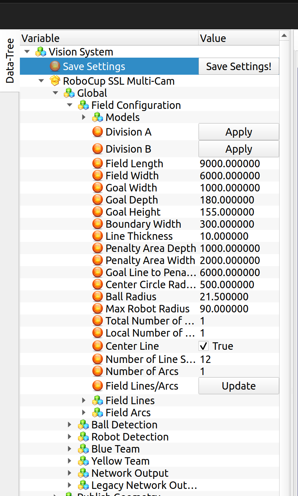
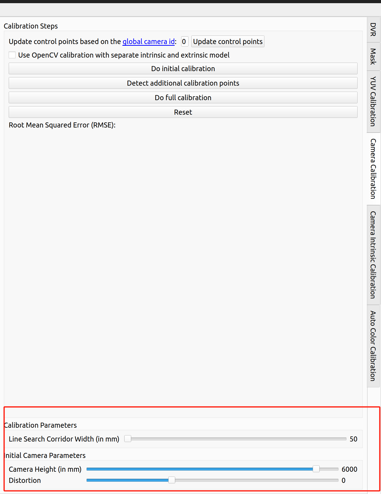
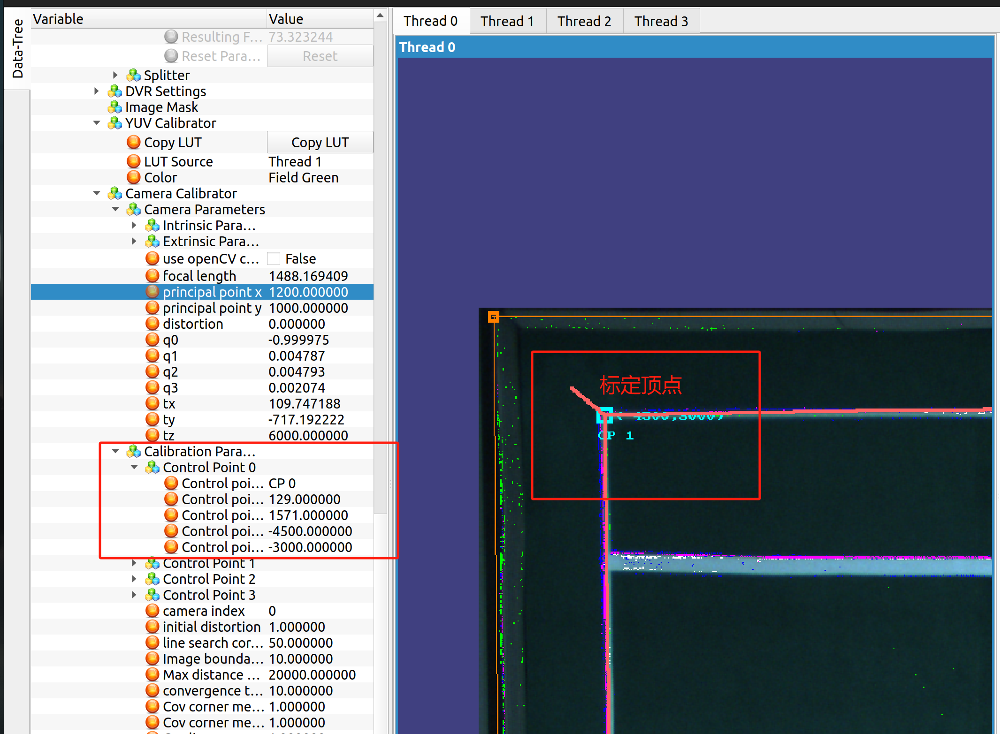
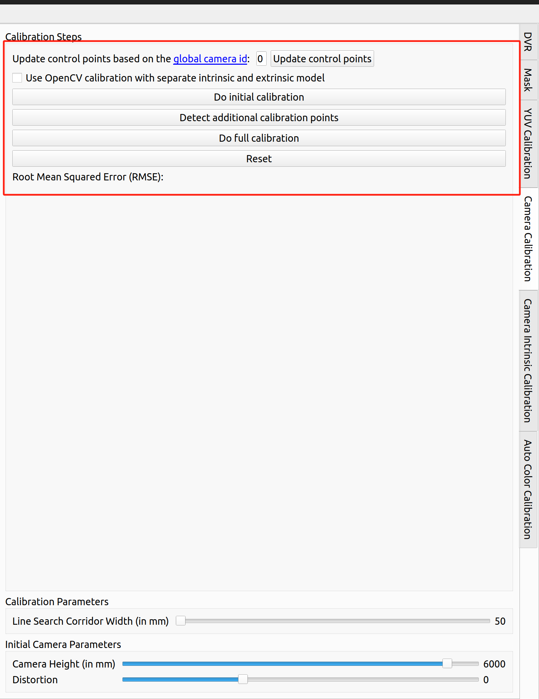
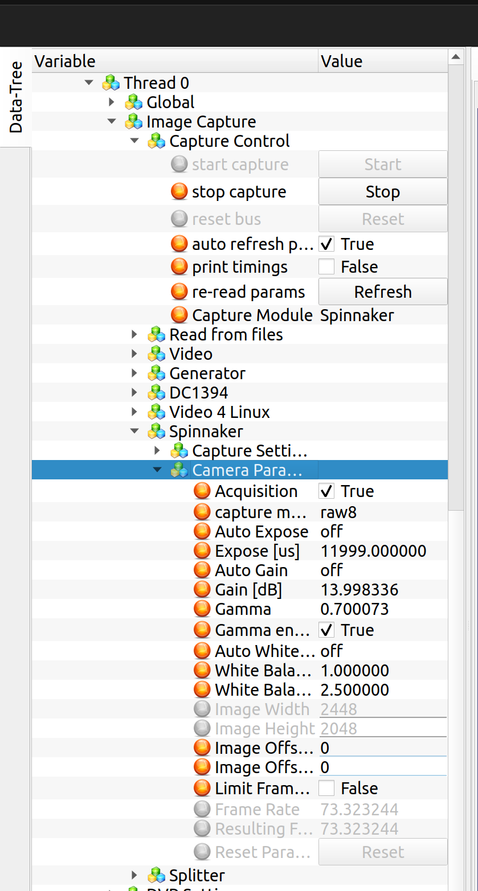
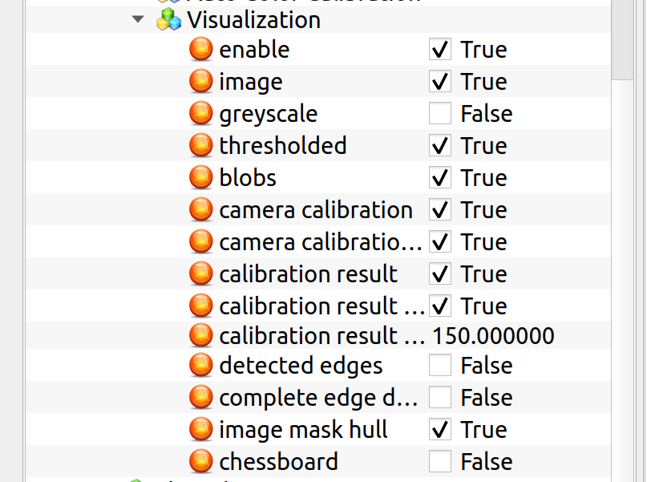

!!! abstract "写在前面"
	- 这里主要介绍ssl-vision，目的是统一视觉调试的标准，讲解必要步骤，并说明一些遇到过的问题。视觉机系统已于2026年更新过为最新版。
	- 操作诀窍就是熟能生巧。具体原理建议看源码或官方介绍，据说还有篇相关论文，有兴趣可以看一下
	- 对于初学者，建议根据官方文档走一遍，对于一些未提及的问题，可以在下文中寻找，这样对于视觉机的认识比较系统
	- 文章中可能有描述不当或者谬误，还得在实践中商榷
	+ [源码地址](https://github.com/RoboCup-SSL/ssl-vision)
	+ [官方文档](https://github.com/RoboCup-SSL/ssl-vision/wiki)

## 操作介绍
!!! warning "注意"
	- 只介绍常规操作，默认下载安装完成，相机正常接入
	- 若有多台电脑共同承担全场视觉，默认时帧同步也已经配好
	- 如果以上部分出了问题，请前往官方文档查询解决方案

### 启动软件

- 命令行输入打开ssl-vision：
  ```cmd
  cd ssl-vision-sjtu/ssl-vision-stable
  sudo su
  ssl(password)
  ./bin/vision
  ```

### 开启相机线程：

- 在对应的Thread下依次展开：`Image Capture`-`Capture Control`-`start capture`
- 有时候会卡退，此时查看命令行是否有 **invalid camera id**，如果有，重新插拔相机线
- 如果开启后未出现图像，查看该线程下visualization勾选enable和image

### 调整相机姿态：

- 目前场地摄像头高度过高，一般也不建议自行调整相机。如有需要请寻求帮助。
- 最好情况：图像边框大致与真实边界平行，视野目测平坦；但一般把矩形区域四个顶点及边线包括在内就行，目前的相机相对场地略微偏向主机所在一侧，因此车位于另一侧边缘的时候存在相机无法捕获整个车顶的情况。请在调车时注意。
- 当使用多个摄像头时（通常为国赛场景下），捕获区域需要覆盖一部分临界相机区域，两个相机重合区域至少有一个机器人的大小。如果场地外较乱，尽量少地包含场地外但也需要在边线外留有一定余地
- 如果要调整相机所在的线程，可以通过更改相机线插口位置实现

### 调整场地参数：

- 在左侧变量树中依次展开：`Global`-`Field Configuration`，通过点击Division A(12 * 9m)或者Division B(9 * 6m)后的`Apply`按钮更换场地大小设置。我们的场地为Division B标准，国赛场地为Division A标准。

!!! warning "注意"
    在更换场地大小设置后，一定要点击下面的`Field Lines/Update`按钮更新场地线设置！

- 也可输入现实场地尺寸，如果现实受限，优先考虑贴近现实尺寸
- **Total Camera Number** 是指全场应有相机总数，比如我们现在只能搞个Division A的半场，用了四台相机，那么这一项中要填8，尽管另外四台不存在
- **Local Camera Number** 是指电脑上连了几个相机
- 点击Update按键可以自动生成场地线参数（起始点、终点、宽度），但建议检查一遍



### 标定，重点来了！！！

- 在左侧栏里找到需要标定的Thread，中间的相机界面可使用滚轮缩放和右键移动
- 如没有标定顶点，可点击 **Update point**，生成标定顶点，一般情况下已位于中间的主视野里
  - 如果没有，检查该线程下的visualization，勾选与标定相关的三项
  - 如果不全，可以人工设置缺少顶点的 **real pos**，先让它在可见区域显示出来
- 设置相机高度（一般为6000，国赛时需根据具体情况改变），相机畸变（一般为0），标定边线搜索范围（一般为50）

- 将标定顶点左键拖至合适的位置（相应的真实矩形区域顶点），并在左侧找到四个control point的设置，control point下方的两个参数为此标定顶点的坐标。例如下图中是CP 1，位于场地左上角，则应修改control point下的坐标为-4500, 3000，符合右手定则。

- 当四个标定顶点全部设置完毕后，依次点击下方的三个按键，完成标定
  - 第一个按键的作用是让标定边线的端点与标定顶点重合
  - 第二个按键的作用是检测场地上的边线位置，绘制若干离散点
  - 第三个按键的作用是让标定边线去拟合
  - 可以重复使用，以提升图像质量
- Reset可以清空所有标定设置，从头再来

- 如果标定边线呈现十分扭曲的形态，请检查：
  - 标定顶点的放置是否正确
  - 电脑是不是卡了
  - 可以等一会，不行直接Reset，或者重启软件甚至电脑
- 画面中的红叉是估计的相机投影位置位置，如果偏的厉害会影响对坐标的识别，自己修改`Camera Calibrator->Camera Parameters->principal point x/y`，保证其位置大致位于摄像头在场地上的投影点附近即可，此时场地线会随着红叉偏移。修改红叉坐标后，需要重新点击上图中的`do initial calibration`更新场地线，这样不会改变调整好的红叉位置。

- 标定的过程实际是在建立场地的坐标系，之后需要检查车、球的位置，车的朝向、车和球的相对位置、车和球与边线的相对位置，以及在相机重叠处如果形成多个影像，是否距离太远。这个可以开graphClient检查（终端中输入 `sudo ./bin/graphClient`）

### 色块识别标定

- 切到色块标定的专栏，Clear表示消除颜色。
- 按住ctrl + Shift + 左键，在中间页面，扫描图像上需要标定的位置，右侧分屏会出现小叉，即刚刚扫过的位置，并涂为选择的颜色。
- 也可以在右侧分屏的相应位置涂抹（大块涂抹按Ctrl）
- 如果没有颜色显示，查看该线程下visualization，勾选threshold和blob选项，前者显示颜色，后者给能识别的色块画框，但对于球，不建议涂抹得太饱满
- 这是最频繁做的操作，因为色块识别极易受光照影响

### Mask

因为场地周围杂物较多，可以使用Mask框住场地范围，使得视觉机只识别场地内物体，避免杂物干扰。
- 在右侧栏找到Mask，可以点击`Clear Mask`清除已有的Mask。
- 然后分别点击场地四角，即可完成Mask

### 相机设置

由于不同场地光照条件不同，相机可能过曝/过暗，或者捕捉到的图像不符合真实颜色，此时可在`Image Capture->Spinnaker->Camera Paramaters`下面调整曝光度(Expose)和白平衡(White Balance)。



### 视觉通讯

- 注意主机要用网线连接交换机，交换机也要上电，如果命令行中出现 **multicast error** 多半是交换机没上电或网线连接问题，重新插拔或换网线解决，再不行可能是主机开的时间过长，重启解决。之前校内赛遇到过pc攻击导致图像机瘫痪的情况，不过是极个别案例。
- 如果视觉机工作时间过长，摄像头的USB接口过热会导致视觉帧率骤降，此时应关闭视觉机，待其冷却后再重新运行。
- 默认向10005和10006发送视觉信息，可以检查 **multicast port** ，这两个端口的信息有所区别，在于包含场地尺寸信息的通讯协议不同
- 切记不要开启交换机上的Virtual按钮，否则会导致交换机内部划定虚拟分区，无法相互通信。
- 参考数目《计算机网络-自顶向下》

### 其他说明

- 软件中有个给每个线程分配运算核的设置，不要轻易动，如果分的过多图像机根本运行不动
- 建议修改后 **save settings** ，正常退出会自动保存，如果是异常退出则不会保存

## debug

下图中的Visualization里可以开启/关闭各种debug信息


- 若vision中途崩掉，先关机，保持摄像头顺序不变的情况下进行插拔，检查线连接情况。没问题后开机，重开视觉检查是否有问题。若视觉摄像头顺序错乱，需要重新调整右侧边栏Camera Calbration中摄像头编号，并依次调整场地标定点，摄像头设定高度6000mm。

- 如果主机收不到视觉机的信息（即视觉帧率为0），首先应确保两台电脑能够通信。可以在终端中`ping 对方ip`检查通信情况。电脑ip可在设置中查看。如果可以ping到，则检查Client中端口设置是否正确。如果还是找不到问题，可以考虑使用WireShark抓包，检查发包情况。

- 若出现视觉能够发包且有内容但是图像上没有车显示的情况，需检查global设置中针对球和车的过滤像素数量上下限，保证球和车不被滤掉，能够正常显示。

- 经过排查发现以上均正常，可进一步检查摄像头性能，利用lsusb确定摄像头usb位置，进入系统设备管理目录中，对相应的usb利用chmod 777赋予权限，打开spinnaker检查摄像头图像显示，若有问题更换新的摄像头。

- 如在国赛赛场上遇到视觉机问题（每年必备项目）且一时没有头绪，建议尽早寻求帮助。

- 视觉机可以连Wifi，但连接Wifi后不能正常发送视觉消息。如需Codex辅助debug，可以打开Wifi。如不能稳定连接学创网络，可以考虑连接热点。
