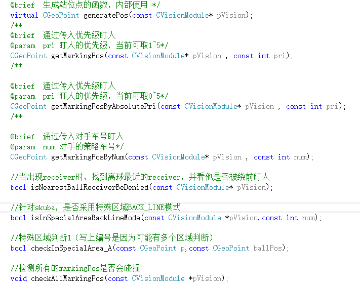
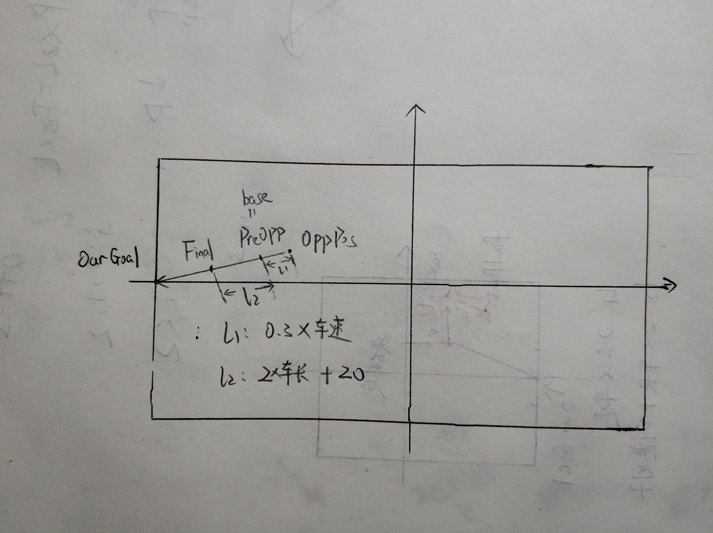
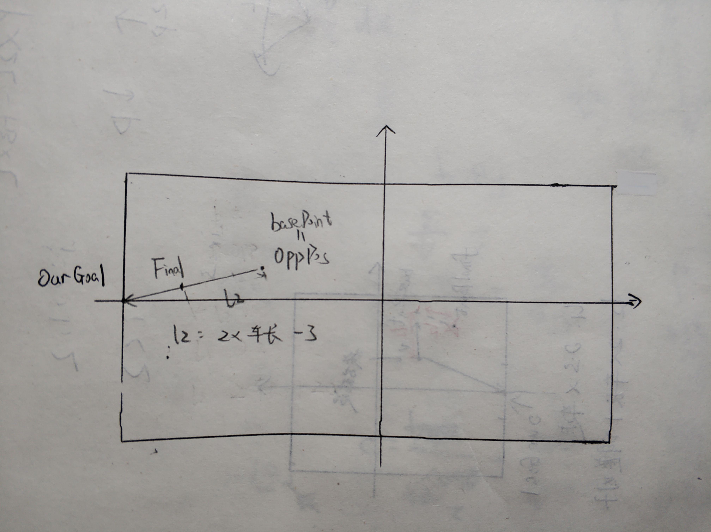
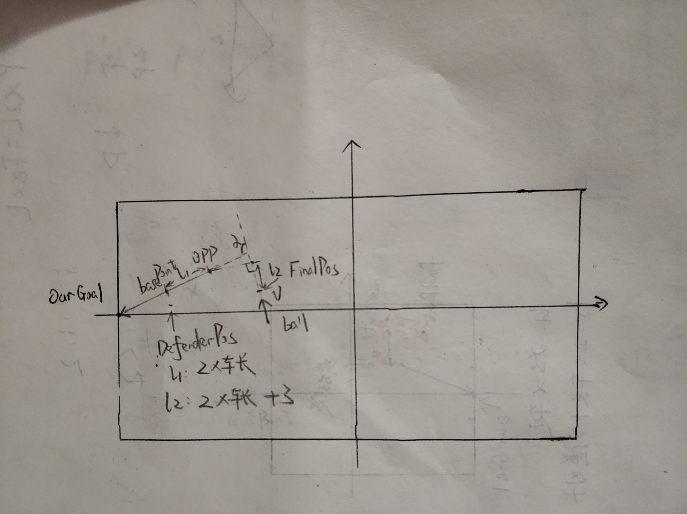
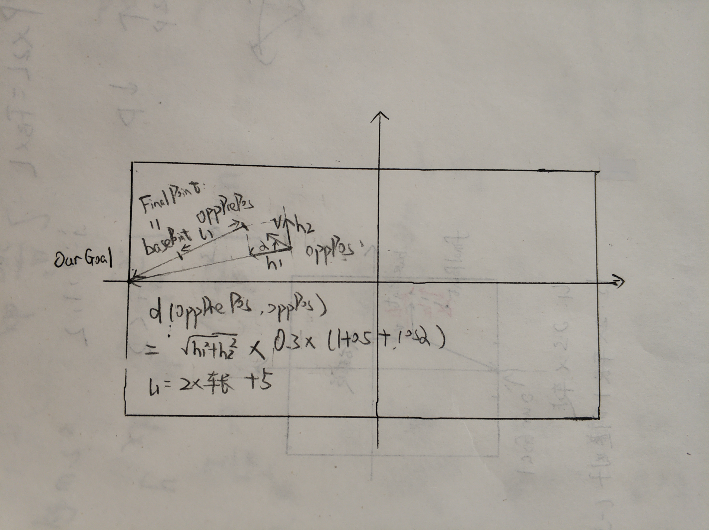
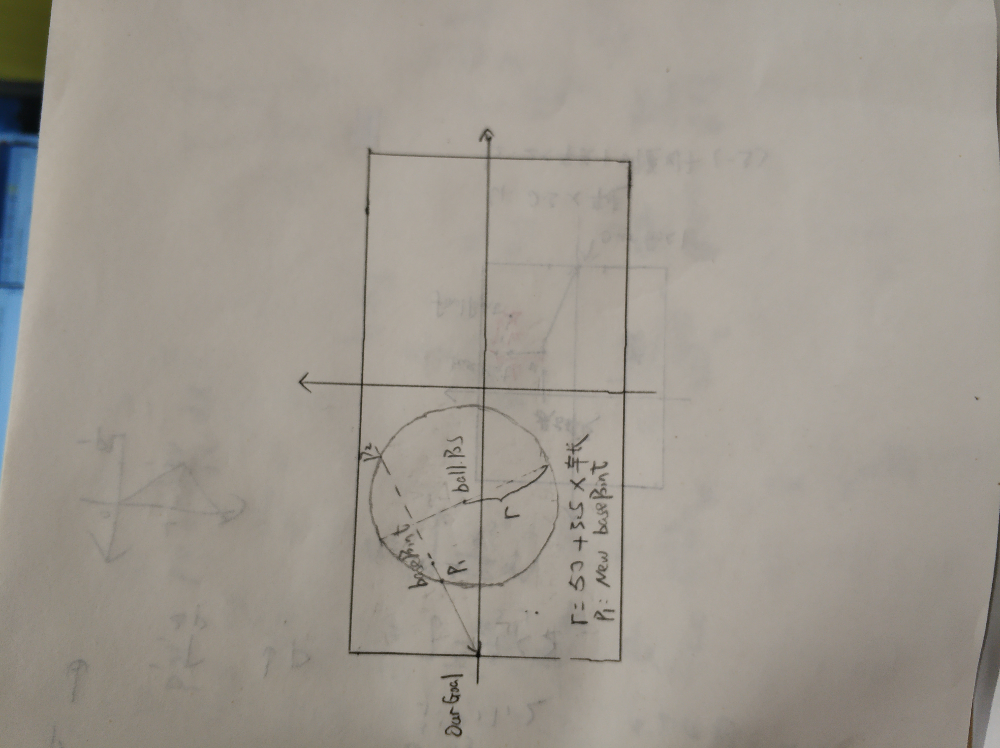

## 基本原理
传入对手威胁度等级，实现对不同威胁度的对手的盯防；获传入对手车号，实现特定车辆盯防
## 需要考虑的因素
1.  盯防模式：是绕前盯人（优先挤在对方车前）还是回退盯人（优先确保不失位，尽可能靠近己方球门）
2.  球所在位置：如果球很靠近我方球门（此区域范围可定义），或对方发角球，以不失位为主；如果球在前场，可考虑绕前盯人，优先抢到球
## 用到函数
 <br/>
generatePos()是基础，其余盯人函数(CGOPoint类函数)均通过调用这个函数生成盯人点；receiver是对方接球球员
## generatePos()讲解
几个常用量：
*   opp2ourGoalVector = CVector(ourGoal - oppPos) &emsp;敌方球员位置到我方球门中心向量

*  angle_oppVel_opp2Goal = fabs(Utils::Normalize(opp2ourGoalVector.dir() - oppVel.dir())) &emsp;敌方球员位置到我方球门中心向量与敌方车速方向向量夹角，方向是从前者指向后者（Normalize函数是把角度归到正负2&pi;范围里;fabs函数是绝对值）
*  oppPos,basePoint,finalPoint:敌方球员位置；盯人计算中间点（计算中的过程量），最终要跑到的点（预测盯人点）
### 如果要盯的车是接球车
* 追逐模式：主要应对接球车接球后一直向球门方向直线带球进攻，比如Immortal战术 <br/>
情况一：接球车比防守球员更靠近球门
 <br/>
即加大车辆回退距离，确保能追上 <br/>
情况二：接球车比防守球员远离球门
 <br/>
可以考虑上抢盯人 <br/>
* touch模式：更常用
 <br/>
综合考虑了敌方车辆速度和它与我方球门之间的角度和距离
* 绕前盯人：目的是抢先拿到球，但是风险很大
 <br/>
判断是否进入绕前模式，需同时满足四个条件：
1.  球到敌方接球车投影到速度延长线上的点的距离/(球速+0.1）>0.5 &emsp;&emsp;确保敌方车辆不会很快接到球
2.  敌方接球车到其投影到速度延长线上的点的距离<25
3.  防守球员到basePoint距离<10,优先确保防守球员不会失位的基础上再去绕前，也避免被轻易甩过
4.  球速角度与opp2ourGoalVector（即图中&alpha;角）大于60度，否则球速路线与敌方接球车角度过小时，我方绕前车需跑更大的角度才能拦截，浪费时间 <br/>
退出绕前模式，满足以下三者其一即可：<br/>
1\.  绕前的防守球员更换（由于换车，罚下等）<br/>
2\.  敌方接球车到其投影到速度延长线上的点的距离>25<br/>
3\.  对方接球车更换角色，不再是接球车<br/>
### 如果盯的车不是接球车
* 常用模式 
 <br/>
首先计算出oppPrePos,综合考虑了车速沿opp2ourGoalVector方向和垂直于opp2ourGoalVector方向的横向移动，但主要权重还是放在沿向量方向，
代码如下：<br/>
```cpp
double sinPre = std::sin(angle_oppVel_opp2Goal);
double cosPre = std::cos(angle_oppVel_opp2Goal); //即图中&alpha;角
if (oppPos.x() > -NORMAL_DIST && oppVel.mod() > 35 &&   //NORMAL_DIST为50
	angle_oppVel_opp2Goal < Param::Math::PI * 75/180.0)//根据位置判断预测量
	{
			predictTime += predictTime * (0.5 + cosPre);  //predictTime基础值为0.3
	}
	int tempFlag = Utils::Normalize(opp2ourGoalVector.dir()-oppVel.dir()) > 0 ? -1 : 1;
	double cosParam  =1.25; 
        double sinParam = 0.2;  //这两个参数即赋予车速在不同方向上的权重分配
CVector oppVelModified = Utils::Polar2Vector(oppVel.mod()*cosPre*cosParam,opp2ourGoalVector.dir()) //图中h1向量
				+Utils::Polar2Vector(oppVel.mod()*sinPre*sinParam,Utils::Normalize(opp2ourGoalVector.dir()+tempFlag*Param::Math::PI/2.0)); //图中h2向量
CGeoPoint oppPrePos = oppPos + Utils::Polar2Vector(oppVelModified.mod() *predictTime,oppVelModified.dir());
                         //CVector Polar2Vector(double m,double angle)
	//{
	//	return CVector(m*std::cos(angle),m*std::sin(angle));
	//}
CVector oppPre2ourGoal = ourGoal - oppPrePos;
basePoint = oppPrePos + Utils::Polar2Vector(2*Param::Vehicle::V2::PLAYER_SIZE+5,oppPre2ourGoal.dir());
if (oppPrePos.x() > -NORMAL_DIST)//要依据效果仔细调参数
	{
		markBuffer += (NORMAL_DIST+oppPrePos.x()) / 1.5;
	}
//当对手有横向速度的时候，markBuffer根据sinPre的增大而增大
if (oppVel.mod() > 60)//待修改！！
	{
		markBuffer += (ENEMY_SIN_MARK_BUFFER * sinPre * oppVel.mod() / 135.0);
	}
```
* 定位球时防守
 <br/>
以球为圆心，r为半径画圆；与以刚刚常用模式计算出的basePoint和球门连线的交点，取与我方球门更近的点，确保防守球员更靠近球门


