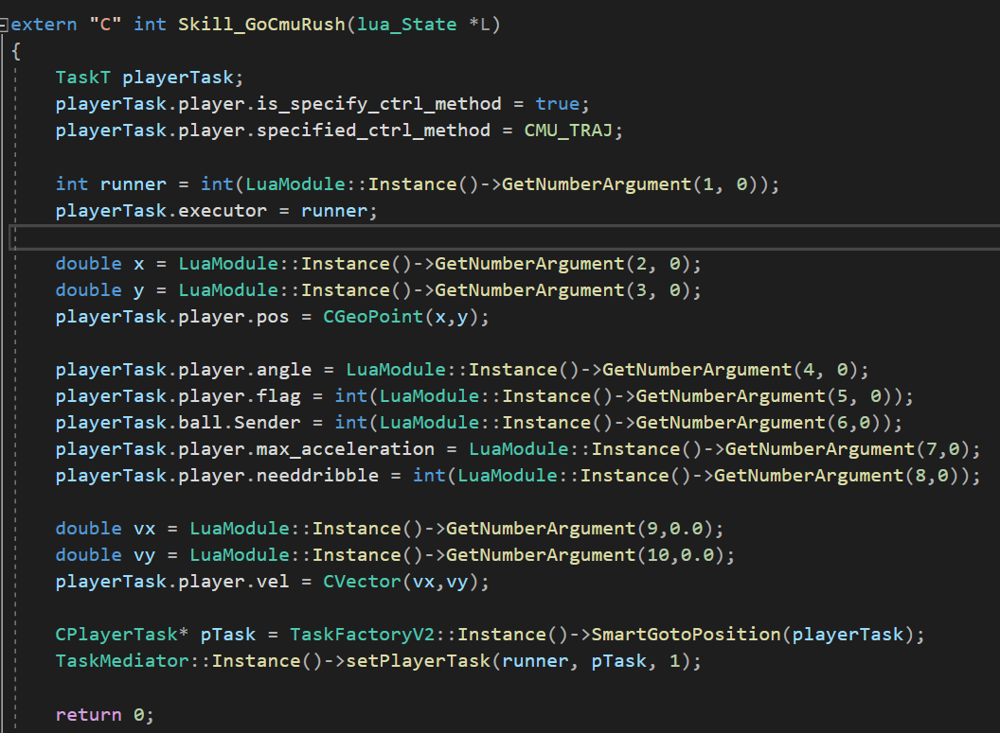

# 从lua到cpp简易教程

--- by  TanYuHong  22.12.17

--- 希望这个教程能够让你快速入门

[TOC]

## 2. 预备知识

### 2.1. 工厂模式

- 隐藏了对象的创建过程，同时让对象调用和编写更加系统化。

- 这代码里面有一个factory.cpp，可以理解为它是一个工厂，实例化的对象(skill)都是产品，可以认为他是个造skill实例的factory，所有skill的实例化都封装在了factory里面。

### 2.2. 单例模式

- 单例对象的类只能允许一个实例存在。
- 在内存中只有一个对象，节省内存空间
- 下面是SRC的单例模式的实现，SingletonClass模板，如果这个类被实例化了，我们就直接返回实例，否则就对该对象实例化。


- 比如说下面这张图，现在需要一个GoCmuRush的任务，我们需要实例化一个叫做SmartGotoPosition的类，但是实际上这个类仅被实例化一次之后就可以满足要求了
  - 如果从函数的角度理解可能更加准确，可以简单的认为SmartGotoPosition的功能就相当于一个函数，那么这个函数只需要一个就可以了。
  - 试想这个GetNumberArgument实例化，我们只需要一个实例即可，其他的实现都可以通过改变他的内部参数实现，所以不需要反复实例化他，此时单例模式就发挥了作用。


## 3. 从实例化的角度理解框架

- 我们整个代码的运行就是不断的在实例化一些任务。
- 在实例化的过程中execute
  - 比如我现在有个player要踢球，那我就实例化一个task，里面有人的状态，有球的状态，当这个task实例化完了之后这个动作也就做完了。
- 整个代码都是指针在传递。
- 类能分为skill、command、para等
- 其中封装了很多namespace


### 3.1. LuaModule

- LuaModule是整个lua和c++的接口


- 这里定义了luaDef这样一个struct

  - 里面有一个name，一个函数指针
  - 
  - 然后每次lua调用函数的时候，给定的是前面这个字符串，相当于查询这个GUIGLue这个数组，然后我们给的接口是后面这个函数指针

- 下面以GoCmuRush为例

  - 
  - 开头的写法是固定的
  - 如果想进一步了解任务架构**TaksT**，他的定义在**misc_types.h**里面
  - 
  - 我个人倾向于把他理解为**任务参数**，上图中的struct就规定了对于一个skill我们到底需要哪些参数。
  - **PlayerStatus**和**stBallStatus**很重要，他告诉了我们如果要完成一个任务我们需要给定什么参数，建议转到定义去再理解。
  - instance：单例模式。
  - GetNumberArgument：
  - 
    - 相当于是从lua中按照顺序一一调取参数。
  
  - 下面开始初始化这个playerTask实例。调用TaskFactoryV2工厂去生产一个叫做zSmartGotoPosition的产品。
  - 最后的TaskMediator就是处理优先级的问题：
    - 
    - 但实际上我们现在不再使用TaskMediator了。

### 3.2. factory

#### 3.2.1. 直接调用skill

- 

- 首先类模板CTaskType，然后下面就实例化具体是哪一个

  - 调用顺序：例如GotoPosition，首先传进来一个task，然后调用MakeTask，指明这个是CGotoPositionV2类型，然后task传到上面这个maketask里面去。
  - param是个namespace，里面有一些参数，Field也是namespace，Param::Field::MAX_PLAYER=16。这些namespace封装了许多常数。

  

  - executor是执行者的编号

  ```c++
  template < class CTaskType >
  CPlayerTask* CTaskFactoryV2::MakeTask(const TaskT& task )
  {
      static CTaskType taskPool[Param::Field::MAX_PLAYER];
      // 申请了一个长度为maxplayer的taskpool
      // 相当于每个人的task弄成了一个数组
      taskPool[task.executor].reset(task);
      //对于当下task的指定人，他的task需要更新
      return &taskPool[task.executor];
      //更新完后返回当下task
  }
  ```
  
  - **类型是static**
    - 这个数组只有在这个类型的skill第一次被调用的时候会被生成，后面就不会再做这一步了，那么taskpool就会一直存在在这里
    - 只有task指定的executor才会发生变化
  - reset：用task初始化taskpool
  - 随后返回taskpool的地址**（取地址符）**
  
  - 随后进入CGotoPositionV2类里面去
  
- 接下来的关键是这个taskpool的实例化过程。


#### 3.2.2. playrole打包调用skill

- 咱们点开这个工厂的.h文件，存在namespace叫做PlayerRole

  - 
  - 相当于实现了一些skill的复用，处理更加精细。
  - 
  - 这里两个makeItGoto，但是在具体实现的时候：
  - 
  - 其实是有区别的，最后调用的同样都是SmartGotoPosition这个skill，但是参数不一样
  - 相当于原来的开发流程又加了一层。
    - 1、lua直接连到skill
    - 2、lua连到playrole再连到skill

  

#### 3.2.3. factory小结

- 语法上来说这个**makeit系列是返回值为CPlayerTask指针的函数，而不是类**，因此**他们不属于工厂里面的东西**
  - **即函数的调用，而并非类的实例化，区分函数调用和类的实例化是读懂这些代码的关键**
- 工厂是只生产skill，namespace把skill再复用。
- **因此我们在顶层设计skill的时候有两种方法：第一种是直接造skill，第二种是playrole，然后skill复用去做。**

- 目前来说就是 直接的接口写在了luamodule里面，然后playerrole的实现和factory的生产写在了factory里面。
- luamodule有些接口是直接接在了skil.cpp，有些是接在了playerrole里面，然后再接到skill.cpp里面去


### 3.3. PlayerTask.h

- **所有skill都是他的派生类**，定义task必要参数
  - **Cskill是CStatedTask的派生，CStatedTask是CPlayerTask的派生**
  - Cskill同样也可以通过CPlayerTask派生得到（不常用）
- 
- 首先默认构造子任务为空，虚构空
- 函数：
  - **plan**：规划
  - **execute**：执行，注意返回为**CPlayerCommand**的指针，方便ActionMudule调用。
  - isempty：是否为空任务
  - 标准化输出调试
  - **reset重置任务**，和上面factory用的reset相同。
  - setsubtask、subtask、task函数都是辅助函数
- 变量：
  - task：当下执行的任务
  - subtask：具体执行的任务
- 如果不写会默认缺省实现


### 3.4. skill  

- 以CStopRobotV2为例
- 以TouchKick为例

#### 3.4.1. .h

- 以CStopRobotV2为例


- 所有的skill都是CPlayerTask的派生**（都是以类为基准展开，不是函数）**
- 注意因为Stop动作很简单，因此无需状态机设计，只用CPlayerTask派生即可，但是复杂的skill一般都需要CStatedTask进行派生。
- 可以只有构造函数、execute、empty，其他的都是缺省。


#### 3.4.2. .cpp

##### 第一种写法 只有execute没有plan

- 针对非常底层的skill，已经不需要子任务了


- 构造函数是空的
- 最后直接返回command发送指令


##### 第二种写法 只有plan没有execute

- 顶层skill开发都用这种写法。


- 这里execute，如果有子任务就布置下去，然后返回NULL
- 随后plan进行计算，调用更加底层的skill（getball or shootball or smartgotopositon）


- 如上图，他最后仅仅只是算wait_kick_task点

```c++
setSubTask(TaskFactoryV2::Instance()->GotoPosition(wait_kick_task));
```

- 然后布置子任务，GotoPosition
- plan相当于布置子任务，然后execute执行子任务：
  - 即：**布置任务 -->  布置子任务  -->  执行子任务  -->  执行任务**


## 5. 开发skill流程：以Gofour为例

- 就是上次hxy布置的那个作业，看球的位置跑四个点。

### 5.1. lua层  想法：从下往上写

- 首先我们要有个lua的Gofour.lua


- 其中CGofour就是给定c++的那个字符串，runner传进去runner信息。
- 注意下面的name也要改，写在skill里面
- 然后在task.lua里面声明
- 
- 在config.lua里面注册


- 然后在最顶层用gofour的时候就可以直接用
- 
- 最顶层的记得注册（具体到战术的状态机就注册在前面）
- 

### 5.2. c++层  想法：从上往下写

- 首先在luamodule把接口写好


- 转到playerrole层


- 在factory.cpp，在namespace里面定义，**一定要注意在factory.h里面声明！**

- 这里转到GofourRobot这个具体的skill，接口如下


- 接下来写一个GofourRobot.h


- 没写的函数都是缺省

- 然后GofourRobot.cpp


- 这里用的方法是plan分配子任务，然后状态机布置子任务，execute执行子任务。**（注意子任务也是先布置后执行）**
- 然后把没引的库引一下，**特别引一下GofourRobot.h**


### 5.3. 可能会遇到的bug与修改方法

#### 5.3.1. 

1、不能直接new，这样路径会变成


- 但是我们期望的skill路径是skill文件夹。
- 我的处理方法：直接在原文件夹上新建东西，然后添加已有项。

2、


- 这是因为我们.h中


- 如果用状态机应该


- Cskill是CStatedTask的派生，CStatedTask是CPlayerTask的派生
- Cskill同样也可以通过CPlayerTask派生得到


## 6. 参考资料

- 工厂模式教程  https://www.cnblogs.com/xiaolincoding/p/11524376.html
- 单例模式教程  https://www.cnblogs.com/xuwendong/p/9633985.html
- Lua调用C函数简单教程  https://blog.csdn.net/doitsjz/article/details/50918056?locationNum=2&fps=1


## 7. 未尽事宜

Command

ActionModule

lua_zeus

KickDireciton等工具cpp
