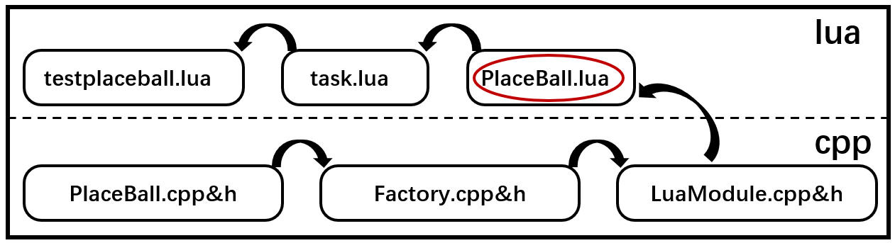

# 如何写一个可以用的skill
##### 2021/1/21    by yh

 写一个可以用skill包括如何写一个skill以及如何让所写的skill能在lua中被调用（如何写接口）。以PlaceBall这个skill为例，我们要做的是如何写一个PlaceBall.cpp，并能够在task.lua中以一个函数被调用。从PlaceBall.cpp到task.lua中间存在多级调用：

接下来我们主要从cpp代码和lua代码两部分展开（以PlaceBall为例）。
## Part 0 准备
开始写新的skill之前需要准备好一套编译好的RBK_RUN_2015。

- [未编译的RBK_RUN_2015的源码](https://gitlab.com/src-ssl/rbk_src/RBK_RUN_2015/tree/cmd-vision-to-owl)
- 编译方法见[软件使用与编译讲解视频](https://jbox.sjtu.edu.cn/link/view/e20d8bf7c0de4c31959e0e786b6c0803)
## Part 1 cpp部分
### 1.1 skill类


skill本质上是一个类，skill的功能通过这个类的函数实现。PlaceBall所对应的类就是CPlaceBall。我们先来看声明类的头文件PlaceBall.h（源码参见：\RBK_RUN_2015\plugins\SSLStrategy\src\ssl\skill\PlaceBall.h）
```cpp
#ifndef _PLACE_BALL__
#define _PLACE_BALL__
#include <skill/PlayerTask.h>

/**  
@brief    处理放球任务
@details  2020中国赛技巧赛*/
class CPlaceBall:public CStatedTask {//CStatedTask是一个有状态的task，维持一个状态机，详情go to defination（PlayerTask.h）
public:
	CPlaceBall();
	virtual void plan(const CVisionModule* pVision);//完成PlaceBall功能的主要函数
	virtual bool isEmpty()const { return false; }
	virtual CPlayerCommand* execute(const CVisionModule* pVision);//有图像信息时保持运行，基本所有skill都有这个函数，相当于是一种规范
protected:
	virtual void toStream(std::ostream& os) const { os << "Skill: PlaceBall\n"; }

private:
	int _lastCycle;
	int _lastRunner;
	CGeoPoint _mePos;
	CPlayerCommand * _directCommand;
};

#endif
```
以CPlaceBall为例，写一个skill的类时需要注意一下几点：

1、CPlaceBall是CStatedTask的派生类，CStatedTask是CPlayerTask的派生类。写类的函数时为了多态性尽可能写成虚函数;

2、实现功能的主要函数（CPlaceBall中的plan）需要有视觉信息（const CVisionModule* pVision）输入；

3、写好的skill需要注明必要信息，具体规范依据参考
```cpp
/************************************************************************/
/* Copyright (c) SRC, Shanghai Jiao Tong University 					*/
/* Team：		SRC         											*/
/* HomePage:	https://gitlab.com/src-ssl                      		*/
/************************************************************************/
/* File:	  PlaceBall.cpp 											*/
/* Func:	  处理放球的skill                       					*/
/* Author:	  Logan Shi, 2020.2.21										*/
/* E-mail:	  loganshi@sjtu.edu.cn										*/
/* Version:	  0.0.1														*/
/************************************************************************/
#ifndef _PLACE_BALL__
#define _PLACE_BALL__
#include <skill/PlayerTask.h>
//······
```
4、写skill时需要用的参数从task()中调用：
```cpp
//cite from \RBK_RUN_2015\plugins\SSLStrategy\src\ssl\skill\PlaceBall.cpp
//······
void CPlaceBall::plan(const CVisionModule* pVision)
{
    //······
	//视觉初步处理
	const MobileVisionT& ball = pVision->Ball();
	const int robotNum = task().executor;
	const int flags = task().player.flag;
	const PlayerVisionT& me = pVision->OurPlayer(robotNum);
	const CGeoPoint myhead = me.Pos()+Utils::Polar2Vector(Param::Vehicle::V2::PLAYER_FRONT_TO_CENTER + newVehicleBuffer,me.Dir());
	const double finalDir = task().player.angle;//获得目标朝向角度
	//const double finalDir1 = task().player.angle + Param::Math::PI * 45 / 180.0;
	const CGeoLine myheadLine = CGeoLine(myhead,Utils::Normalize(me.Dir() + Param::Math::PI/2.0));
	const CGeoPoint ball2myheadLine_ProjPoint = myheadLine.projection(ball.Pos());
	const CGeoPoint targetPos = task().ball.pos;//°ÑÇò·Åµ½¸ÃµãÉÏ
    //······
}
```
### 1.2 cpp中skill类的调用接口


由于rbk中需要大量的skill，所以为了代码的整洁，需要一个规范统一的通向某个skill的类的接口。在rbk中这个接口是Factory。Factory.h的简化代码（只保留一个skill）如下：（源码参见：\RBK_RUN_2015\plugins\SSLStrategy\src\ssl\skill\Factory.h）

```cpp
#ifndef _TASK_FACTORY_V2_H_
#define _TASK_FACTORY_V2_H_

#include <singleton.h>
#include <misc_types.h>
#include "param.h"
/************************************************************************/
/*                         CTaskFactoryV2                               */
/************************************************************************/

class CPlayerTask;
class CTaskFactoryV2{
public:

    CPlayerTask* PlaceBall(const TaskT& task);//调用MakeTask( const TaskT& task )函数

protected:
    template < class CTaskType >
    CPlayerTask* MakeTask( const TaskT& task );//模板类函数，为所有skill提供统一接口
};
typedef NormalSingleton<CTaskFactoryV2> TaskFactoryV2;
/************************************************************************/
/*                 一些包裹(wrap)函数, 方便调用tasks                    */
/************************************************************************/
//! LuaModule中调用skill的接口
namespace PlayerRole{

    CPlayerTask* makeItPlaceBall(const int num, const CGeoPoint target, const double angle);//调用PlaceBall(const TaskT& task)函数
	
}

#endif // _TASK_FACTORY_V2_H_
```
只需要调用"makeIt"--"skill_name"(···)函数（例如PlaceBall是makeItPlaceBall函数，写新skill接口时也需要按照此规范）就可以调用skill_name所代表的skill的类。MakeTask( const TaskT& task )函数的输入参数类型定义如下：
```cpp
//定义在\RBK_RUN_2015\plugins\SSLStrategy\src\ssl\misc_types.h中
/// 任务结构
struct TaskT{
	TaskT() : executor(0){ }
	int executor;				// 执行任务的队员号码
	PlayerStatus player;		// 队员的状态
	stBallStatus ball;			// 球的状态
};
```
    TaskT结构体包含了一个skill所需要的所有任务参数，具体包含哪些参数可以从TaskT开始逐级go to defination。写skill时调用的task()就是CPlayerTask类中定义的TaskT类型的变量。因此可以认为一个skill所需的统一输入参数就是TaskT类型的参数。

接下来我们来看Factory中的三个主要函数是怎么实现的：
```cpp
//cite from \RBK_RUN_2015\plugins\SSLStrategy\src\ssl\skill\Factory.cpp
  CPlayerTask* makeItPlaceBall(const int num, const CGeoPoint target, const double angle)
    {
        static TaskT playerTask;
        playerTask.executor = num;
        playerTask.ball.pos = target;
        playerTask.player.angle = angle;
        return TaskFactoryV2::Instance()->PlaceBall(playerTask);
    }
```
    TaskT类型的数据包含的最基本的参数很多，但是对于某一个skill来说实际所需要调用的基本参数没有那么多。因此"makeIt"--"skill_name"函数只需要skill所需的基本参数作为输入参数即可。
    
    对于新写的skill需要依据格式和实际需求新写一个。


```cpp
CPlayerTask* CTaskFactoryV2::PlaceBall(const TaskT& task) {
    return MakeTask< CPlaceBall >(task);
```
    这个以skill_name命名的函数是"makeIt"--"skill_name"函数调用统一接口MakeTask的过渡接口。

    对于新写的skill需要依据格式和实际需求新写一个。

```cpp
template < class CTaskType >
CPlayerTask* CTaskFactoryV2::MakeTask(const TaskT& task )
{
    static CTaskType taskPool[Param::Field::MAX_PLAYER + 1];
    taskPool[task.executor].reset(task);
    return &taskPool[task.executor];
}
```
    这个统一接口是通过模板类实现的，一般只需要调用它即可。

在为新的skill修改模板类时需要注意以下几点：

1、Factory.cpp中需要include新的skill的类的头文件

2、为新skill添加新函数时需要严格依据Factory中已有的模板

### 1.3 lua与cpp的接口

lua与cpp的接口在LuaModule中实现，LuaModule写在cpp代码中，这意味着这之后的代码就是用lua写的上层代码了。LuaModule作为cpp与lua之间的接口，我们一般不会对它框架做修改。我们只需要知道如何为新写的skill添加对应的符合规范的函数。接下来我们来看LuaModule.cpp的简化代码：
```cpp
//cite from \RBK_RUN_2015\plugins\SSLStrategy\src\LuaModule\LuaModule.cpp

#include <stdio.h>
#include <string.h>
#include <string>
#include "skill/Factory.h"
#include "LuaModule.h"
//#include······

extern "C" {
#include "lua.h"
#include "lualib.h"
#include "lauxlib.h"
}

#include "tolua++.h"
TOLUA_API int  tolua_zeus_open (lua_State* tolua_S);
// have 'c' linkage 
extern "C" {
	typedef struct 
	{
		const char *name;
		int (*func)(lua_State *);
	}luaDef;
}

extern luaDef GUIGlue[];
extern bool IS_SIMULATION;
/*
CLuaModule::CLuaModule()
{
	//······
}

void CLuaModule::InitLuaGlueFunc()
{
	//······
}

CLuaModule::~CLuaModule()
{
	//······
}

static std::string findScript(const char *pFname)
{
    //······
}
bool CLuaModule::RunScript(const char *pFname)
{
    //······
}
bool CLuaModule::RunString(const char *pCommand)
{
    //······
}
const char *CLuaModule::GetErrorString(void)
{
	//······
}
bool CLuaModule::AddFunction(const char *pFunctionName, LuaFunctionType pFunction)
{
	//······
}
const char *CLuaModule::GetStringArgument(int num, const char *pDefault)
{
	//······
}
double CLuaModule::GetNumberArgument(int num, double dDefault)
{
	//······
}
bool CLuaModule::GetBoolArgument(int num)
{
	//······
}
CGeoPoint* CLuaModule::GetPointArgument(int num)
{
	//······
}
void CLuaModule::PushString(const char *pString)
{
	//······
}
void CLuaModule::PushNumber(double value)
{
	//······
}
void CLuaModule::PushBool(bool value)
{
	//······
}
*/
extern "C" int Skill_PlaceBall(lua_State *L)
{
	int runner = LuaModule::Instance()->GetNumberArgument(1, NULL);//获取lua中CPlaceBall(a,b,c,d)的第一个参数a
	double targetPosX = LuaModule::Instance()->GetNumberArgument(2, NULL);//获取lua中CPlaceBall(a,b,c,d)的第二个参数b
	double targetPosY = LuaModule::Instance()->GetNumberArgument(3, NULL);//获取lua中CPlaceBall(a,b,c,d)的第三个参数c
	double angle = LuaModule::Instance()->GetNumberArgument(4, NULL);//获取lua中CPlaceBall(a,b,c,d)的第四个参数d
	CGeoPoint targetPos = CGeoPoint(targetPosX, targetPosY);
	CPlayerTask* pTask = PlayerRole::makeItPlaceBall(runner, targetPos, angle);
	TaskMediator::Instance()->setPlayerTask(runner, pTask, 1);//设置任务的属性。runner表示车号，pTask表示执行的任务（skill），1表示优先级
	return 0;
}


luaDef GUIGlue[] = 
{

	{"CPlaceBall",          Skill_PlaceBall},//CPlaceBall是lua中调用的skill函数，它在cpp中对应Skill_PlaceBall函数
	{NULL, NULL}
};
```
对于新写的skill，LuaModule.cpp中需要做的修改包括：

1、添加"Skill_"--"skill_name"函数,具体添加方式可依据输入参数需求参考其他已有的skill的对应的函数;

2、在luaDef GUIGlue[]中添加cpp与lua之间函数名称的映射：{"C"--"skill_name",          "Skill_"--"skill_name"}。

### 1.4 初步调试
cpp的代码写完之后，首先进行编译，经过一系列debug编译成功之后再开始写lua代码。

## Part 2 lua部分
### 2.1 skill函数

lua中的skill函数可以认为是task.lua中琳琅满目（luan qi ba zao）的功能函数所调用的基本函数，也就是说skill函数之间的功能一般不会有高度相似。PlaceBall.lua的代码如下：
```lua
--cite from \RBK_RUN_2015\bin\lua_scripts\ssl\skill\PlaceBall.lua
function PlaceBall(task)--task 相当于是cpp中TaskT类型的数据，就是表示任务环境
	local mpos = task.target--获取必要的任务环境参数
	local mdir

	execute = function(runner)--让车号为runner的执行skill
		if type(task.dir) == "function" then
			mdir = task.dir(runner)
		else
			mdir = task.dir
		end
		return CPlaceBall(runner, mpos:x(), mpos:y(),mdir)--runner, mpos:x(), mpos:y(),mdir就是skill所需要的基本任务环境参数
	end

	matchPos = function()--目标坐标
		return ball.pos()
	end

	return execute, matchPos
end

gSkillTable.CreateSkill{
	name = "PlaceBall",--定义lua中skill的名字
	execute = function (self)
		print("This is in skill"..self.name)
	end
}
```
在lua中写新的skill时需要注意：

1、一般skill函数都会return execute和matchPos，写的时候尽量按已有skill的框架来

2、skill的名称要与lua文件的文件名相同

3、新写的skill需要在config.lua中注册：
```lua
--cite from \RBK_RUN_2015\bin\lua_scripts\ssl\config.lua
--······
gSkill = {

	"PlaceBall",

}
--······

```
### 2.2 task.···()函数

如上一节所说，task.lua有大量的功能函数，这些函数只是skill函数的部分衍生。task.lua的存在简化了play中对skill的调用。skill的功能往往比较多，而task.lua中的函数则是为了play中的实际需求所写的，能够恰好满足play的需求，从而简化play。task.lua中的placeBall函数如下：
```lua
--cite from 
-- ball placement, 将球放到p点
function placeBall(p)
	local idir
	if type(p) == "string" then
		idir = player.toPlayerHeadDir(p)
	elseif type(p) == "function" then
		idir = p
	else
		idir = player.toPointDir(p)
	end
	
	local mexe, mpos = PlaceBall{target = p, dir = idir}
	return {mexe, mpos}
end
```
对于新写的函数来说，一般需要在task.lua中写一个尽可能简洁的功能函数便于测试代码"test"--"skill_name".lua的调试。在skill的功能完全得到验证之后可以在task.lua中写几个用于分解其功能的函数便于play的调用。

### 2.3 testplay

testplay时用于验证skill的最简单的play，它一般调用task.lua写好的测试函数，TestPlaceBall.lua的部分代码如下：
```lua
--cite from \RBK_RUN_2015\bin\lua_scripts\ssl\play\TestPlaceBall.lua
local TargetPos0 = CGeoPoint:new_local(0,0)
local TargetPos1 = CGeoPoint:new_local(200,200)
local TargetPos2 = CGeoPoint:new_local(-200,-200)

gPlayTable.CreatePlay{

firstState = "run1",
--······
["run2"] = {
	switch = function ()
		if bufcnt(ball.toPointDist(TargetPos1 ) < 10 ,60)then
			return "run3";
		end
	end,
	Kicker = task.placeBall(TargetPos1),
	match = ""
},
--······

},

name = "TestPlaceBall",
applicable ={
	exp = "a",
	a = true
},
attribute = "attack",
timeout = 99999
}
```
写完testplay后不要忘记在config.lua注册它：
```lua
--cite from \RBK_RUN_2015\bin\lua_scripts\ssl\config.lua
--······
gTestPlayTable = {

	"TestPlaceBall",

}
--······
```

### 2.4 综合调试

写完testplay之后还要结合它进行大量的调试。当能完全保证逐级调用的接口没有问题时，基本只需要反复修改和调试Skill的cpp文件。如果在仿真中跑testplay能够实现所设想的功能后就意味着一个能用的skill基本写完了。