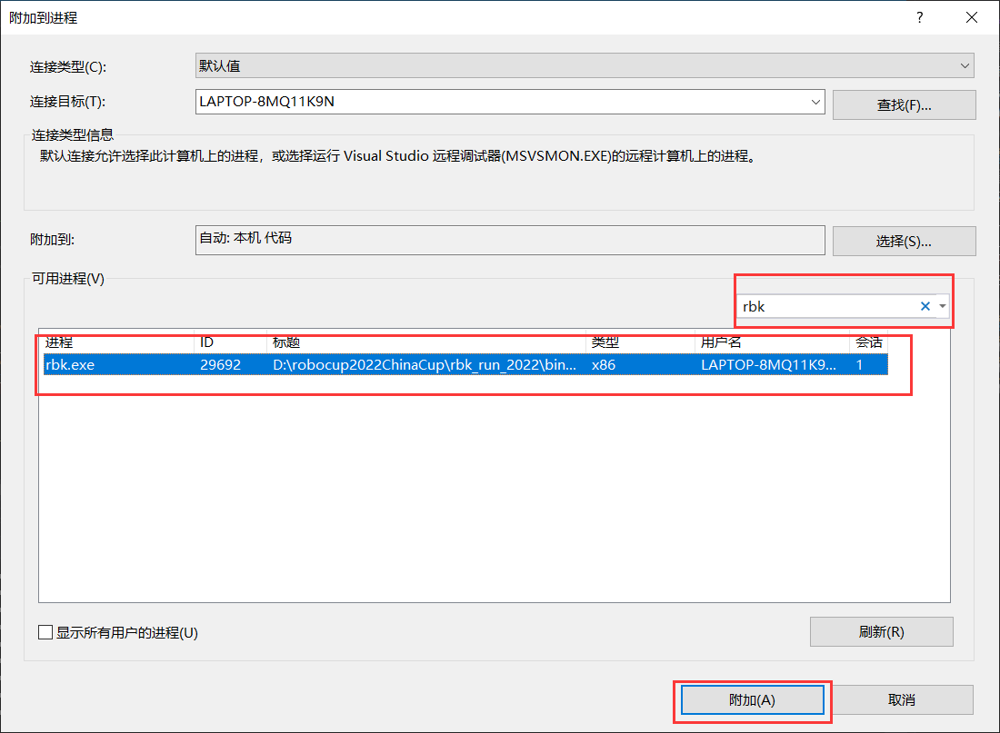
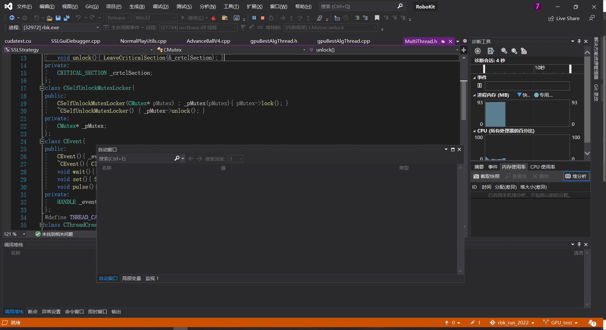
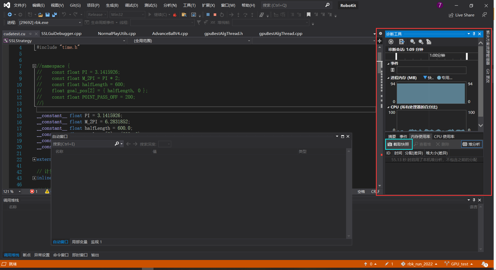
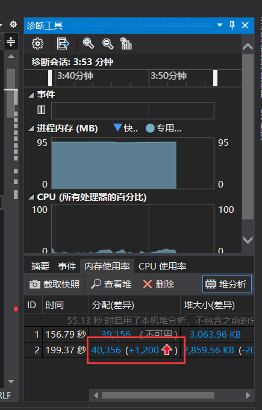
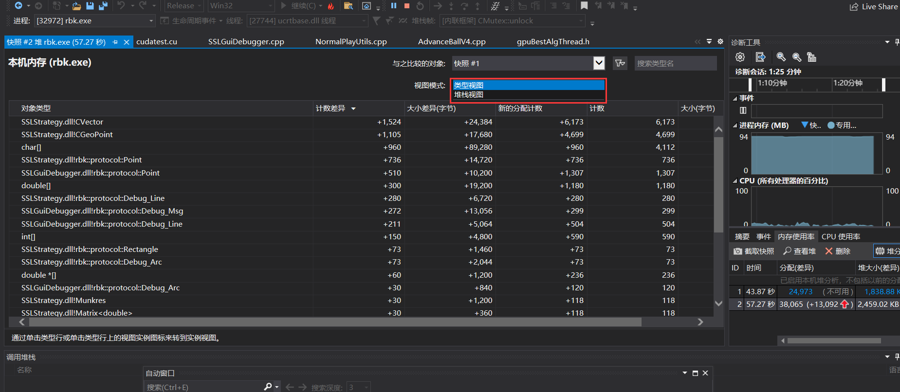

# 如何使用Visual Studio解决可能存在的内存泄漏问题

启动owl2与rbk，打开任务管理器，在进程一栏中观察Robokit.exe的内存占用情况，若其内存占用随时间明显增加，则可能有内存泄漏的问题，使用Visual Studio可尝试定位该问题。

使用VS打开该项目，保持owl2与rbk运行，在VS中选择调试-》附加到进程，在搜索框中输入rbk，选中rbk.exe，然后点击附加

点击后VS将如下图所示：

在右侧诊断工具栏选择点击内存使用率，若下方显示已禁用快照则点击蓝色字体部分启用快照，若没有被禁用或已经启用，则如下图所示：

然后点击青色框中的“截取快照”按钮，一段时间（进程内存占用有明显增加）后再点击一次，点击红框位置的数字

此处视图选择堆栈视图

即可根据计数差异可能发现有些函数在两次截取快照之间的时间内申请的内存远多于释放的内存，则此类函数可能存在内存泄漏的问题。

[参考资料](https://blog.csdn.net/wangshenqiang/article/details/122106880)
