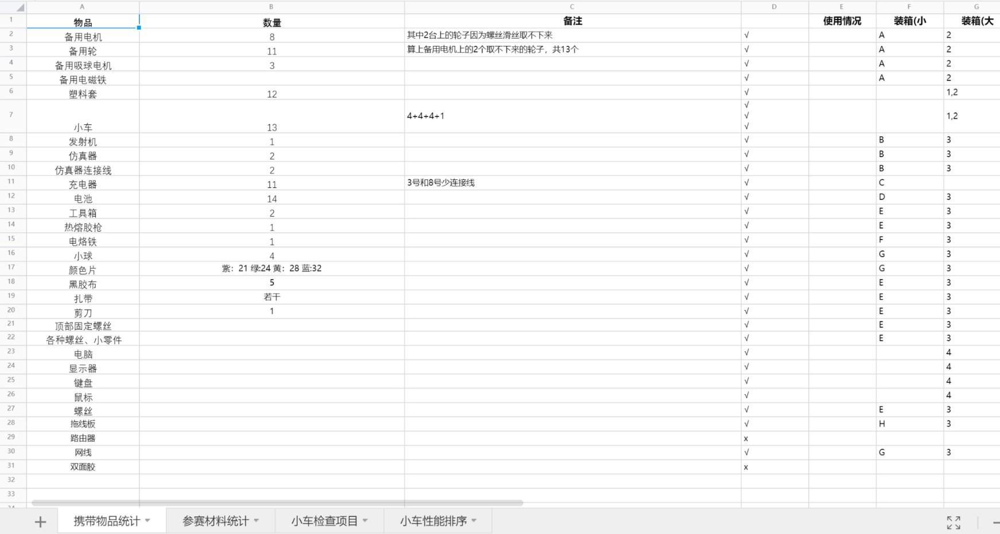
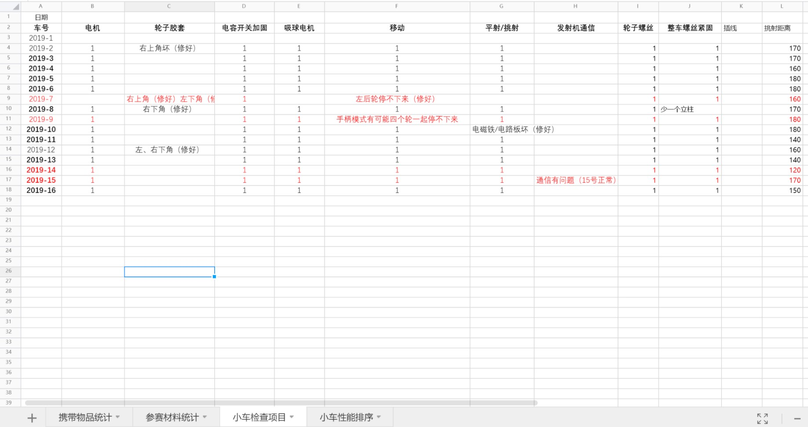
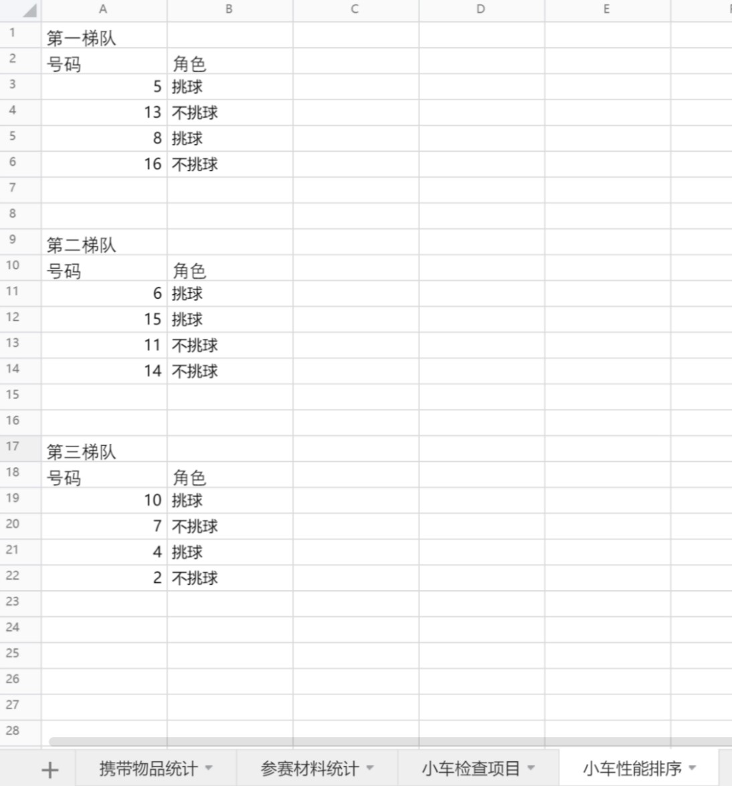
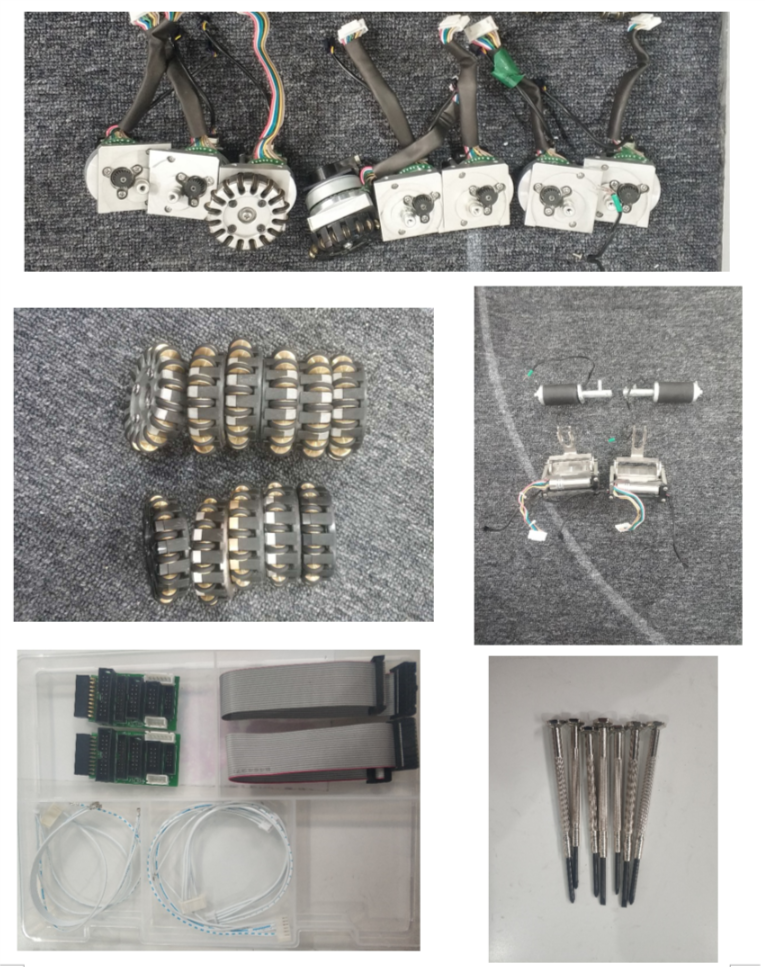
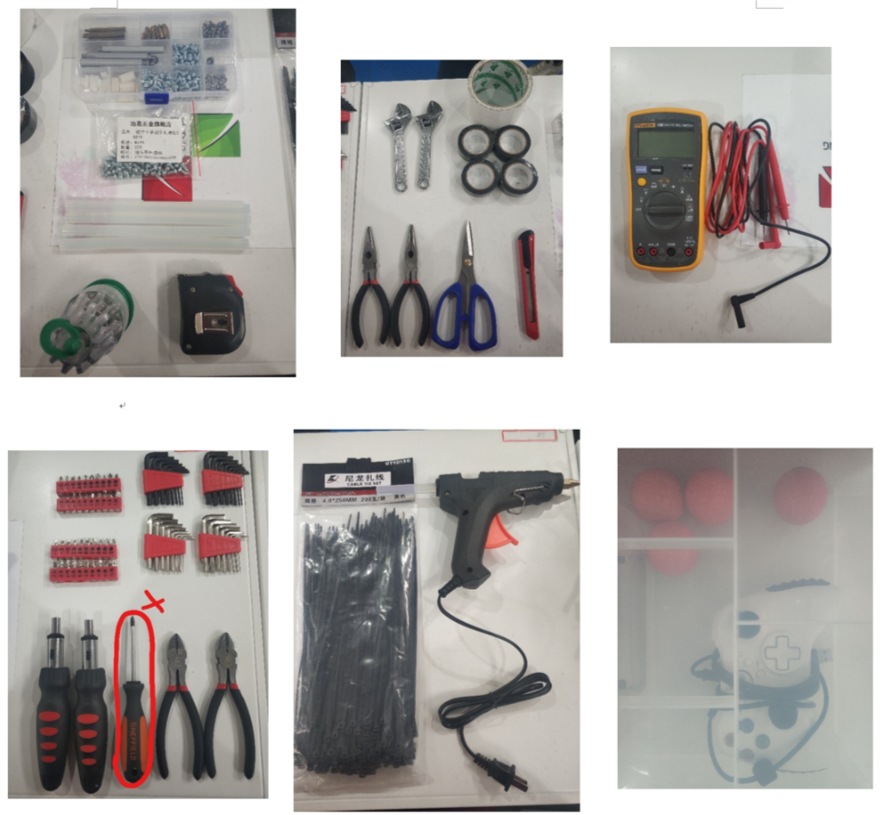

# 2019RoboCup中国赛 硬件管理经验总结

## 一、行前准备
(1)做一个checklist  
checklist要包含的内容分为三个方面：①要带哪些东西，每类东西的数量，要带的零件也都检查一遍，别带着坏的零件去比赛；②对每辆小车的性能进行全方位的排查；③根据小车的性能情况将小车分类，如：第一梯队（首发），第二梯队，第三梯队。

  
(2)养成贴标签编号的好习惯，每一类东西点清数目后就全部贴上标签编好号，便于清点和记录。

 
(3)出发之前所有物品要分类放在收纳盒里，最好给收纳盒也编号，然后记录一下每个收纳盒里都放了什么东西。

## 二、临场硬件管理与维护
**①临场可能出现的事故**
- 剧烈碰撞使得盖子上的螺丝掉下来
+ 与对方机器人在剧烈对抗时，轮子上的小胶套会掉
- 撞坏挑球电机
+ 场地上的草线缠进轮子，使轮子卡住不能转动，需要将轮子拆下来，清除轴承上缠的线
- 小车的编号（num）与盖子的色标对应不上，这样的话跑战术时小车会原地打转

**②分工很重要，列一下都有哪些工作要做，然后把每个人的任务分配好**  

**A.非比赛状态的工作**  
- 调整小车参数、测试小车性能（射球速度/跳球距离等）时要确保使用满电量的电池，如果电池不是满电量，那么测出来的参数误差很大，是无效的。  
检验电池是否满电的方法：用万用表的直流电压档接在电池两端，满电量的电压是16.6V或16.7V  
- 每天在场地上调试完、策略组跑完战术后要将用过的小车全面检查一边，拧一拧螺丝，清一清轮子里的杂草；电量不满的电池要充上电，比赛场地晚上可能会断电，要问清楚，如果断电的话就把电池，充电器和插线板带回宾馆给电池充电。
- 场地上的物品摆放一般很混乱，一定要分清楚哪些电池是满电的，哪些电池是用了一段时间需要充电，哪些电池是刚充上电的，哪些电池是已经充了很久快充满电了；建议把充电器摆放整齐，充电时电池也摆放整齐，不然乱糟糟地堆在桌上很快就分不清了。  
- 每天晚上走之前要将物品分类整理好，不能是一坨乱麻，该带回酒店的要带走，可以腾出几个空的行李箱在酒店和比赛场地之间来回带东西时用。  

**B.比赛时的工作**  
- 比赛前：  
a.全面检查首发车和备用车的情况，盖子色标和车号对应好（千万不能错），然后把盖子的螺丝拧紧（比赛时剧烈碰撞可能会把螺丝撞掉的），每一台首发车和对应的替补摆好  
b.充满电的电池若干个（上半场比赛打完要给所有场上车换电池，换下来的电池也要及时拿过去充电）  
c.准备好各种工具：螺丝刀（最好人手一个，上下半场的时间间隔很短，需要分工好，每一个人负责给一辆车换电池），备用零件（螺丝、小轮的胶套等）  
- 比赛中  
a.有车坏了就及时换它的替补，然后安排1个人开始修坏的车。  
b.上半场结束后抓紧时间换电池，简单检查一下小车有没有问题，时间很紧，任务也多（有4辆车要处理），大家很容易手忙脚乱，建议比赛前就把每个人负责哪辆车、负责干什么分配清楚，到时候按照自己的任务来做