## 导语

本文努力用通俗易懂的语言介绍机器人世界杯小型组比赛

1. 让机器人和人一样的踢足球
2. 如何让车跑起来
    - 基本操作  
    - 策略
3. The Art of the State
4. 写在最后

## 让机器人和人一样的踢足球

RoboCup的初衷是让在2050年左右机器人足球的世界杯冠军和人类世界杯冠军踢比赛。目的是除了像AlphaGo除了有思考，还能结合物理硬件像人一样的物理运动。不妨来思考人自身是如何踢球的，然后教会机器人来学习怎么踢球。

我们不妨以著名球星梅东为例，当他刚出生到成为世界巨星是一个不断加技能树的过程。

小梅东首先获得的技能是移动能力走（技能一），并且在他成长过程中该技能不断的增强，从爬到快速奔跑。虽然有了移动能力，但是只是移动能力是很无助的，连走一条直线都存在困难（不妨可以试试遮住眼睛走能沿着一条轨迹走吗，还不算上转弯）。

梅东在获得移动技能的当时有了眼睛感知的能力，这个技能就厉害了，不说能走直线了，还知道球在哪里，自己位置在哪里，球门在哪里。。。。。。这样梅东就能上场了吗？要是可以的话，每个人都能踢足球了。梅东经过训练学会了最基本的技能，跑，踢球（技能二）。

梅东终于可以上场踢球了，慢慢的发展出来就最基本的一些技术，跑位（技术一），挑球（技术二），平踢球（技术三），盘带（技术四）。

然而好像梅东还是进不了球，为什么？因为经常一个人打多个对手。这时候梅东叫上自己的兄弟们，梅南，梅北…………专门训练了几个好用的战术，还找来一个好门将。梅东现在技术可以冲出亚洲了，但是现在对方防守也有很好的战术，对付每个队伍就那几个战术，很容易被对手破解。

这时候，梅东遇到了瓜瓜奥拉这个好教练，教练针对每个对手都布置了相应的阵型和定位球战术配合。靠着熬夜通宵的跑战术和练定位球，梅东带领球队进了世界杯，在最后的决赛上，靠着定位球战术在比赛2：1领先。

在顺风顺水的时候，裁判掏出了红牌，原来梅冬手球了，被罚下去了，原来梅东的队伍没有专门训练不手球，在最后的时候梅南也被罚下来了。没办法，前锋当后卫使用，还好瓜瓜奥拉训练了四个人的踢球战术和跑位，靠着最后的死顶，终于获得了冠军！  

上面就是足球巨星梅东的故事，现在回到我们的机器人足球队伍。他们也是做像相同的事情。我们将梅冬换成一个机器人，也就是足球机器人世界杯的故事了！

我们重新思考一场足球比赛的层次结构。

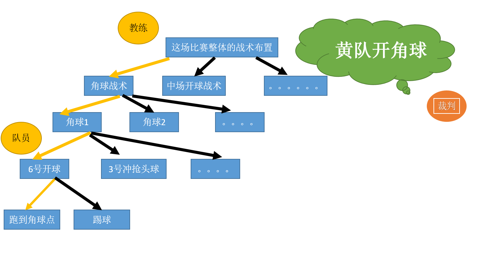

这个就是一场足球比赛的过程

SSL的实现方式，公共的相机给机器人眼睛的功能，策略机分析场上的形势确定要跑的战术，给每个队员分发任务，通过无线射频将命令给每个队员。

## 如何让车跑起来

### 基本操作

主要介绍四个技术，跑，挑，踢，盘带的小车实现

跑点

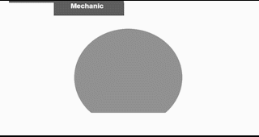

平射

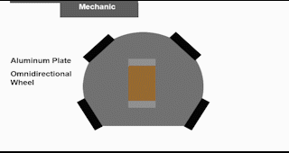

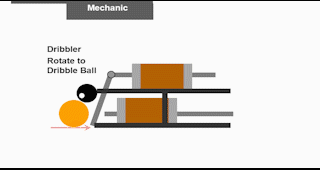  

挑射

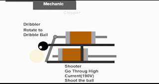

盘带

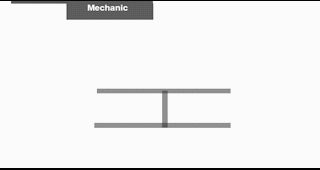

运动控制

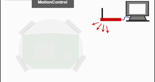

### 策略

主要介绍小车的大脑

策略机与机器人通信

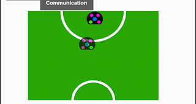

Skill&Agent

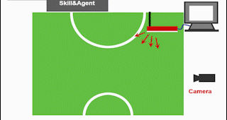

战术

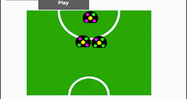

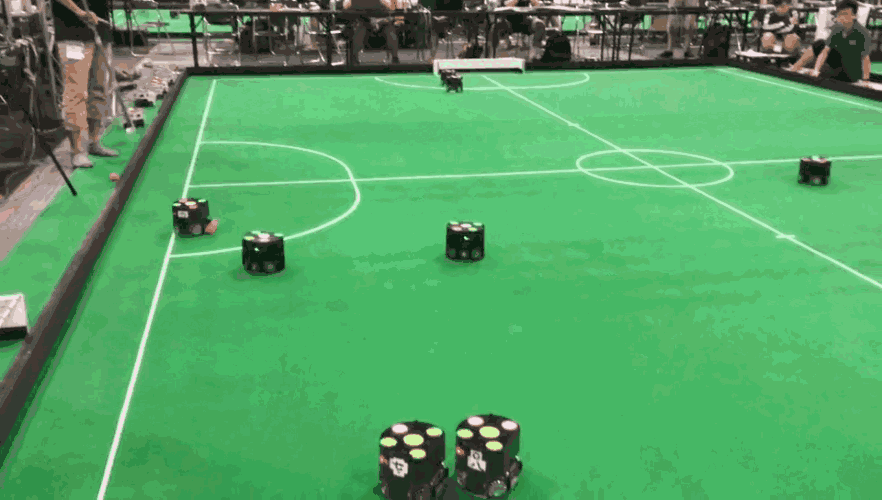

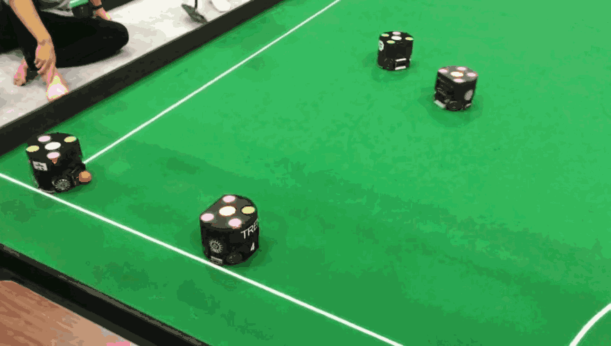

状态机

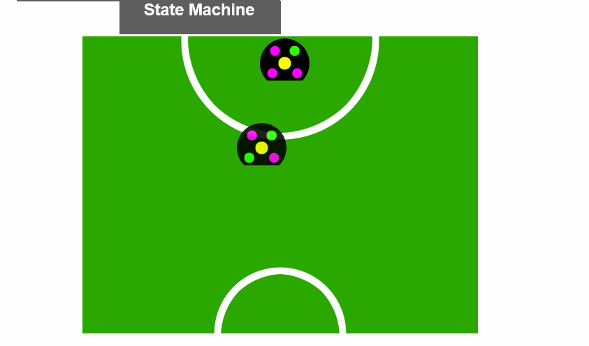

策略

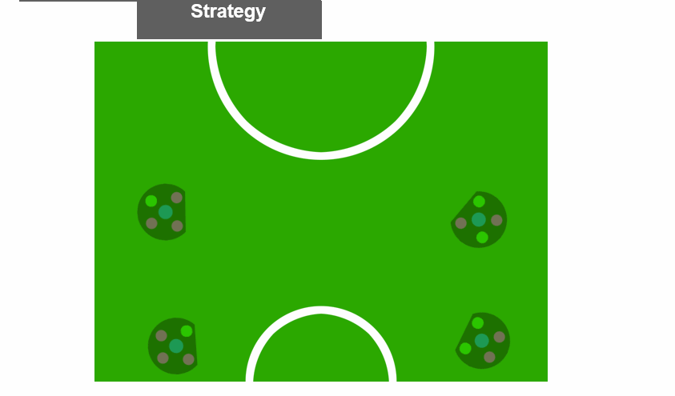

命令从教练到每个队员这一部分都是队伍大脑做的事情：分析场上形势，设计战术，分配任务给每个队员

## The Art of The State

瓶颈和高级玩法

小车硬件：和梅东相似，基本功能不能加拓展，只能持续升级，其中如果盘带技术好，就可以玩很多的骚操作！！！当然我们的挑球和跑也是有很大该进的空间。

策略软件：AI Agent：概况而言，在场上做最有益的事！如何判断现在高度动态环境和制设计好战术。（此处脑补瓜瓜奥拉的脑袋上头发数量）

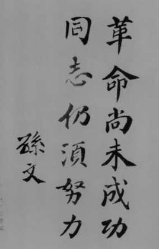

## 写在最后

打比赛最大的特点之一，相比骚操作和高级玩法，没有短板和bug是更为重要的！就像梅东的手球，没有训练好就非常的危险！

One more thing，写代码时候想的或者仿真上跑的效果和实车跑的距离与你和梦中女神的现实距离是差不多的！

