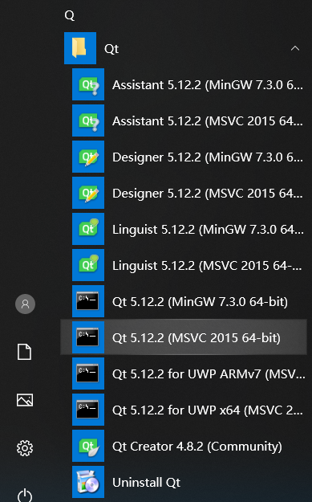
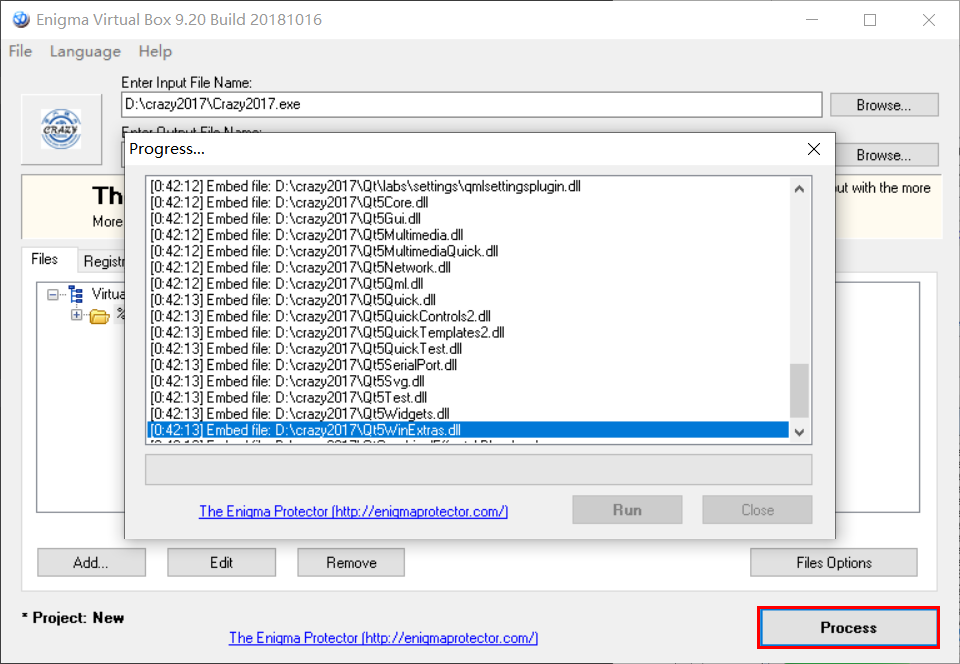

## 来源及内容

+ [本教程借鉴博客](https://blog.csdn.net/helaisun/article/details/51810082)
+ [下载网址参考](http://c.biancheng.net/view/3851.html)
+ [最新补充内容来源](https://www.cnblogs.com/FairlyHarmony/p/11324659.html)
+ [QT5软件开发入门教程+配套所有代码](https://jbox.sjtu.edu.cn/l/N10IED)

包括以下内容：

1.  通过Qt5生成可执行文件，在没有装Qt库的机子上也能运行。
    
2.  将一个包含可执行文件的文件夹（包含各种链接库）生成一个单独的可执行文件

3.  压缩文件夹里的dll链接库（大约可节省1/2的空间）

注：关于Qt，这里只介绍编译等基本操作，保证能够生成软件成品。编程开发中的更多使用方法请见上述教程，很详细

## Qt5生成可执行文件（以crazy2017为例）

### 环境配置

1. 安装Qt

这里提供两个安装的途径，版本在4.12及以上即可
- 前往 [Qt 下载](http://download.qt.io/archive/) 进行下载，选择其中的online installer进行下载，因为这样后面的选择空间比较大，且本身下载下来的文件并不大
- 下载 [sjtug镜像](https://mirrors.sjtug.sjtu.edu.cn/qt/archive/qt/5.14/5.14.2/qt-opensource-windows-x86-5.14.2.exe) ，下载后打开，首先需要注册一个qt账号

然后就一路下一步，选择合适的组件，注意与电脑位数相符:
- MSVC2015使用时需要visual studio2015及以上版本的工具集，MSVC2017同理，下载vs工具集的方法见下文。还有Windows software kits中的debugger项需要一并安装
- MinGW可以直接进行编译

然后等待下载安装完成

2. 安装vs工具集

使用vs的配置工具进行下载

如要安装vs2015工具集，只需在安装的时候在单个组建里选择：安装2015工具集，注意与电脑位数相符

然后点击安装即可

### 检查配置

打开QtCreator，在项目的manage kits下查看自己之前下载的kits是否均处于可用状态（黄色叹号为不可用）

mingw通常均可用，msvc是否可用取决于是否下载过该版本的vs工具集和Windows software kits中的debugger项。前者可以使用vs的配置工具进行下载，后者可以在控制面板中找到Windows software management kits进行安装
- 如果在安装时漏装组件，不建议使用mainteinance工具，国内的镜像源由于某种原因均无法搜索到需要补装的组件，建议卸载后重新运行安装程序

### 编译项目

利用QtCreator打开项目中的.pro文件，以release方式生成可执行文件（debug方式类似，只是生成的文件偏大），需要配置一下编译环境，选择可用的kit以及合适的路径：
- Shadow build：自动把编译生成的文件放于下方的目录中，否则都生成在源代码目录中

编译前check以下两个地方都是对的

大家编译的时候可能会遇到的问题：
- 如果如下图所示，只要找到语句附近的中文注释，在中文注释之后在加两个//就可以解决👀

- 若显示'rc'不是内部或外部命令，是由于rc.exe未添加到path。在window software management kit文件夹中找到rc.exe所处路径，在系统环境变量中将其添加至path项中即可

编译通过会显示如下信息，软件随之在Qt中运行

注意这时生成的 *.exe文件是不能独立运行的，需要很多外部.dll文件：

### 添加依赖

如Crazy2017.exe在D盘的crazy2017文件夹中，启用Qt自带的windeployqt，将Crazy2017.exe运行需要关联的dll文件拷贝到该路径下，

在开始菜单找到Qt的命令行工具，需要和上面用的msvc保持版本和操作系统位数一致，运行打开Qt命令行，

针对D盘下的crazy2017文件夹，输入命令行： cd D:\crazy2017，切换到crazy2017文件夹目录下。注意，如果Qt命令行和crazy2017文件夹不在同一盘，需要先切换盘符，如 d: 是切换至D盘

然后使用windeployqt工具，输入命令行

> windeployqt Crazy2017.exe --qmldir D:\Qt\5.12.2\msvc2015_64\qml

由于我们使用的是Qt Quick构建的Crazy2017，界面用qml语言编写，所以需要提供对应工具的PATH，我的是--qmldir D:\Qt\5.12.2\msvc2015_64\qml。如果未用到qml，则可以不用 --qmldir 及之后的语句

在后续实践中有时会遇到打包后无法打开的情况，此时请尝试将上述命令行改为

> windeployqt Crazy2017.exe --qmldir D:\Crazy2017\src\qml

其中 D:\Crazy2017\src\qml 为我的电脑上Crazy2017中qml文件所在的路径

就可以执行拷贝CRAZY2017.exe文件关联的dll文件到crazy2017目录下面了，再看看D盘下的crazy2017文件夹，所需要的dll文件都已经拷贝进去了，

可以打开crazy2017文件夹，里面的Crazy2017.exe可以运行了，此时crazy2017文件夹的总大小约80M，

现在这个文件夹里的Crazy2017.exe就可以在其他没有装Qt的Win上运行了

## 生成单个可执行文件（以刚刚生成的Crazy2107为例）

使用的软件叫做Enigma virtual Box，这里给出[官方下载连接](https://www.enigmaprotector.com/en/downloads.html)

安装好后的界面如下

运行提前安装好的Enigma virtual Box，"Input File Name"项选择可执行文件Crazy2017.exe，“Enter Output File Name”选择待生成的单个可执行文件存放位置。点击“Add...”选择“Add Folder Recursive”添加dll文件所在的文件夹，选择D盘下的crazy2017文件夹。

注意，需要把该文件夹路径下的非dll文件，如参数配置文件（.ini、.xml）、记录文件（.log）提前取出，否则将会编入可执行文件中，增加文件大小且之后无法更改参数。

最后一步是点击"Process"，即可自动生成所需的单个可执行文件。生成的单个可执行文件有81.7M大小:

这样的.exe文件可以跨电脑直接运行，在很多方面都很方便，但我们认为它还是有点大了，所以我们可以对它进行压缩。

## 压缩dll链接库

我使用的是upx对dll文件进行压缩，给出upx的[官方下载地址](https://upx.github.io/)

下载upx，并将其解压到D盘下面，因为不同版本的文件夹名称不同，我直接改成了D:\upx

运行电脑的命令行，依次输入 d: 和 cd D:\upx  (如果cd不了可以直接在D:\upx文件夹里的地址栏打上cmd再回车)

再次输入命令行：

>   upx.exe D:\crazy2017\*dll

这样就能将crazy2017下的所有dll文件进行压缩了，下图可以看出压缩后的文件比压缩前的文件小了60%多，

当然你也可以如法炮制对iconengines等文件夹下的dll文件进行压缩

但不能对platforms、Qt、QtQml、QtQuick、QtQuick.2文件夹中的dll文件进行压缩，否则crazy2017文件夹下的Crazy2017.exe不能正常运行，.exe文件可以压缩，但不能用来生成单个可执行文件

子文件夹我只压缩了'imageformats'和'virtualkeyboard'内的dll，压缩完后，整个crazy2017文件夹的大小变为43.7M,比原来的80M小了一倍左右。

这时重新用Enigma virtual Box将crazy2017文件夹内的Crazy2017.exe进行制作成单个可执行文件，发现制作后的可执行文件大小为45.5M，相比较未压缩dll文件制作的单个可执行文件81.7M小了约一半。

写到这里，将自己写的Qt程序生成单个或者是简单压缩以单个文件夹的形式使用基本可以满足需要了。文中最后生成的.exe文件基本满足使用需要，但还是稍大了一些，进一步精简体积还是要从代码入手，减少代码的冗余。

