# SRC软件算法组 开发环境搭建教程
___

--- by 陶涵 23.11.15

## 1.必要软件安装
+ Git Bash与Github注册
    - 采用Git进行代码管理，同时注册一个Github账号
    - 参考[Git Bash教程](https://blog.csdn.net/qq_36667170/article/details/79085301)进行配置
    - 全部完成后可以输入`ssh -T git@github.com`命令行后看是否能够正常连入你的Github
    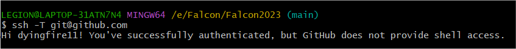
+ Cmake安装
    - 为什么要使用Cmake：gcc将源文件编译成可执行文件或者库文件；而当需要编译的东西很多时，需要说明先编译什么，后编译什么，这个过程称为构建，常用的工具是make。而我们的代码体系较为庞大，需要通过CMake软件更加简单的定义构建的流程。
    - 代码从Github上pull下来后需要通过Cmake进行编译
    - [CMake官网](https://cmake.org/)
    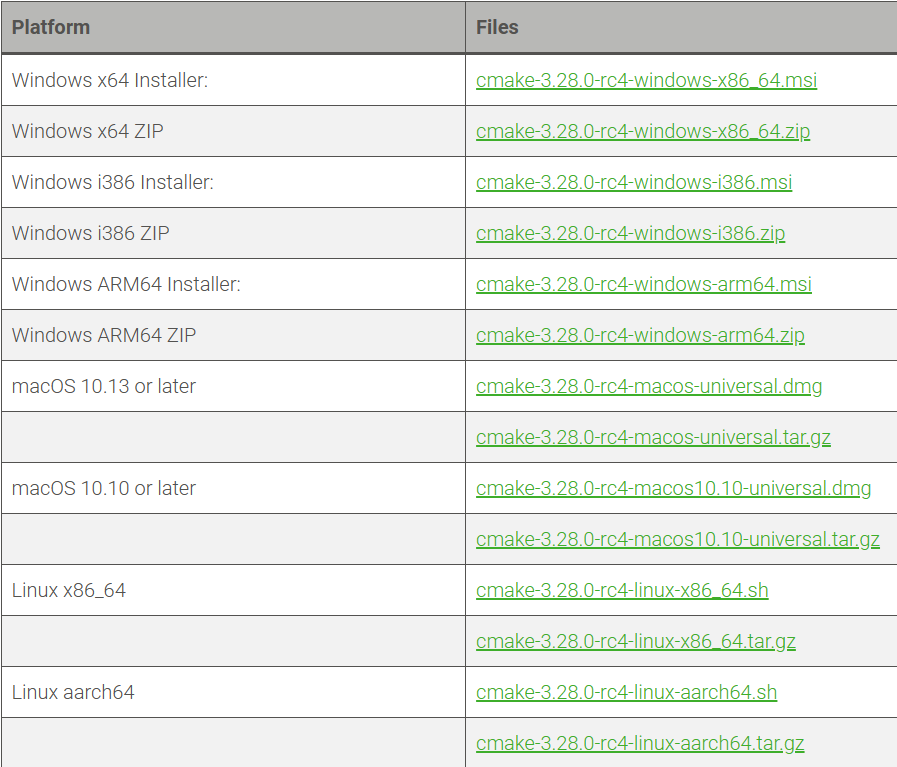
    - 进入官网后找到合适自己电脑对应的Cmake版本即可，可以选择3.28。
+ Visual Studio
    - 我们的项目需要通过Visual Studio进行编辑运行，建议下载Visual Studio 2022
    - [VS](https://visualstudio.microsoft.com/zh-hans/vs/)官网，安装过程所需项目勾选含有本地cpp开发的选项即可，注意更改安装路径（占用空间很大）
    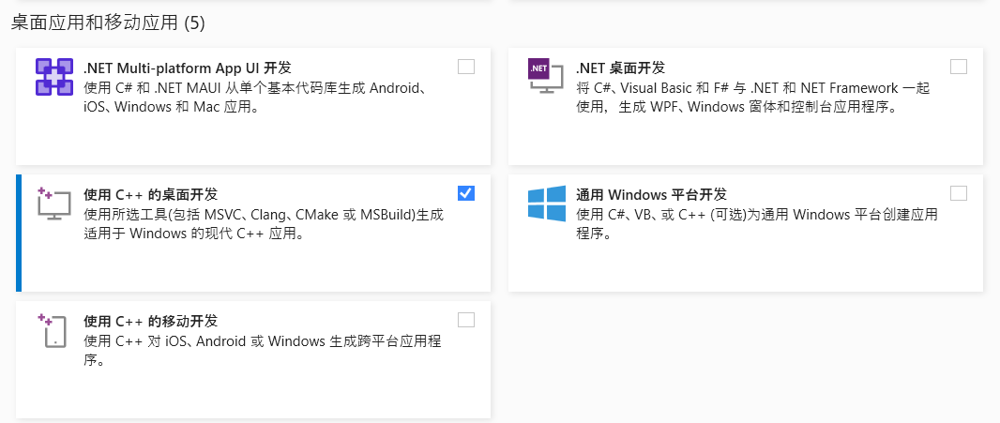
    - 完成界面
    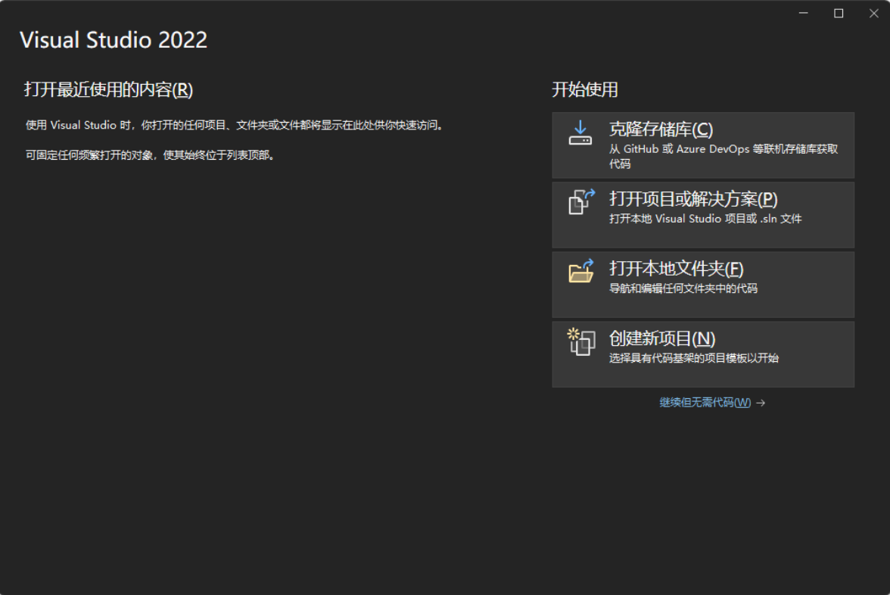
---
## 2.Falcon环境配置
### 编译准备
+ Qt
    - [Qt安装器下载](https://jbox.sjtu.edu.cn/v/link/view/da696e5c2f7c40aa9c797437aada7f06)
    - 进入到 Qt 安装器所在的文件夹内，打开终端
    - 输入以下命令 （使用清华镜像源下载比较快）
        ```
        .\qt-unified-windows-x64-4.5.1-online.exe --mirror https://mirrors.tuna.tsinghua.edu.cn/qt
        ```
    - 回车之后，开始进入到 Qt 安装阶段。
    - 在窗口内输入个人的 Qt 账号和密码（如果没有的话，需要先注册，否则无法进行下一步），完成后单击 下一步
    - 勾选界面中的同意协议及声明是个人账号，完成后单击 下一步
    - 点击 下一步
    - 根据个人习惯选择是否提交信息给Qt官方，完成后单击 下一步
    - 根据个人习惯，确定软件的安装目录，这里勾选 Custom Installation 即可，同时根据个人习惯确认是否将文件建立关联，完成后单击 下一步
    - 如图勾选安装组件，只需要勾选Qt/Qt 5.15.2/MSVC 2019 64-bit，其余全部取消勾选，完成后单击 下一步
    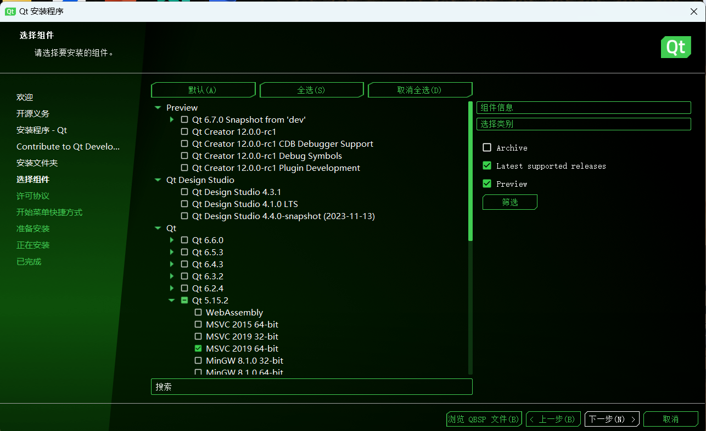
    - 勾选同意许可协议，完成后单击 下一步
    - 默认即可，单击 下一步
    - 单击 安装 开始安装，接下来等待其安装完成
    - 安装完成，单击 完成 即可
---
### 编译方法
+  Windows :
    - 修改 cmake/GetThirdParty.cmake 中的 QT 部分，输入自己电脑上的 QT 路径，例如：
        ```
        set(CMAKE_PREFIX_PATH "D:/QT/5.15.2/msvc2019_64/lib/cmake/Qt5")
        ```
    - 使用 CMake Gui，输入源代码所在目录和编译目录，如：
        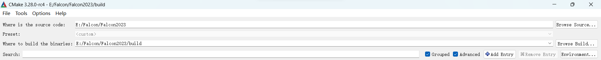
    - 点击 Configure
    - 如图选择，点击Finish

        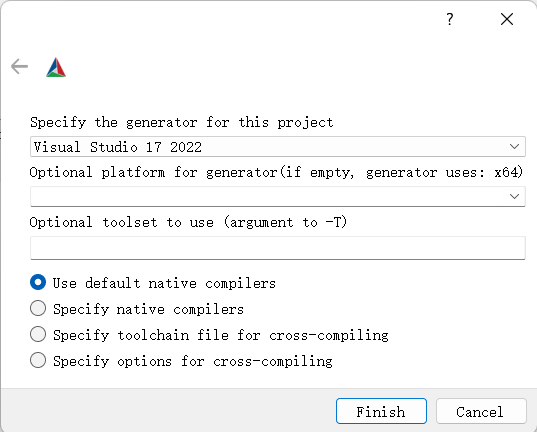
    - 完成后无报错，点击 Generate，再点击 Open Project
        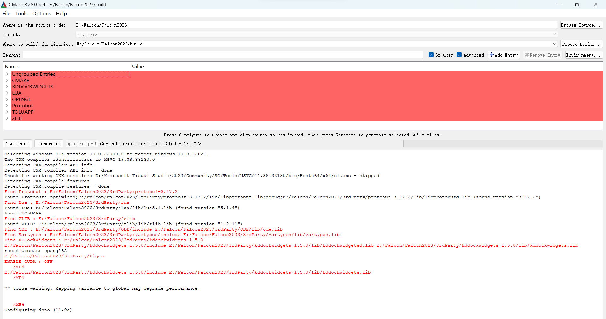
    - 在 vs 中选择 Release x64 模式

        
    - 点击生成解决方案，没有报错则完成

        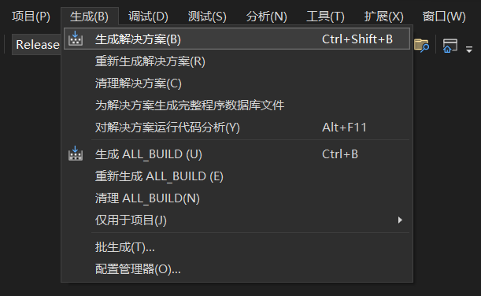
        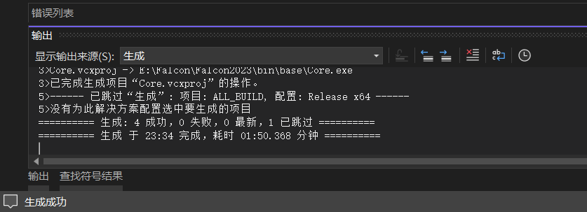
    - 运行 bin/package.bat，首次编译或更换 QT 路径时需删除 package.txt 重新输入路径,如：
        ```
        Where is QT QML : D:\QT\5.15.2\msvc2019_64\qml
        Where is Client QML : D:\Falcon_2023\Client\src\qml
        ```
    - 如果发现 cmake 载入路径有误，则先点击菜单栏中的 File/Delete Cache，做有必要的调整后再重新 Configure 和 Generate
        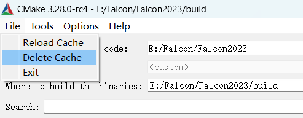
    - 如果觉得生成过慢，可以更改 cmake/Utils.cmake，之后重新 Configure 和 Generate。下述用了4核并行编译，可以查看电脑有几核，适当设置多些，但不建议给满
        ```
        ProcessorCount(N)
        if(N GREATER_EQUAL 4)
 	        set(N 4)
        endif()
        ```
+ ubuntu :
    - 具体编译方法见B站，搜索"Rocos环境配置"
---
#### CUDA配置
[参考文档](https://github.com/sjtu-src/Wiki/blob/master/docs/Algorithm/%E5%8A%A0%E5%85%A5cuda%E7%9A%84falcon%E7%BC%96%E8%AF%91.md)
+ CUDA下载
    - 首先电脑得有NVIDIA显卡，然后命令行输入nvidia-smi查看当前驱动支持的最高CUDA版本
        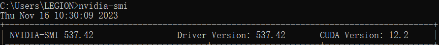
        如果低于12.0就需要升级显卡驱动
    - 推荐下载CUDA12，安装教程网上多的是，不再赘述了
    - [CUDA下载官网](https://developer.download.nvidia.com/compute/cuda/12.0.1/local_installers/cuda_12.0.1_528.33_windows.exe)
    - [交大云盘备份](https://jbox.sjtu.edu.cn/l/k1G4BM)
---
+ VS配置
    - 点击上方菜单栏工具->选项->文本编辑器->文件扩展名，在扩展名栏中输入.cu，并选择编辑器为：Microsoft Visual C++
        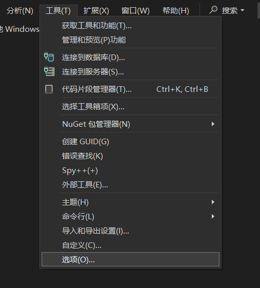
        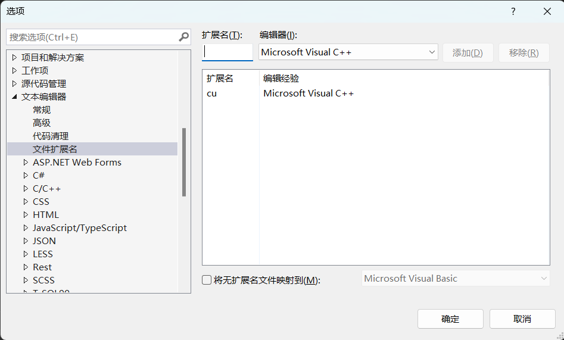
    - 工具–>选项–>项目和解决方案–>VC++项目设置，添加要包括的扩展名".cu"
        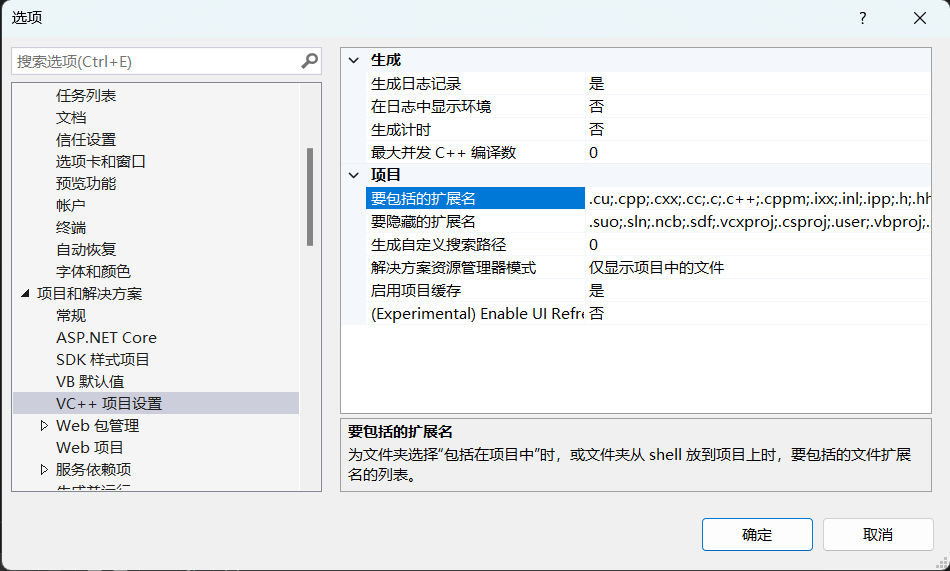
    - 打开解决方案管理器

        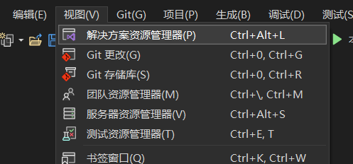
        
        找到Core

        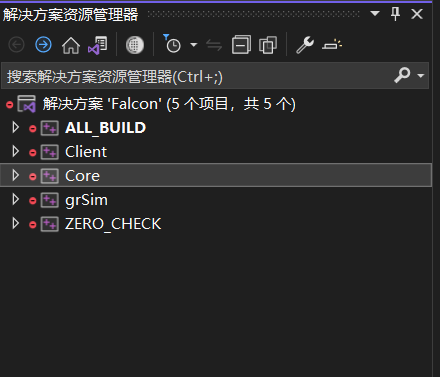

        右键Core–>生成依赖项–>生成自定义–>勾选CUDA v12.0

        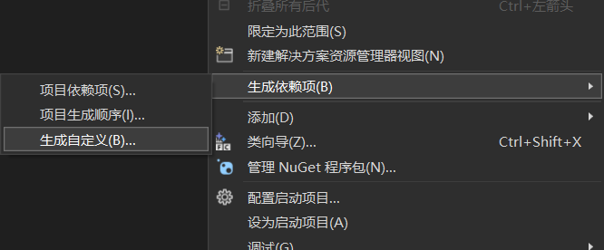
        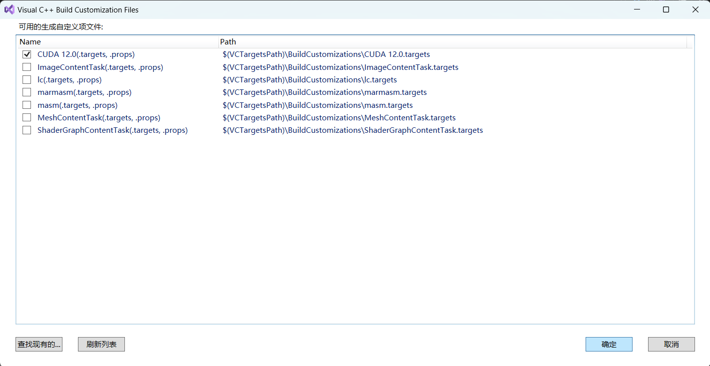

        如果这里找不到CUDA12.0，可以参考这篇[博客](https://blog.csdn.net/a7_aaaaa/article/details/122470988)，或者重装CUDA。如果CUDA路径下没有找到visual_studio_integration，可能要重新安装CUDA
    - 在解决方案管理器搜索栏输入 cudatest.cu
        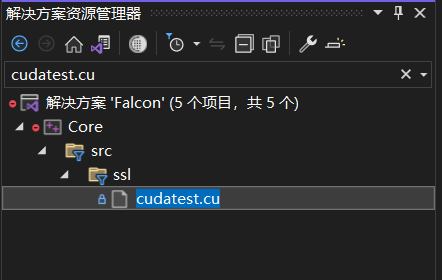

        右键cudatest.cu->属性->配置属性->常规->项类型->CUDA C/C++

        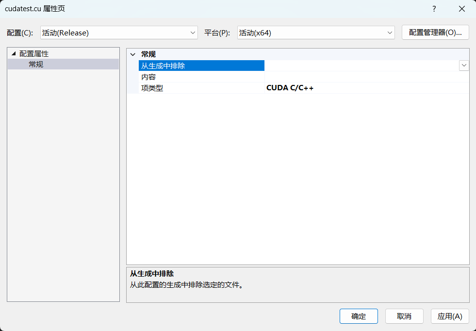
    - 配置cuda的lib，右键Core->属性->链接器->输入->附加依赖项中填入:cudart_static.lib与cublas.lib

        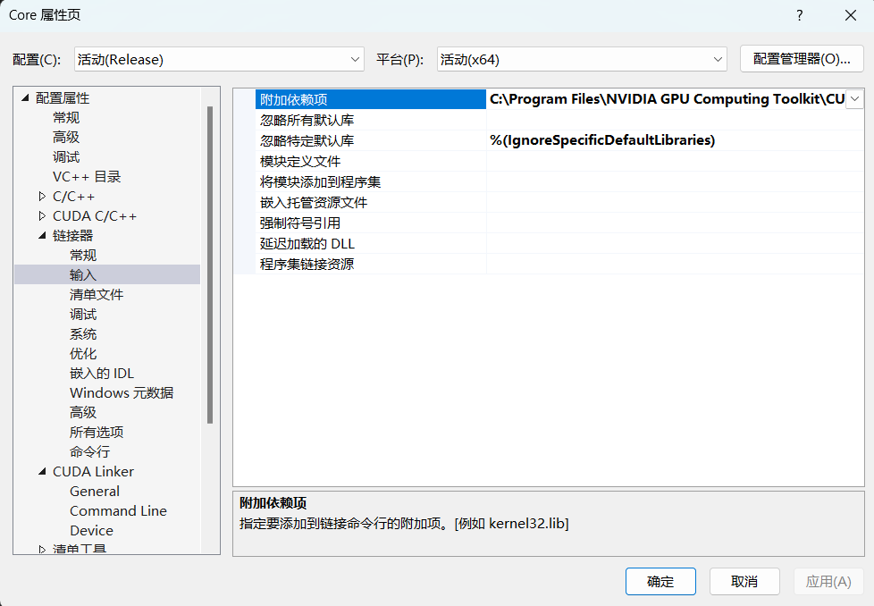

        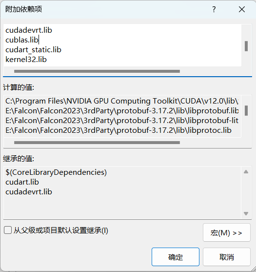
    - 右键Core->属性->配置属性->CUDA C/C++->Common，在CUDA Toolkit Custom Dir处填入CUDA路径即可，如：
        ```
        C:\Program Files\NVIDIA GPU Computing Toolkit\CUDA\v12.0
        ```

        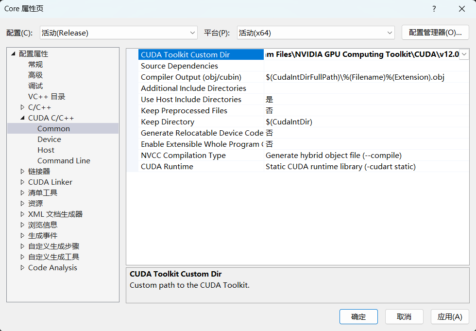
    - 生成解决方案，可能会报错

        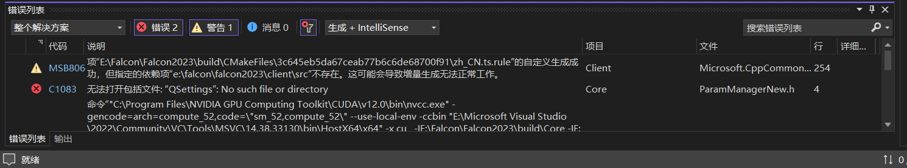
    - 将 cmake 中的 ENABLE_CUDA 置为 ON

        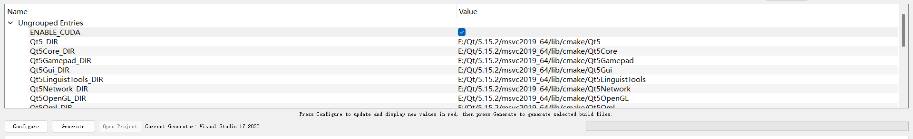

        重新Configure->Generate->Open Project
    - 再次生成解决方案，出现以下信息即配置成功

        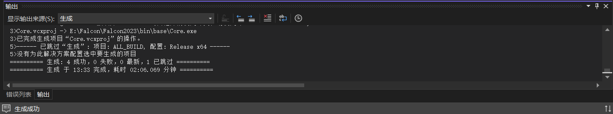


