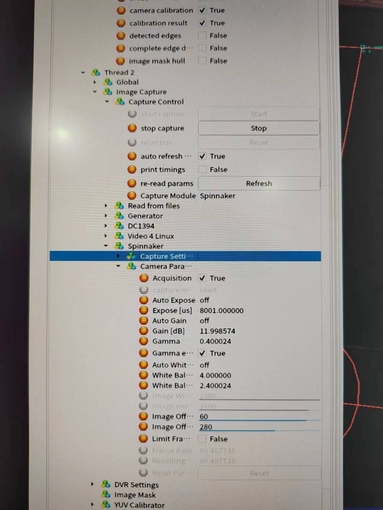

Author:	Xuanming Shang

[TOC]

# Ubuntu 20.04

[教程](https://zhuanlan.zhihu.com/p/617640635)

- UltraISO官方免费试用版就够用
- 进入bios模式每台电脑的快捷键都不太一样，在开机界面会有短暂显示
- 后续硬盘空间分配可不按照帖子内进行，“交换空间”“主分区”“数据分区”可成比例放大
- 刚开始使用ubuntu时部分必要库可能没有安装，可通过apt自行安装

# 基础技能

## Linux CMD

- cd, ls, mkdir, touch, cp
- sudo, chmod
- **lsusb**, **dmseg**

## Vim

- `i`进入编辑模式，`Esc`退出编辑模式
- `:`进入命令模式，`w`保存，`q`退出，后加`!`进行强制操作
- `shift`+`g`跳转至最后一行

## clash

1. home目录下新建clash文件夹
2. 下载clash安装包解压到上述文件夹中
3. 命令行输入`wget -o config.yaml "<clash的订阅链接>"`
4. 下载[GeoLite2-Country](https://gitee.com/mirrors/Pingtunnel/blob/master/GeoLite2-Country.mmdb)，修改文件名称为`Country.mmdb`导入clash文件夹中
5. 用chmod修改解压文件的读写权限
6. 运行命令`./clash-linux-amd64 -d .` 或 `./clash-linux-amd64 -f <第三步生成的文件> -d .` 即可

## ip相关

有线网络设置ip、mask、gateway（与falcon使用端搭配进行设定）（缺详细补充）

# SSL-Vision

## 安装

[github地址](https://github.com/RoboCup-SSL/ssl-vision)

1. Dependency(esp. cam version) : `InstallPackagesUbuntu.sh`
2. Install Camera driver: eg. SPINNAKER and FLYCAP SDK	安装过程中执行其readme中section1~3即可完成配置 
3. Compilation: 先设定对应的硬件驱动eg. `cmake -B build -DUSE_SPINNAKER=true`，后对ssl-vision进行编译`make`

## 运行

```
$ cd <SSL-Vision所在目录>
$ sudo su
(enter password:) ssl
$ ./bin/vision
```

变量树中点击Thread 0->Image Capture->Capture Control->start capture打开对应摄像头

另外可在Thread 0->Visualization中控制可视化参数（如果处理后的帧率过低可关闭可视化）

## 配置

1. 场地：变量树中Global->filed configuration->models中选择场地A/B，设定total number of cameras/local number of cameras
2. 摄像头：设置摄像头变量树中Thread0->Image Capture->Capture Control->Capture Module更改为Spinnaker
3. 摄像头参数：变量树中Thread0->Image Capture->Spinnaker->Camera parameter参照先前已经配置好的视觉机中的参数
4. 色卡标定：右侧边栏YUV Calbration
5. 场地标定：右侧边栏Camera Calbration先update control points后拖动蓝点到场地标定位置后依次点do initial calibration/detect additional calibration points/do full calibration即可
6. 其余Thread重复上述操作

## debug

1. 开启时检查摄像头参数
2. 若vision中途崩掉，先关机，保持摄像头顺序不变的情况下进行插拔，检查线连接情况。没问题后开机，重开视觉检查是否有问题。若视觉摄像头顺序错乱，需要重新调整右侧边栏Camera Calbration中摄像头编号，并依次调整场地标定点，摄像头设定高度3000~3500mm。
3. 若出现视觉能够发包且有内容但是图像上没有车显示的情况，需检查global设置中针对球和车的过滤像素数量上下限，保证球和车不被滤掉，能够正常显示。
4. 经过排查发现以上均正常，可进一步检查摄像头性能，利用lsusb确定摄像头usb位置，进入系统设备管理目录中，对相应的usb利用chmod 777赋予权限，打开spinnaker检查摄像头图像显示，若有问题更换新的摄像头。

附：推荐摄像头参数



# AutoRef & GameController

## 安装

[github地址](https://github.com/TIGERs-Mannheim/AutoReferee)

- Version: V1.0.0
- Notation: gamecontroller在本版本中不是默认包含的，需要在run时额外添加指令调用

1. Environment (JDK17): 请参考[教程](https://www.cnblogs.com/shenyuanhaojie/p/15744357.html)（extra. 需要在 /etc/environment 中配置JAVA_HOME环境变量）
2. Build: `./build.sh`

## 运行

`./gradlew :run -PcompactBuild=false`

## 配置

Autoref和GC的端口需要对应

# SSL Status Board

[github地址](https://github.com/RoboCup-SSL/ssl-status-board)

- Version: V2.10.0
- Configuration: 直接下载release即可，注意对应电脑系统和架构
- Usage: 连接网线，运行app