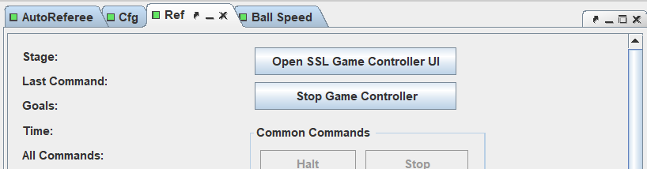

本篇文档介绍Tigers-AutoRef的常规操作和参数配置

## 关于软件

- Tigers-AutoRef是由德国TIGERs Mannheim队伍研发的自动裁判系统，现已被世界赛、中国赛等各级赛事采用，用于对场上机器人行为进行自动判罚，减轻了人类裁判的负担，也在一定程度上维护了比赛的客观公正性，加强了比赛的流畅度
- 软件运行的基本原理分为视觉处理、局势判断、生成判罚
  - 视觉处理：接收裸视觉，经过卡尔曼滤波等处理得出更为准确的位置、速度信息
  - 局势判断：接收裁判指令（Halt、Stop……），结合视觉得出当前场上形势
  - 根据规则判断有无犯规行为
- 软件还融合进了GC(gameController)，可以为其提供滤波后的视觉，丰富判罚种类，并且可以反馈自动判罚结果，使其能够自动发送裁判指令
- 以上两个软件配合，可以形成一个较为完整的裁判逻辑
- 该软件由java语言编写，有一定的语法学习门槛，但看懂逻辑难度不大，且功能的模块化做得很好，可以学习学习

+ [Tigers-AutoRef](https://github.com/TIGERs-Mannheim/AutoReferee)
+ [gameController](https://github.com/RoboCup-SSL/ssl-game-controller)

## 常规操作

软件自带的README中的描述不算详细，这里结合使用经验再说一说

### 编译

- 请提前配置版本合适的java环境（详见README）
- 运行build.sh/bat或者使用IntelliJ编译

### 运行

- 运行run.sh/bat

### 界面介绍

主界面，由多个不同功能的页面组成，每个页面都可单独拖出或取消，方便使用

#### 下拉栏

- File：退出软件
- Replay：录制及回放功能，暂时没用过
- Layout：保存、设置分页面的组合方式，不重要
- Views：打开分页面

#### Visualizer

可视化页面，展示场地情况和部分绘制的debug信息，上栏的一系列选项用于选择展示的信息

#### Ball Speed

- 展示球速，红线为限制球速（6.5m/s），绿线为估计的踢出球速，蓝线为滤波得出的当前球速
- 是否超速看绿线是否有一段时间超过红线，如果是一个快速下降的峰值则也不超速
- 右侧可以调节展示比例尺
- 两个按钮：Pause，暂停绘制；Resume：恢复绘制

#### Log

- 输出程序里的debug语句
- Filter：关键词搜索
- Freeze：暂停/恢复输出
- Reset：重置，清空输出栏
- 还有个横向的进度条，用于调节输出语句的种类

#### Game Log

显示比赛的信息，包括裁判指令、比赛状态、自动判罚结果等，可在下栏选择需要显示的信息种类

#### AutoRef

- 设置自动裁判系统的模式，重要，使用前必须确定已选择合适的模式
- Game Event Detectors：选择是否监测以下比赛事件
- Off：关闭自动裁判系统，仅接收裁判指令
- Passive：开启自动裁判功能，但只提供判罚结果，不去影响裁判指令的发送
- Active：与GC通讯，自动判罚并据此发送裁判指令

#### Ref

开启/关闭GC，默认显示在http://localhost:50543/#/

## 参数配置

### cfg

- 显示所有的参数，并做了初步的分类（分栏）
  - autoreferee：自动判决的尺度
  - geom：场地尺寸
  - ruleConst：规则限制
  - user：用户设置，主要是通讯端口（不太好用）
  - vision：视觉处理（滤波）的参数
  - wp：部分用于自动判决计算的参数
- Apply：修改后生效
- Save：保存至文件中
- Reload：重新加载文件中的参数
- 如果出现误判（球出界），应优先检查参数，特别是geom是否正确

### config/moduli/moduli.xml

- 重要文件，定义了AutoRef的通讯端口
- 如果接不到视觉/裁判指令，应优先查看端口是否对应
- 绑定特一端口，接收视觉机（ssl-vision/grSim）传来的裸视觉：更换时可修改 port 选项

- 绑定特一端口，接收裁判盒（可以是GC，也可以是队内自研的）发送的裁判指令：port 定义通讯端口，gameController 定义GC是否自动激活

- 与GC通讯，向特一端口反馈自动判决结果，可修改 gameControllerPort 来更换

- 向特一地址发送滤波后的视觉信息，修改 address 更换ip，port 更换端口

- module id 和 implementation 表示功能实现的代码位置，有兴趣可以看看

## 版本提醒

- 本篇文章参考的软件版本为V0.9.6，是2021年中国赛和2022年浙江省赛的使用版本
- 该软件还在不断开发中，所以应注意根据比赛需要及时更新

