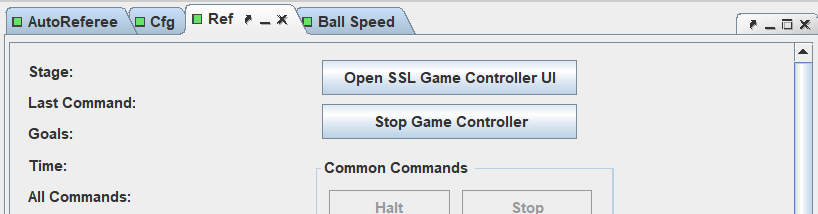
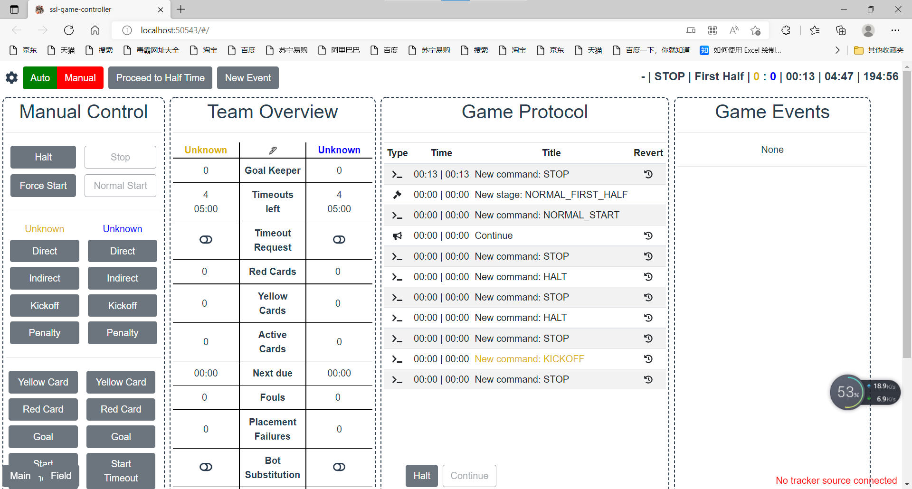
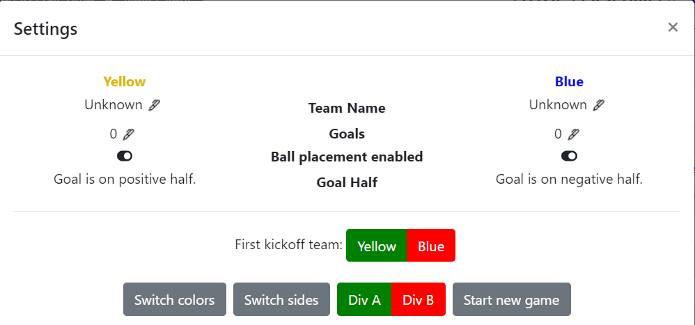
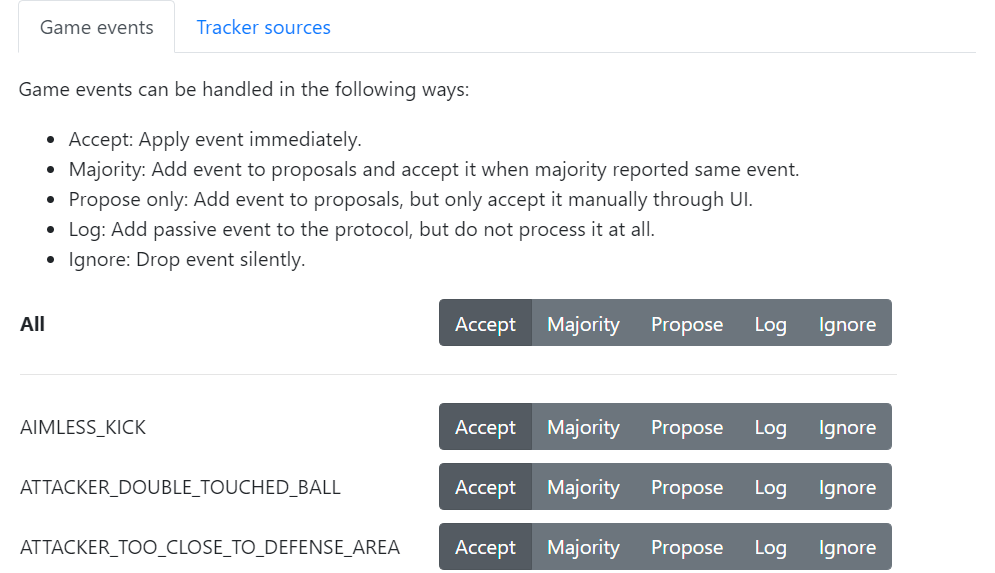
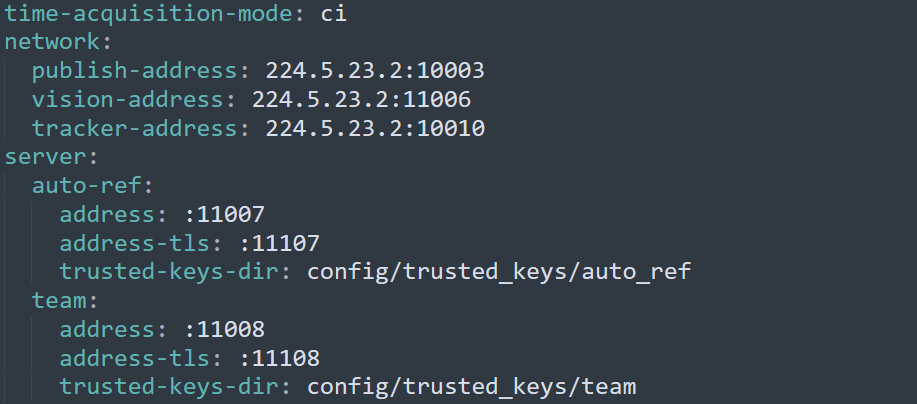
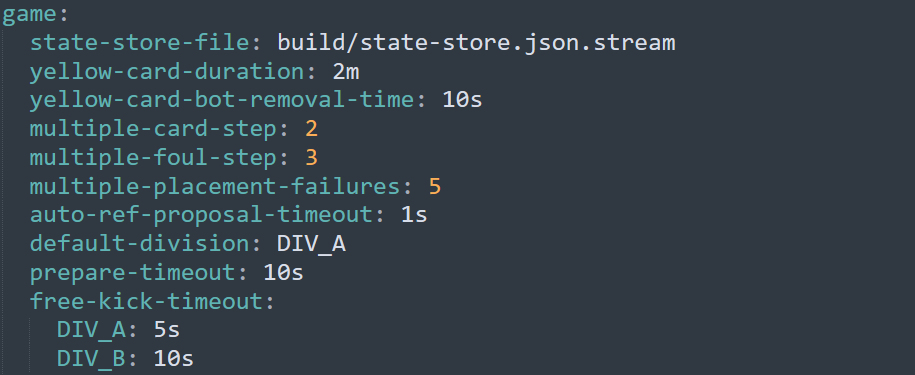

本篇文章主要介绍gameController的基本操作和参数配置

## 关于软件

- gameController也是RoboCup SSL官方推荐使用的软件，用于发布裁判指令（Halt、Stop……），以控制比赛进程
- 与一般裁判盒的区别是，gameController中含有自动跳转逻辑，需要其他软件为其提供裸视觉及滤波后视觉和不间断的反馈（比赛状态、犯规行为……），它可以据此发送合适的裁判指令
- 目前，各级赛事普遍采用Tigers-AutoRef + gameController的组合，所以建议使用前也熟悉[Tigers-AutoRef的操作](https://gitlab.com/src-ssl/src/-/wikis/Software/Tigers-AutoRef操作手册)
- 最后必须吐槽一句，这个软件是用GO语言写的，对于普通学习者不太友好（也可能是我才疏学浅了）

+ [gameController](https://github.com/RoboCup-SSL/ssl-game-controller)
+ [Tigers-AutoRef](https://github.com/TIGERs-Mannheim/AutoReferee)

## 基本操作

默认使用Tigers-AutoRef里自带的gameController，如果是单独下载的，配置方式参考README即可

### 开启

切换至ref页面，点击Start Game Controller，或是直接点击Open Game Controller，默认显示在http://localhost:50543/#/

### 关闭

点击Stop Game Controller

### 主界面

### Auto/Manual

- 选择模式，重要，使用前必须确定已选择合适的模式，不熟练者请先用手动模式
- 自动模式接收反馈，自动跳转，具体逻辑参考当年[官方规则](https://ssl.robocup.org/rules/)
- 手动模式，人工按键发送裁判指令

### 设置

- 点击左上角的齿轮图标，显示以下页面

- 比赛前需要设置
    - Ball placement enabled：是否能自动放球
    - First kickoff team：上半场开球队伍，点击相应的一方，绿色为选中
    - Switch colors：两队换颜色，选择性使用，Team Name、Goals、Ball placement enabled、Goal Half都调换
    - Switch sides：两队换边，选择性使用，仅调换Goal Half
    - Div A/B：场地大小，Division A/B标准，点击相应的选项，绿色为选中
    - Start New Game：设置完成，开始比赛
    

- Game Event：根据提示，设置对场上行为的响应（正常判罚、缓判、忽略……）
- 与AutoRef中的选项区别：AutoRef起监视作用，选中则监视该行为并报告，但gameController中决定是否因为该行为而发布裁判指令，干涉比赛进程

### Process to First Half/Half Time/Second Half……

开始上半场、中场、下半场比赛……

### New Event

添加新的事件，当某个事件并没有被监测到，或者需要人工进行判决时，手动添加

### Manual Control

- 手动模式，按键发送指令，用法可参考[自研裁判盒用法](https://gitlab.com/src-ssl/src/-/wikis/Software/owl2操作手册)
- 自动模式：部分指令仍需按键发送，如开球指令，其他自动跳转
- 只要收到AutoRef的反馈，就可以得出下一步要发送的指令，正下方的Continue按键会标红，并显示即将发布的指令

### Team Overview

- 显示一些队伍的基本情况，可编辑，点击中间的笔图标开始/结束编辑
- Goal Keeper：两队的门将号码，也要在比赛前设置，重要，否则会误判防守队员犯规
- 其他均为比赛状态的显示，如暂停剩余时间、红牌数、黄牌数……

### Game Protocol

- 显示比赛中发布的裁判指令
- Revert：回退到某一指令时刻

### Game Events

- 显示AutoRef和gameController的事件

## 参数设置

### config/ssl-game-controller.yaml

- 定义通讯端口

- publish-address：向某一地址发布裁判指令
- vision-address：绑定地址，接收裸视觉，由AutoRef转发，默认224.5.23.2:11006
- tracker-address：绑定地址，接收滤波后的视觉
- auto-ref：address：绑定端口，接收AutoRef反馈
- team：address：绑定端口，接收队伍注册信息

- 定义一些规则和场地配置
- 单位：秒（s），分钟（m），次数，米（m）

## 版本提醒

- 本篇文章参照版本为V2.6.4，为2021年中国赛和2022年浙江省赛的指定版本
- 注意根据比赛需要更新版本，虽然这个软件更新得比较少