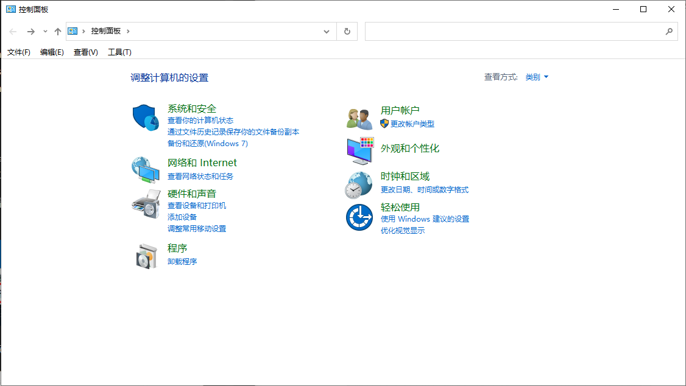
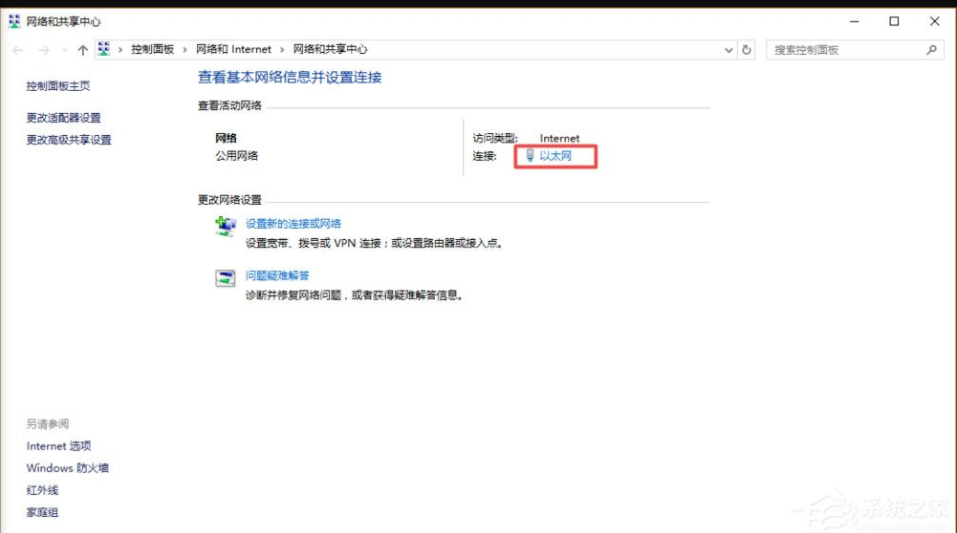
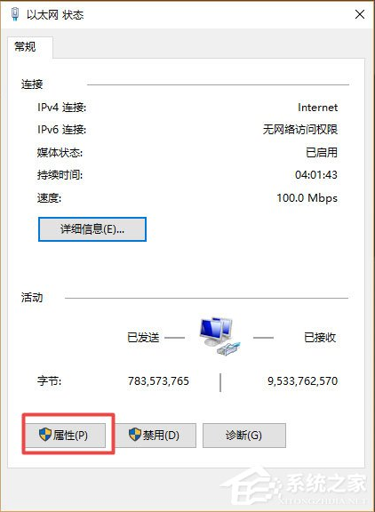
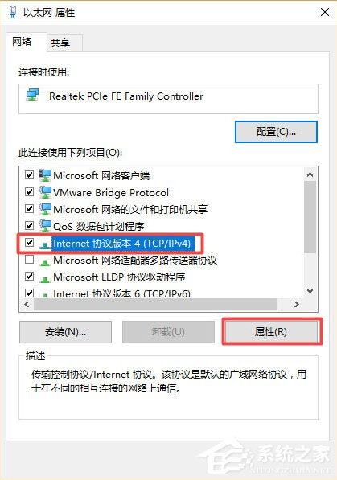
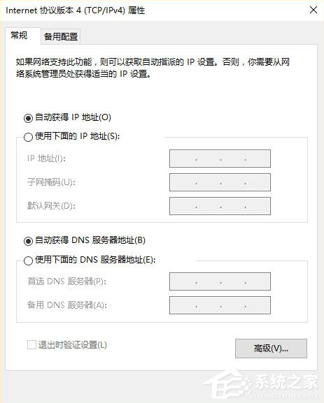
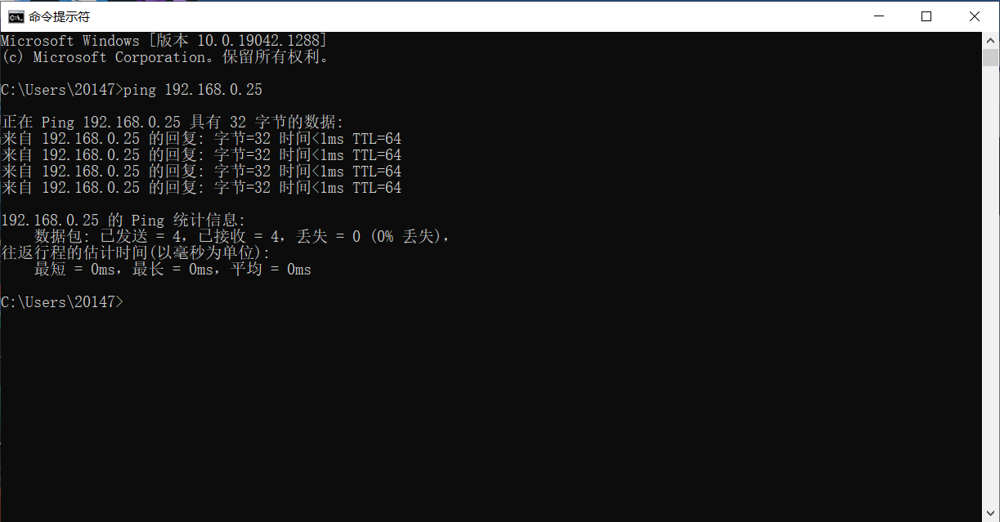

ubuntu密码为ssl

linux在输入密码时不会显示，不是电脑卡了

win7的密码是796234

## 启动视觉软件

``` shell
cd
cd Documents
cd ssl-vision-master
sudo ./bin/vision -s
```

## 启动graphicalClient

``` shell
cd
cd Documents
cd ssl-vision-master
sudo ./bin/graphicalClient
```

## 配置网关

- 先检查交换机是否接通电源，图像机上有没有接网线以及你的电脑上有没有接网线（网口或USB），转接口末端闪烁表示通讯畅通


- 打开电脑控制面板，点击打开网络和Internet，点击打开网络和共享中心；



- 点击以太网；



- 在新窗口点击属性；



- 选中Internet协议版本4（TCP/IP4），点击属性；



- 现在IP和DNS是自动的；



- 点击使用下面的ip地址

``` shell
192.168.0.***
255.255.255.0
192.168.0.1
```

`***`更换为0-255的数字，注意不要和同时运行的设备重复（视觉机为192.168.0.25/26）

- 关闭电脑的公用防火墙，使用图像机ctrl+alt+t打开终端，使用`ping 192.168.0.***`测试图像机是否能ping通你的电脑，能ping就说明静态ip配置成功

- 以上步骤可以替代为，使用电脑cmd，输入ping 192.168.0.25，若有字节返回，则配置成功，否则建议重启电脑后再试



- 以上配置在首次连接实车视觉时需要操作，成功接收过视觉说明配置生效，之后无需进行该操作

## 接入视觉

- 在owl2里选择Real模式，选择要使用的相机(id:0~7)，连接视觉

- 视觉帧率不为0时则成功接入，一般为65~75，与视觉机上的fps大致相同

- 无法接入建议重启电脑解决
