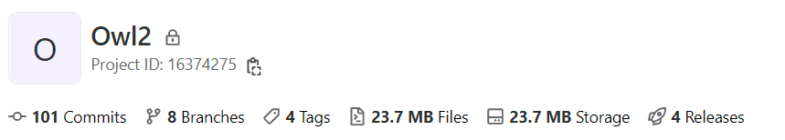
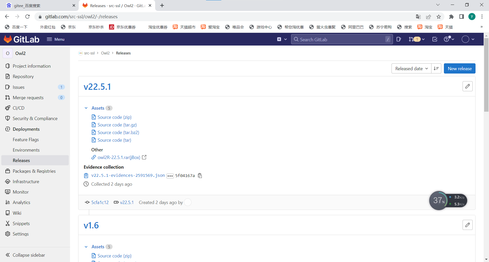
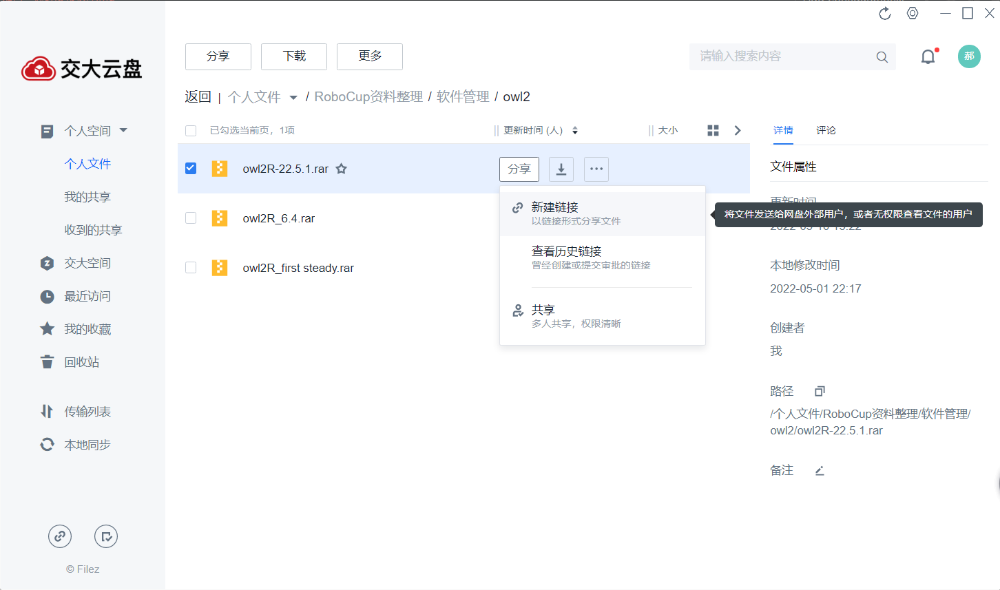

这里的软件指包含可执行文件的目录，而非源码。所有软件在确定版本后统一在Gitlab上以Release形式发布，这里介绍如何查找或发布某一版本的Release

## 如何在Gitlab查找Release

- 登录Gitlab，找到并进入需要下载的软件的仓库，以owl2为例

- 找到Releases，点击进入相关页面，可以看到历次发布的版本。Assets中有源码，Other为可执行文件目录。一般点击Other下的jBox链接下载

- 关于下载过慢，实测通过连接**交大vpn**可以提高一定程度的下载速度

## 如何在Gitlab发布Release

由于Gitlab无法在Release中上传压缩包等大的Release出的文件，我们可以结合jBox(交大云盘)之类来发布我们需要的Release

下面介绍一下发布过程，以owl2为例

### 准备可执行文件

- 压缩可执行文件目录，得到一个压缩包，将压缩包上传至jBox，标明一下版本号，并生成分享链接。推荐放于jBox的**软件管理**目录下
- [交大云盘](https://jbox.sjtu.edu.cn/l/eHE7uQ)

### 在Gitlab中创建Tag

在Gitlab中点击**Repository**下的**Tags**进入Tags界面，点击右上角的**New Tag**

输入要生成的Tag的**名字**，**来源分支**和一些附加的信息

点击**Create tag**，一个Tag就生成了，在右上侧的功能里可以修改Release Note，浏览文件，下载文件等

### 根据Tag发布Release

在右侧的**Deployments**->**Releases**里已经可以看到刚刚的Tag了，点击Tag右上角的编辑选项

现在的Release只有源代码，我们需要添加之前的jBox连接，点击右上角的修改图标，在下方的**URL**和**Link title**上分别填入jbox里的分享链接和要展示的名字，点击左下角的**Save changes**

可以看到增加了刚刚添加的链接，点击进入jBox的分享界面

## 参考视频

- [下载release版软件](https://jbox.sjtu.edu.cn/l/L1zRxS) (提取码：wygc)
